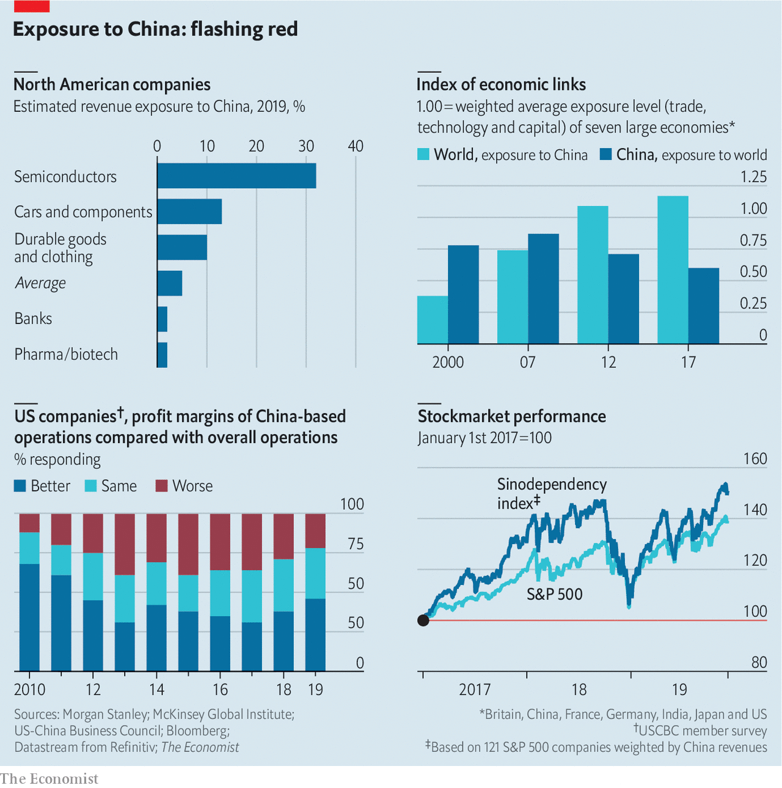

## Still worth it

# Despite political woes, America Inc is still thriving in China

> Trade wars aren’t the only complications multinationals face there

> Jan 2nd 2020NEW YORK AND SHANGHAI

FOUR DECADES ago communist China officially opened its doors to America and its capitalist firms. Politics, once seemingly set aside for the purpose of commerce, has recently made a comeback. President Xi Jinping has stirred up nationalism as part of his effort to consolidate power—worryingly for American firms seen as insufficiently deferential to China’s line on Hong Kong among other sensitive political topics. President Donald Trump’s trade war against China and his crackdown on Huawei, a domestic telecoms-equipment giant, have provoked further anti-American sentiments.

On December 31st Mr Trump tweeted that he will soon sign a “phase one” trade agreement with China. That will lead to some tariff cuts on Chinese imports, and to a presidential trip to Beijing for further haggling. When he visits, Mr Trump will surely hear grouses from his country’s firms about their troubles in China. What they are less likely to trumpet is how surprisingly well they are still doing there.

Some firms are suffering from a backlash arising from the trade war. But its effect on America Inc has been exaggerated. For one thing, American companies on average get only about 5% of their revenues from China (see chart), according to Morgan Stanley, a bank. Though the technology, automobile and consumer-products industries have greater exposure, for others China is an afterthought.

A third of respondents to a survey by the US China Business Council (USCBC), a trade group, claim they have been subjected to “increased scrutiny from Chinese regulators as a result of bilateral trade tensions.” However, local governments with their own growth targets have been rolling out the red carpet this year, foreign executives say. Thanks in part to such efforts, the share of American firms claiming their local operations had been hurt by “Made in China 2025”, an indigenous-innovation scheme America is wary of, plunged from 20% in 2017 to 12% in 2019.

Rising nationalism, stirred up by Mr Xi and embraced with zeal by mainland netizens, may prove a bigger problem than trade tensions. In November DC Comics was forced to pull a promotional poster for a Batman comic book from social media (Batwoman was shown throwing a molotov cocktail) as Chinese critics on social media drew parallels with the pro-democracy movement in Hong Kong. That came on the heels of a much-publicised row involving the National Basketball Association (NBA), after an executive at the Houston Rockets tweeted support for Hong Kong’s molotov-chuckers.

Previous nationalist backlashes stirred up by the Communist Party, for example against Lotte, a South Korean supermarket chain, and Toyota, a Japanese carmaker, led to no more than flash-in-the-pan boycotts. The basketball row, in contrast, is dragging on; the Rockets remain blacklisted in China, and by one reckoning have lost nearly $20m in sponsorship deals as a result.

Being seen to kowtow to China presents its own risks nowadays. The NBA, which claims 600m fans in China, promptly apologised—only for its apology to come under fire in America, including a reprimand from Mike Pence, the vice-president. In July Google scrapped a mooted return to the mainland’s censored online-search market after an employee revolt. Shutterstock, an online-photo agency, faced similar outrage from its workers in November over its decision to censor images in China.

American bosses are now in the unenviable position of having to weigh up the prospect of Chinese official ire with the sensibilities of politicians, employees and consumers at home. This risk will be heightened by increasing international concern over Xinjiang, a province in the west of China where officials stand accused of abusing Uighurs, the largest Muslim group in the country. American firms ranging from Kraft Heinz, a food giant, Coca-Cola, a fizzy-drinks colossus, and Nike, a sporting-goods brand, are reported to have supply chains that stretch into Xinjiang.

Despite these complications, most American firms remain committed to the mainland. The latest survey by the American Chamber of Commerce in Beijing finds that China remains in the top three as a global investment destination for 62% of its members, up from 56% in 2016; 87% of member firms tell the USCBC that they plan to keep doing business in China, roughly the same proportion as in recent years.

The reason is that the mainland remains a huge and growing market for most industries. American firms are still making money there. Andy Rothman of Matthews Asia, an investment firm, even argues that China is “the world’s best consumer story.” In dollar terms, retail sales in China are nearly as big as those in America, but they surged by 6% last year compared with a 2% rise in America. Chinese real incomes rose 120% over the last decade, whereas American ones grew by 17%. American multinationals are benefiting from this rising tide: the vast majority of their operations are not only profitable, but often increasingly so. Nearly half reported their Chinese operations were more profitable than elsewhere in 2019, up from 38% a year earlier.

More Budweiser beer is consumed in China than in America, notes Bruno Lannes of Bain, a consultancy. ABInBev, which brews the quintessentially American tipple, has seen its revenues in China grow more than six-fold even as its profit margins have fizzed. China’s market for fast-moving consumer goods rose by 5.2% in 2018, and foreign firms have benefited. Procter & Gamble, an American consumer-products goliath, says China represents more than 30% of its global sales growth. In December Tesla, an electric-vehicle pioneer, delivered the first EVs produced at its new factory in Shanghai (see [Schumpeter](https://www.economist.com//business/2020/01/04/cloning-tesla-electric-vehicle-wars-in-china)).

If the threat from politics seems overblown, there is a genuine worry for American bosses on the mainland: market competition. Chinese smartphone makers have increased their share in the local market for phones costing over $400 from 12% in 2014 to 67% in 2018, says McKinsey, a consultancy. Domestic carmakers, who once made subsidised hunks of junk, have managed to reduce their defect rate by an order of magnitude since 2003; their market share has jumped from 26% in 2014 to 38% in 2018.

This is primarily the result of nimbleness, not subsidies. Unlike state-owned firms, which Mr Xi is propping up with renewed vigour, most Chinese private companies are frugal innovators. Only 9% of American firms complain that local private firms get unfair advantages like tax breaks, licensing approvals and subsidies. Political rows dominate the headlines today, but the longer-term challenge for American firms may prove to be the rise of China Inc.■