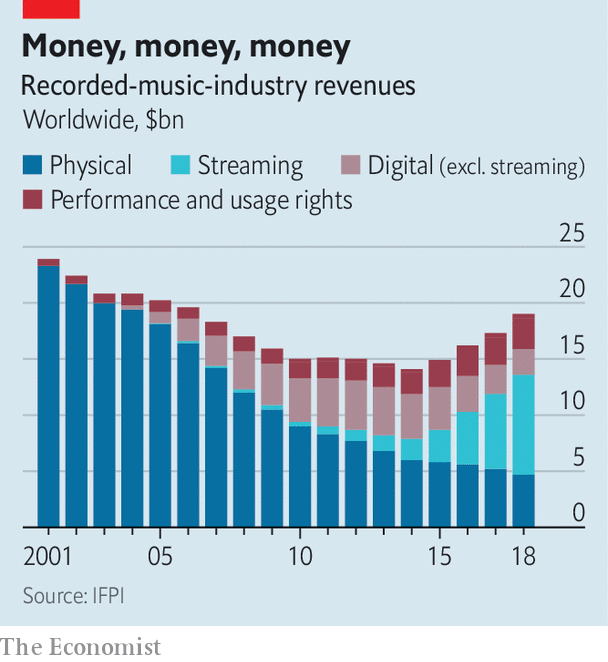

## Thank you for the music

# Tencent buys a stake in Universal Music

> Streaming has turned the music business around in recent years

> Jan 2nd 2020

IT WAS A nice example of nominative determinism. On December 31st a consortium led by Tencent, a giant Chinese digital conglomerate, announced it was buying 10% of Universal Music Group, a subsidiary of Vivendi, a French company, for €3bn ($3.4bn). The deal, first mooted in August, gives Tencent a stake in a firm whose catalogue spans artists from ABBA and Bob Marley to Jay-Z and Taylor Swift.

Tencent’s purchase values Universal at around €30bn. That is remarkable, for two reasons. The first is that Vivendi’s total market capitalisation is just €31.5bn. But Universal is merely the largest component of a conglomerate that also includes Canal+, a French pay-TV channel, and Havas, a PR-and-advertising firm. Both bring in profits of hundreds of millions of euros, and Vivendi is only lightly indebted.

The second is that it illustrates the recorded-music industry’s remarkable recovery over the past few years. The International Federation of the Phonographic Industry, a trade body, reckons that sales of recorded music were $23.9bn in 2001. By 2014 that had dropped by 40%, to $14.3bn (see chart). The industry laid much of the blame on piracy fuelled by the internet.

Nowadays, though, the internet has become the music industry’s best friend. Music-streaming firms like Spotify, a Swedish company, and Deezer, a French one, have outcompeted the pirates with a mix of the go-anywhere convenience enabled by smartphones and subscription-based pricing. For $9.99 a month, Spotify users get access to more than 50m songs (true skinflints can pay nothing, if they are prepared to put up with adverts). High volumes make up for low prices. Spotify alone has over 100m paying users, which helped the firm achieve a valuation of $27bn in its April flotation. It has also helped reverse the decline in music-industry revenues, which are up 34% from their 2014 nadir.

The streaming market is highly concentrated. Spotify and Apple between them account for over half of it. But plenty of firms are nonetheless trying their luck, including Google, Amazon and Tencent itself, whose music-streaming subsidiary has around 35m paying users in China. The latest entrant is ByteDance, best-known for developing TikTok, a trendy social-media app; Resso, its streaming service, was released in India and Indonesia last month.

That rush of new entrants will bring new customers, helping the market grow. It will also boost the firms, like Universal, that control the music that streaming firms must license. Universal’s revenue grew by 24% last year. Tencent’s purchase therefore looks like an attempt to profit from both sides of the game.

It also fits with Tencent’s taste for investing in other firms, and with its growing presence in the Western entertainment industry. The firm is best known for WeChat, a multi-purpose chat, payment and social media app with over a billion users. But it has stakes in hundreds of smaller firms. It is the world’s biggest video-game company: revenues from gaming accounted for around two-fifths of its 2018 total of 313bn yuan ($47bn). It owns Riot Games, the makers of “League of Legends”, an e-sports title whose biggest matches attract tens of millions of viewers. It has a controlling stake in Supercell, the Finnish studio behind the hit mobile game “Clash of Clans”. And it has a 40% share in Epic Games, an American firm whose offerings include “Fortnite”, a popular online shooter. Epic Games was valued at nearly $15bn in 2018.

Tencent Music Entertainment Group, the firm’s streaming subsidiary, was listed on New York’s stock exchange in 2018. Its film-production company was involved with films such as “Wonder Woman” and “Terminator: Dark Fate”, the sixth instalment in the interminable “Terminator” franchise. The Universal deal may likewise not be the end of the story. Vivendi has given Tencent the option to double its stake at the same price, and has hinted that it might sell even more of Universal to the Chinese giant in future. Will Tencent be back? ■

## URL

https://www.economist.com/business/2020/01/02/tencent-buys-a-stake-in-universal-music
