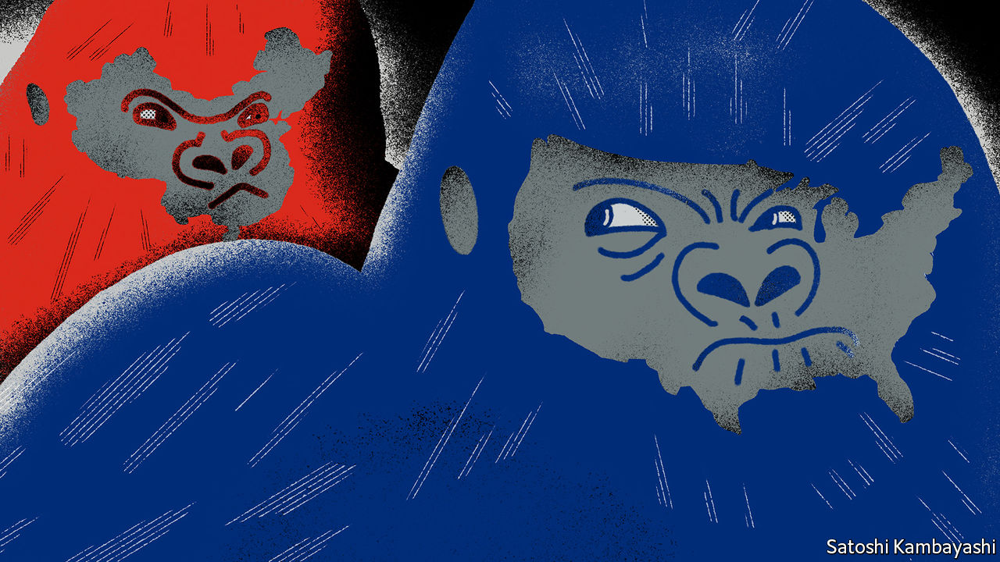
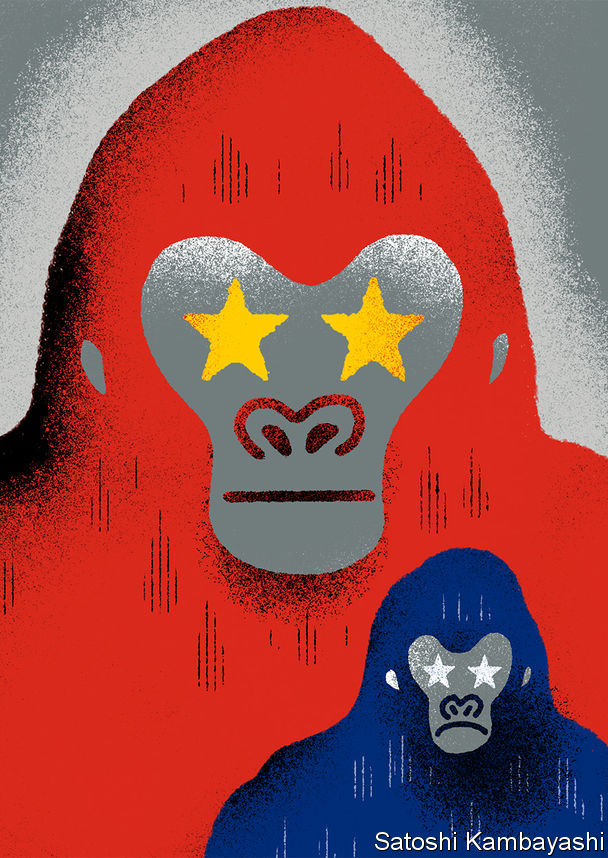

## 400-pound rivals

# China views Donald Trump’s America with growing distrust and scorn

> And cynics in Beijing hope for his re-election

> Jan 2nd 2020BEIJING

ZOOLOGISTS USE a mild-sounding term—“displacements”—for moments when a strong, young mountain gorilla confronts the dominant male in his group. Behind the jargon lies a brutal reality: a drawn-out, bloody conflict looms. China’s leaders similarly use prim, technical-sounding terms to describe their confrontation with America. In closed-door briefings and chats with Western bigwigs, they chide the country led by President Donald Trump for responding to China’s rise with “strategic anxiety” (ie, fear). They insist that China’s only crime is to have grown so rapidly.

However, behind that chilly, self-serving analysis lurks a series of angrier, more primal calculations about relative heft. These began before Mr Trump came to office, and will continue even if an initial trade truce is made formal (Mr Trump says he will sign one on January 15th). They will endure long after November, when American voters next choose a president. China has spent decades growing stronger and richer. It already senses that only one country—America—can defy Chinese ambitions with any confidence. Its leaders have a bleak worldview in which might makes right, and it is a fairy tale to pretend that universal rules bind all powers equally. Increasingly, they can imagine a day when even America ducks a direct challenge, and the global balance of power shifts for ever.

China does not seek a fight now. Like a powerful juvenile warily sizing up a silverback gorilla—his age and status marked by the silvery fur on his back, and his mighty muscles and teeth—China knows that America can inflict terrible damage, as it wields still-unrivalled economic, financial and military might. But officials and scholars in Beijing no longer bother to conceal their impatience and scorn for an America they view—with a perilous mix of hubris and paranoia—as old, tired and clumsy.

When addressing foreigners, China’s leaders talk piously of their commitment to free trade, market opening and globalisation. Their domestic actions betray a different agenda: namely, to make Chinese companies dominant in high-value manufacturing sectors, and to hasten the day when they no longer depend on America for vital technologies. Long before Mr Trump was elected, China pursued such policies as “indigenous innovation” and “civil-military fusion”. Since Mr Trump’s tariff war with China began in 2018, President Xi Jinping and his underlings have accelerated efforts to make China self-sufficient in high-value sectors, creating supply chains that are “autonomous, controllable, safe and effective”, in Mr Xi’s words.

For decades Chinese officials have seen bilateral relations swinging, pendulum-like, between periods of hostility (notably during American elections, when candidates promise to shield workers from unfair Chinese competition) and a profit-driven willingness to engage. Now Chinese and American insiders talk of a downward spiral. Both countries have become quick to assume the other has malign motives. Where relations were once balanced between co-operation and competition, and China’s rise seemed on balance to benefit both countries, Chinese officials accuse Mr Trump and his team of seeking co-operation only when it serves a coercive, short-sighted “America First” agenda. They do not see this changing soon—far from it. They view relations with sour fatalism, and America as a sore loser.

Chinese experts talk wistfully of the scores of dialogues and mechanisms that used to underpin co-operation with America’s government before Mr Trump scrapped most of them. But, when pressed, they struggle to explain what a useful agenda for future talks might be. Instead, they prefer to count the ways in which America is to blame for today’s tensions. In China’s telling, American companies became accustomed to making fat profits in China, but see Chinese rivals catching them up and potentially setting global standards for future technologies. Now American businesses are crying cheat, and demanding that trade rules designed for the rich world be used to keep China down.

Populist election victories in the West are ascribed to domestic failures in the countries concerned. Chinese officials say that America failed to educate workers, allowed inequalities to yawn and never built social safety-nets to help victims of globalisation—and is now scapegoating China for those ills.

In public, Chinese officials call Mr Trump’s tariffs self-defeating and stress their country’s economic resilience. In private, they are both less confident and less focused on tariffs than they pretend. They are less bullish because economic sentiment in China was fragile before the trade war. Worse, the tariff feud has planted seeds of uncertainty about the country in the heads of every chief executive pondering where to place a new factory.

Chinese officials are less focused on tariffs than they maintain in public because they believe Mr Trump will lose his leverage over time, as he frets about the impact on American farm states and other places where he needs votes. Chinese officials fear other forms of competition more than any tariff fight. In Beijing leaders do worry about the consequences of a technology war with America or of an all-out struggle for global influence.

It is not just a figure of speech when officials in Beijing divide foreign grandees into “friends of China”, and “anti-China forces”. China’s rulers take an intensely personalised view of foreign relations. Communist Party bosses have learned over decades that individual foreign envoys, CEOs and political leaders can be turned into reliable advocates for China with the right blend of high-level access and reasoned appeals, financial incentives and flattery.

But Chinese officials feel sadly short of influential friends in the corridors of American power. Within the Trump administration, only the treasury secretary, Steven Mnuchin, is seen as representing the old, familiar American approach of putting profit first when engaging with China. There are firms that rely heavily on China as a supply base and market, from Apple to General Motors, which sells more cars in China than in America. But the profit motive itself is under suspicion in the new, populist Washington, where even Republican members of Congress urge businessmen to weigh America’s national interests in dealings with China, and not just their shareholders’ dividends.

After much study, leaders in Beijing have decided that Mr Trump is neither a friend of China nor a traditional anti-China hawk, in the sense of someone who disapproves of the party’s policies on grounds of principle. In essence, Mr Trump is seen as a friend of Mr Trump—a man whose self-interest is his only reliable guiding instinct. Famous scholars at elite universities in China who have studied America for years tut-tut about how that makes Mr Trump unpredictable and liable to break any promise he makes to Mr Xi. More cynical figures, including some close to the national security bureaucracy, unblushingly root for Mr Trump to win re-election in 2020, so that he can continue to upset allies and cast into doubt decades-long American security guarantees in Asia. Their great fear is that Mr Trump may be captured by sincerely hawkish aides. That includes economic nationalists with trade portfolios, like Robert Lighthizer and Peter Navarro. But unique animus is aimed at the “two Mikes”: the vice-president, Mike Pence, and the secretary of state, Mike Pompeo. In Beijing both are called anti-communist, evangelical Christian zealots, with ambitions to succeed Mr Trump in 2024.

China is sure it is in a worldwide influence war, in which its propaganda about Xinjiang, Hong Kong or Huawei is pitted against an “anti-China” story. Mr Pence and Mr Pompeo are semi-openly reviled as crazy, ignorant warriors in that conflict. They are accused of slandering China over its iron-fisted rule in the western region of Xinjiang, and of egging on pro-democracy protesters in Hong Kong, whom China calls terrorists and separatists. Mr Pence and Mr Pompeo are also condemned for leading a diplomatic charge to warn smaller countries to beware of Chinese loans and technology (the results have been mixed). Chinese officials have not missed the factor that links all successful efforts at American arm-twisting. Countries have proved most tractable when America has real co-operation to offer or to withhold, whether that involves Poland and its yearning for a permanent garrison of American troops to act as a tripwire against Russian aggression, or Brexit Britain dreaming of a free-trade deal with Mr Trump. Where American envoys merely nag countries to shun China’s investments without offering concrete alternatives, they have fared less well. As one Chinese insider crows, America under Mr Trump looks “self-isolating”.

Chinese officials who favour Mr Trump’s re-election hope that he will feel free in his second term to disavow hawks around him and pursue transactional policies. They fret that a Democratic president may place more weight on human, labour and environmental rights.

All this fulminating does not mean that China seeks to match the hawks in Washington and drag their two countries into a new cold war, in which the world is divided into rival camps. China believes that most other nations do not want to choose between it and America, at least for now. China is playing for time, as it builds its strength and tries to construct alternatives to such potent tools of American power as the dollar-denominated financial system. China’s interest in developing its own blockchain technology and international payment systems is in part a sign of its fear of American sanctions that would expel Chinese banks from American markets.

Some Chinese voices say their country has not lost interest in an offer China made to Mr Trump’s predecessors, involving a “new model of great-power relations”: code for carving the world into spheres of geopolitical influence, and an end to American carping about China’s ways. Others stress China’s right to help write the rules of globalisation. That would be reasonable, were it not that China’s aim is to make the world safe for techno-authoritarian state capitalism. Chinese officials want to avoid confronting America for now. But few silverbacks gracefully retire. Increasingly, America is seen as an obstacle to China’s rise. That means trouble looms. ■

## URL

https://www.economist.com/china/2020/01/02/china-views-donald-trumps-america-with-growing-distrust-and-scorn
