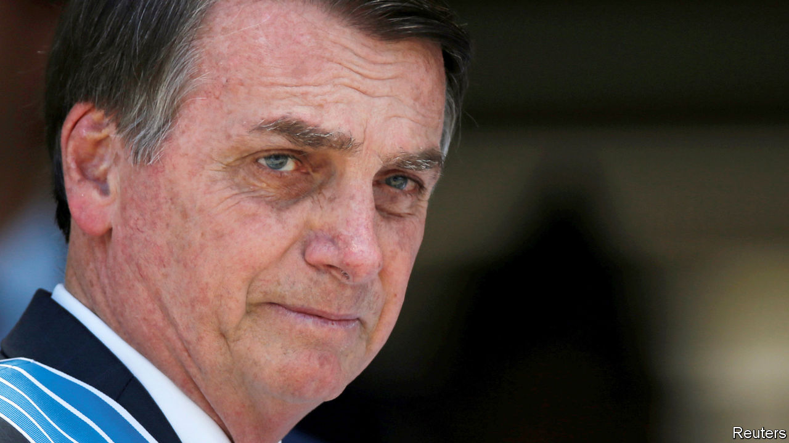
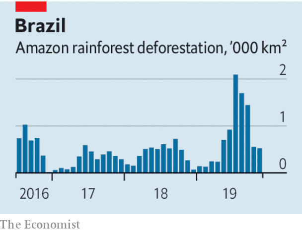

## Governing dangerously

# A year of Jair Bolsonaro

> Brazil’s president can boast some achievements. They come at a high price

> Jan 2nd 2020

WHEN JAIR BOLSONARO took office as Brazil’s president on January 1st 2019, many observers feared the worst. The former army captain had made his name by extolling the military dictators who ruled from 1964 to 1985 and by disparaging women and gays. He won the election because voters were traumatised by the country’s worst-ever recession, from 2014 to 2016, by crime and by revelations of corruption at the highest levels of politics and business. They hoped that Mr Bolsonaro would restore prosperity, peace and probity to Brazil.

After his first year in office they have some of what they wanted. The economy has improved, and violent crime has fallen. Yet Mr Bolsonaro has not put to rest the doubts raised by his unlikely rise to power. The provocateur has not become a statesman. Instead of strengthening Brazil’s democratic institutions, he is testing them. When it comes to corruption and the environment, Brazil is either stuck or going backwards.

Mr Bolsonaro’s main achievement is pension reform, a prize that has eluded Brazilian governments for decades and which congress agreed on in November. This will help remove a trap that Brazil set itself by paying lavish benefits to people who, on average, retire in their mid-50s. Without reform, pension spending as a share of GDP would have nearly doubled by 2050, with alarming consequences for public debt and the government’s capacity to spend money on anything else. Brazil will now gradually introduce minimum retirement ages of 65 for men and 62 for women, and will reduce benefits as a share of people’s earnings.

This has helped restore confidence in the economy. Interest rates have dropped to their lowest level in 33 years. Growth in 2020 should be at least 2%, well above the Latin American average. If Paulo Guedes, the Chicago-trained, pro-market economy minister, had his way, pension reform would mark the start of a transformation in Brazil’s fortunes (see [articles](https://www.economist.com//the-americas/2020/01/04/jair-bolsonaros-contentious-first-year-in-office)). He rightly believes that the state has kept Brazil poorer and more unequal than it should be, by spending too much money on the wrong things and subjecting businesses to needless rules and the world’s most baffling tax system. He wants to privatise public enterprises, shrink a bloated administration, simplify taxes and transfer power and money to states and municipalities. In 2019 Mercosur (a four-country bloc including Brazil and Argentina) reached a trade agreement with the EU. If it is ratified, it could help Brazil shed its status as one of the world’s more closed economies.

Mr Guedes urges the president’s critics to focus on that. The top man has “bad manners, but great principles”. It would be truer to say that Mr Bolsonaro, a fierce social conservative, has merely adopted Mr Guedes’s economic creed, for the time being. In other spheres, his ideas cannot just be brushed aside, even if congress and the president’s more level-headed advisers have so far contained his worst instincts. As long as he continues to endorse police violence, there is little chance of stopping its long upward trend. While left-wing protests were raging in other Latin American countries one of his sons, a congressman, said that if such protests turned violent in Brazil the government could revive a decree that shut congress during the dictatorship. In December, irritated by press accusations, the president turned on a journalist, saying, “Your face looks an awful lot like a homosexual’s, but that’s no reason to accuse you of being a homosexual.”

Although murders have fallen, largely because inter-gang warfare has eased, Mr Bolsonaro has all but given up the fight against white-collar crime. Sergio Moro, the justice minister, has been compromised by revelations of his improperly close dealings with prosecutors when he was the judge in charge of the vast anti-corruption probe that helped propel Mr Bolsonaro to power. Congress stripped Mr Moro’s crime bill of most of its anti-corruption measures. Prosecutors are investigating allegations that another of Mr Bolsonaro’s sons, a senator from Rio de Janeiro, pocketed money meant for employees when he was a state legislator and has links to murderous “militias” of ex-policemen.

Then there is the environment. Early data suggest deforestation in the Amazon in the first 11 months of 2019 rose by 80% compared with 2018. Mr Bolsonaro sacked the chief of the space agency after it reported unwelcome deforestation data, and has hollowed out environmental-enforcement agencies and egged on ranchers and loggers who set fires to clear land. At recent global climate-change talks, Brazil played the wrecker.

If Mr Bolsonaro transforms the economy, Brazilians will have reason to be grateful. But they, and the world, will have paid a high and unnecessary price. ■

## URL

https://www.economist.com/leaders/2020/01/02/a-year-of-jair-bolsonaro
