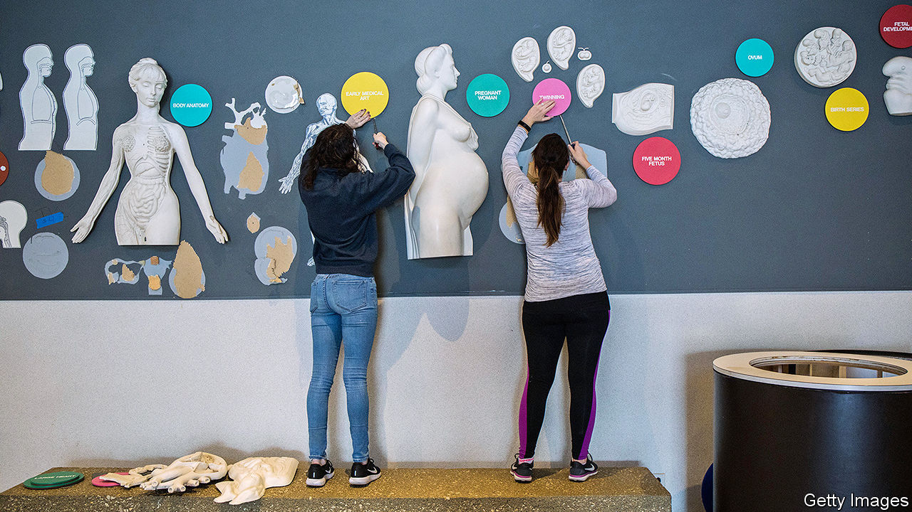

## TexEd

# Austin has changed sex education in its schools

> The rest of Texas is primed to react

> Jan 4th 2020AUSTIN

FOR A CONSERVATIVE bunch, Texans are talking a lot about anal sex. The cause is a change to sex-education lessons in the progressive city of Austin which, some fear, could spread to the rest of the state.

Texas is a poster-child for abstinence education. Over 80% of schools teach either abstinence-only or nothing on sex at all. State law requires teaching to emphasise abstinence “as the preferred choice of behaviour in relationship to all sexual activity for unmarried persons of school age.” It does not require mention of condoms, contraceptives or sexual orientation. The last time the state Board of Education touched this hot-button issue, in 2004, abstinence advocates won and kept calls for more comprehensive sex education at bay.

This does not appear to have worked. Texas has one of the highest teen-pregnancy rates in America. For all the abstinence lessons, over 60% of high-school seniors say they have had sex. According to the Centres for Disease Control and Prevention, Texan teens are the least likely in America to have used contraception last time they did. “We’re creating generation after generation after generation of sexually illiterate adults,” David Wiley, founder of the Texas Campaign to Prevent Teen Pregnancy, told the Houston Chronicle.

Change is under way. The share of school districts teaching abstinence-plus (don’t have sex, but if you do, be safe) increased from 4% in 2008 to 17% in 2016, according to Texas Freedom Network (TFN), an advocacy group. In October the board of Austin’s independent school district unanimously voted for an updated sex-education curriculum for 8- to 14-year-olds. For the youngest children the syllabus involves naming body parts and the idea that some of them are private, which is thought to help guard against sexual abuse. Later on it includes lessons on contraceptives, disease prevention, LGBT relations, gender identity and consent. The battle in Austin was fierce and may foreshadow a larger one: in 2020 the state Board of Education will consider revising state standards for teaching health and sex education.

All this has infuriated conservatives. Some worry that Austin’s updated material promotes the sexualisation of young children, grooms teenagers for under-age sex and amounts to “LGBT indoctrination”. One mother worries that teaching 11-year-old boys how to put on condoms will “get them aroused” and “encourage risk-taking”. Another fears that teaching girls that motherhood is optional collides with conservative family values. On the day of the Austin vote, the Christian Broadcasting Network declared: “Texas School District Mandates Teaching Kids How to Have Anal Sex.”

The Austin vote may have been unanimous, but the run-up was far from consensual. First, a change in the law meant the district could not buy teaching material from Planned Parenthood and had to create its own. Then came haggling over content. Concessions included removal of several references to body parts (all related to disease prevention) and, allegedly, a video with mixed-race and gay parents. When it came to the vote dozens of speakers lined up into the night, mostly objecting. “It’s not appropriate for a government body to encourage students to engage in any kind of sexual activity,” said David Walls from Texas Values, a conservative advocacy group.

The lessons on gender identity are among the most controversial parts of the new curriculum. Ten-year-olds will be presented with a “gender-bread person” handout to illustrate the idea that biological sex refers to the reproductive system and that gender identity is the way people see themselves. Pupils will be taught that the two do not always match.

Although the new curriculum will be taught from May in Austin, and parents can opt out, opponents say this is just the beginning. Concerned Parents of Texas, a group claiming to represent “parents, educators and concerned citizens”, says the material encourages risky behaviour and gender confusion and may be against Texas law. “They are pushing anal sex,” says Caryl Ayala, a former primary schoolteacher and one of the group’s founders. She worries about children’s physical health and life prospects, but also about the trauma of engaging in sex before marriage. “A condom doesn’t protect the heart of a child,” she adds, holding a binder of school material which, she believes, is pornographic.

In her eighth-floor office overlooking the city, Lisa Goodnow, from the Austin schools district, sighs as she recalls the tug-of-war over an update which, she believes, is well overdue. “Kids are two clicks away from seeing anything online. That’s not where we want our students to get information,” she says. For many public-health, gay and trans campaigners, the Austin change is a victory. But the real fight has not started yet, says Dan Quinn, from TFN. More conservative districts may well look at Austin’s battle and think it easier not to have sex education at all, or stick to abstinence. Book publishers may agree. The other side also believes that the real fight has not yet started. “It won’t stay in Austin, it’s already spreading, they want to change the state,” says Jennifer Fleck, a Republican candidate for the state legislature. “It’s time to draw a line in the sand and say: ‘You need to stop and move back’.”■

## URL

https://www.economist.com/united-states/2020/01/04/austin-has-changed-sex-education-in-its-schools
