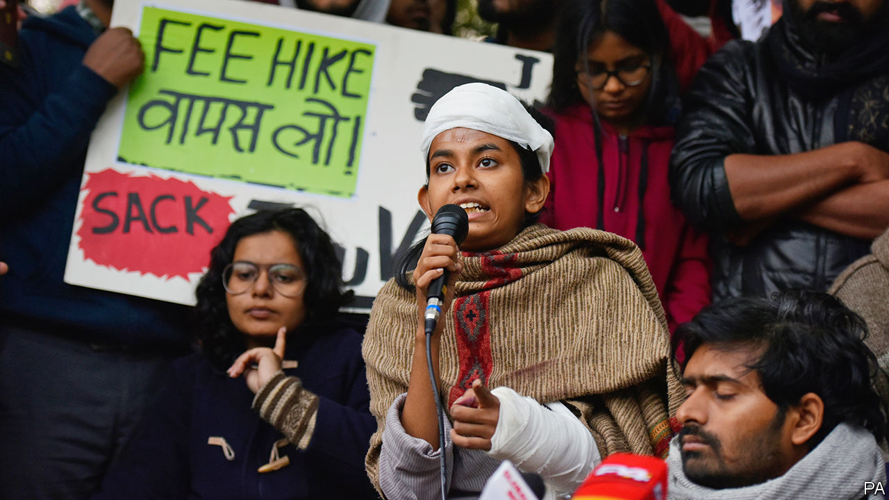

## Cracking heads

# An assault on students brings trouble for Narendra Modi

> An attack on a university outrages Indians

> Jan 9th 2020DELHI

AISHE GHOSH is no stranger to trouble. She heads the student union at Jawaharlal Nehru University (JNU), a prestigious state-run institution of which the leafy campus in Delhi has long been a seedbed of radical activism. Even so, Ms Ghosh (pictured) did not expect to be attacked by a mob of masked, club-wielding thugs on January 5th, and to end up in hospital with a broken hand, multiple contusions and 16 stitches in her scalp. Nor did she expect police to file charges against her, rather than the aggressors. And she certainly did not expect such instant national fame as to prompt Deepika Padukone, the reigning glamour queen of Bollywood, to join a subsequent student rally and whisper encouragement to her wounded comrade.

The trouble at JNU that landed 34 students and teachers in hospital had been brewing for some time. The Hindu-nationalist movement has long demonised the university, which has a strong record of independent research, as a taxpayer-funded playground for long-haired “anti-nationals”. Such attacks grew fiercer following the first national electoral triumph of Narendra Modi, India’s prime minister, in 2014. Then, the appointment of a new university head who was determined to impose “discipline” and “patriotism” set the scene for running campus quarrels. Students, many of whom come from poor families and remote regions, have been on strike since October against a steep rise in residents’ fees. Tension had grown between Ms Ghosh’s faction, which is historically linked to the Communist party, and a group known by its abbreviation ABVP. This is the youth branch of India’s main Hindu-nationalist organisation, the Rashtriya Swayamsevak Sangh or RSS, which also happens to be the parent group of Mr Modi’s Bharatiya Janata Party (BJP).

When leftist students tried to block others from registering for a new term, someone appears to have called for reinforcements. After dark on January 5th perhaps a hundred masked youths armed with hammers, cudgels and iron bars slipped into the campus, smashing windows and assaulting anyone who could be identified with the left.

Despite numerous calls, police declined for several hours to intervene. Instead they blocked entrances to the university, standing by as more Hindu-nationalist vandals beat up journalists and attacked an ambulance. Someone switched off streetlights, helping the masked invaders to steal away. Not a single one was caught. Police later filed charges against Ms Ghosh and other leftist students for alleged damage to university property in previous incidents.

By the scale of Indian politics, the events at JNU are a typhoon in a thimble. In December alone some 27 Indians died in protests against Mr Modi’s introduction of a new citizenship law that is widely seen as targeting Muslims and undermining India’s secular constitution. Most of the dead were Muslim. Most appear to have been shot by police, who were widely captured on film using extreme violence against citizens who appeared to present no threat.

Mr Modi, who was re-elected last May with an even bigger margin, has ridden out numerous other storms over controversial policies, from his banning of high-value currency notes in 2016, to imposition of a complex new tax regime in 2017, to an abrupt, fierce and ongoing clampdown in the state of Jammu & Kashmir, which has been split in two and placed under direct rule from Delhi. Even the recent sharp downturn in India’s economy, which is now growing in nominal terms at its slowest rate in 42 years, has failed to elicit much more than muted grumbling.

Yet the brazen attack on university students in the Indian capital seems to have touched a nerve. The official narrative, which is that the assailants are unknown but perhaps, it is hinted, justified, has not gained traction. After all, top officials in Mr Modi’s government have consistently stirred up animosity against JNU. Just days before the attack, his home minister had declared it was time to punish what he called the “tukde tukde gang”, a reference to an alleged incident in which JNU students had chanted that they would break India into tukde, or pieces. The Delhi police come under his direct command.

In a response that has left the government defensive and bewildered, students at dozens of other universities have protested in solidarity with JNU. Media outlets long reviled for sycophancy have turned sceptical. Doubters who previously shied from direct criticism of Mr Modi now appear emboldened. Shyam Saran, a former foreign secretary known for delicate takedowns rather than blunt broadsides, described the university attack as “a calculated message to academic institutions, civil society and minorities, that they would be bludgeoned into submission if they dare to resist the reconstruction of the Indian state and society in accordance with a majoritarian blueprint.” Even Bollywood stars, a type generally seen as cravenly pro-government-of-the-day, have stepped up.

The ongoing citizenship row has had the effect of healing myriad divisions among India’s 200m Muslims, releasing their pent-up frustration with Mr Modi, and encouraging them to find allies from across Indian society. The apparent impunity with which thugs attacked secular, middle-class university students in the middle of India’s capital seems to have offended another slice of the Indian public.

In the absence of a strong parliamentary opposition to exploit the government’s missteps, the sight of Ms Ghosh with blood pouring down her face may soon be forgotten. Mr Modi still has no rival for mastery of Indian politics. Yet he seems to have missed an important point. The country’s first-past-the-post electoral system has exaggerated the scale of his popularity: his party’s 38% of the national vote translated into a 56% parliamentary majority. Now, it seems, the 62% of Indians who did not vote for him, and certainly did not endorse the Hindu-nationalist project to turn India into a monochrome state, are beginning to speak out.■

## URL

https://www.economist.com/asia/2020/01/09/an-assault-on-students-brings-trouble-for-narendra-modi
