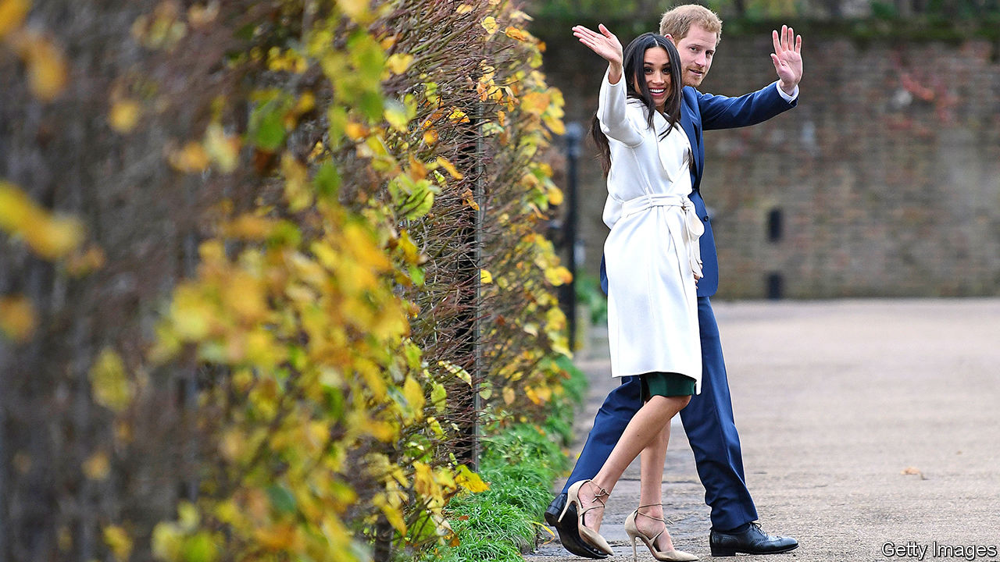

## Britain’s longest-running family firm

# Harry and Meghan go private

> The House of Windsor starts a long-awaited restructure

> Jan 9th 2020

PART OF BRITAIN’S royal family is to spin itself off from the rest of the firm. In what they described as a “carve out”, Prince Harry and his wife Meghan Markle, aka the Duke and Duchess of Sussex, said on January 8th that they intend, in effect, to take their arm of the operation private, stepping back from duties as senior royals and working to become “financially independent” from the rest of the House of Windsor group.

It has been clear for some time that Harry and Meghan were not a natural fit with the group. Attempts to package them with the Duke and Duchess of Cambridge—aka Prince William and Kate Middleton—in a charitable foundation were unsuccessful. Although the brands were distinct—the first appealing to woke millennials, the second to more conventional customers—they proved rival rather than complementary.

Harry and Meghan’s move was announced without consultation with the group’s management, but may have been encouraged by developments within it. The stock price has tumbled recently, as a result of missteps by Prince Andrew, who has now been fired. Prince Charles—who will take over the top job in the not-too-distant future—has hinted that he plans to cut costs and slim down its operations as part of a broader restructuring. Rather than wait for that shake-up, Harry, who knew he was unlikely ever to get the top job, has now decided to cut loose.

This separation has the advantage of strategic clarity, and is likely to unlock value, given that the Harry and Meghan brand was widely perceived to be undervalued. The new entity will now have more freedom to diverge from the positioning of the parent group and to tap overseas markets. The couple say they plan to divide their time between Britain and North America.

Exactly how the new entity will generate revenues to finance itself and the “charitable foundation” that it plans to launch is unclear. The couple have said they will forgo money from the Sovereign Grant, through which the government pays for the royals, though not whether they are also planning to do without the cross-subsidy they get from Charles. Harry has only modest startup capital—mostly his inheritance from his mother—and his human capital consists of a title, a certain amount of puppyish charm and the ability to fly helicopters. Ms Markle could at least resume her acting career, and would be well-placed to win a part in the next season of “Succession”, an HBO series on the troubled offspring of a manipulative autocrat.

If the spin-off goes well, might other parts of the group make similar moves? Princess Anne’s sporting-lifestyle brand might have potential as a stand-alone entity, particularly after its advantageous product-placement in the latest season of “The Crown”, a Netflix series depicting a fictionalised version of the company’s behind-the-scenes operations. The Wessex, York and Kent brands are not, however, thought to have value.