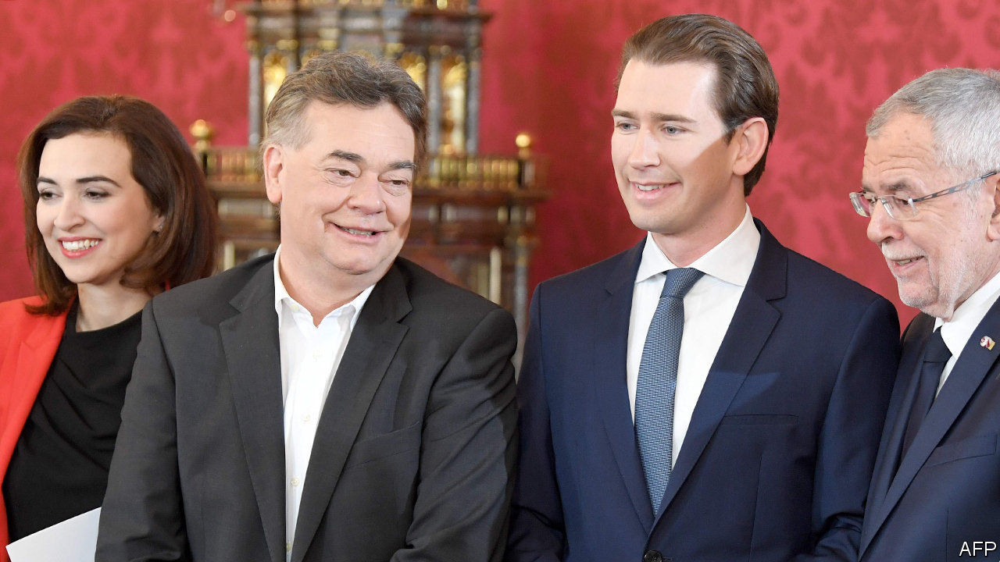
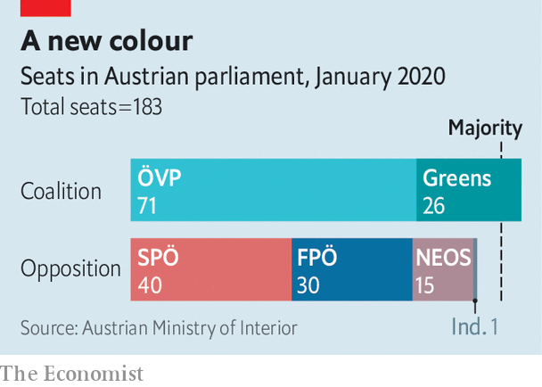

## Three’s a charm

# A new right-wing-Green coalition takes office in Austria

> Sebastian Kurz picks up where he left off—this time with the Greens

> Jan 9th 2020BERLIN

IT WAS “the greatest comeback since Lazarus,” said Werner Kogler. The leader of Austria’s Green party was describing its recovery from electoral oblivion last year. Four months ago the Greens were not even represented in parliament, having been wiped out in 2017. But on January 7th they were sworn into office as junior partners to the right-wing Austrian People’s Party (ÖVP), marking their first foray into national government. The new coalition also represents a resurgence of sorts for Sebastian Kurz, the young ÖVP leader now reinstated as chancellor of his third coalition. In 2017 Mr Kurz invited the far-right Freedom Party (FPö) into office, an experiment that collapsed last May amid a baroque scandal involving fake Russians and FPÖ corruption. In the ensuing election the ÖVP and Greens picked up the spoils, enabling a coalition few Austrians had thought possible.

The negotiations were oiled by an unexpected rapport between the two party leaders. Mr Kurz calls the unusual tie-up “the best of both worlds”. But the extensive ÖVP fingerprints on the deal will leave some Greens wondering. On migration and integration, Mr Kurz’s pet themes, the government will consider preventive detention for potentially violent asylum-seekers, ban headscarves for Muslim girls aged under 14 and block EU schemes to redistribute refugees. It will cut income and corporate taxes while aiming for balanced budgets.

To help sugar these pills, the Greens obtained one of Europe’s more ambitious climate-change programmes, including a pledge for carbon neutrality by 2040 and a plan to price emissions by 2022. They secured sharper party-financing rules and more aid spending, and will run a jumbo environment, energy and transport ministry. Party officials, eager for power after the wilderness years, backed the deal with gusto. Yet the Greens could have squeezed more out of Mr Kurz, says Thomas Hofer, an Austrian analyst. The coalition is less a meeting of minds than a division of fiefs.

It also helps the 33-year-old Mr Kurz cement his reputation as Austria’s changemaker-in-chief. He is once again the world’s youngest leader, and yet already a gnarled veteran of Austrian politics, earning over nine years in government a reputation as a smart tactician and political bruiser. Greens either distrust him or, eyeing the woes of his previous coalition partners, fear him. Immigration could yet prove a flashpoint. A curious clause in the coalition deal allows Mr Kurz to make common cause with the FPÖ in the event of a migration “emergency”. Yet the Greens’ hunger to replace the floundering Social Democrats as Austria’s chief progressive force, and to keep the FPÖ out, will help bind the coalition together.

For optimists, the government hits a sweet spot: greater ambition on climate plus tough migration policies to blunt the appeal of FPÖ-style radicals. Might others follow? In Germany, ruled by a weary left-right “grand coalition” of the sort that prevailed in Austria before Mr Kurz came along, the idea of a conservative-green government has long circulated. Germany’s Greens are wary about drawing lessons from their less experienced Austrian brethren, and the German Christian Democrats (CDU) are more moderate than the ÖVP. Yet for that reason, if even Mr Kurz can pull it off, his many admirers in the CDU may too turn their gaze greenwards. ■