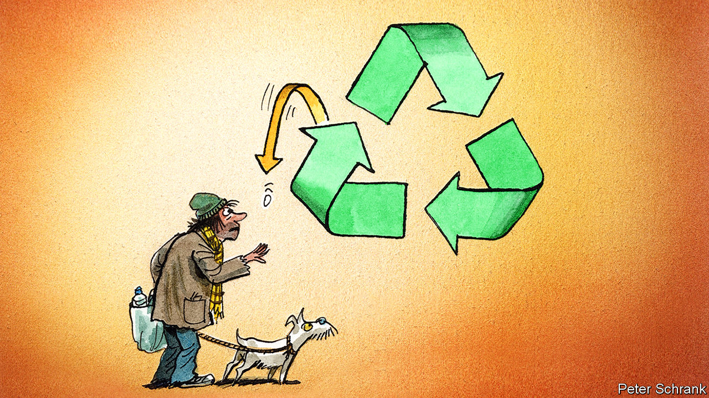

## Waste not

# Why Lithuanians cash in on their trash

> Avid recyclers are not necessarily eco-warriors; they need the money

> Jan 11th 2020

AFTER THE season for giving, ’tis the one for throwing away. Each year in late December and early January a massive amount of plastic packaging is discarded worldwide. In Britain alone households generate 30% more waste, an extra 3m tonnes, in the month over Christmas. Most is destined for landfill. Lithuania will do less damage than many, though. The country now recycles at a record level. Almost three-quarters (74%) of plastic packaging waste was recycled there in 2017, the highest proportion in Europe. The EU average was 42%, and the worst performers, including Finland and France, under 30%.

Much of Lithuania’s success is due to a deposit refund scheme, introduced in 2016. Customers pay €0.10 extra when buying drinks containers. After use, these can be fed into reverse vending machines installed in shops, which spit the deposit back out. The machines’ contents are sent directly to recycling centres. By the end of 2017, 92% of all bottles and cans sold in Lithuania were being returned, close to triple the amount before the scheme began. The overall plastic packaging recycling rate increased by almost 20%.

The Lithuanian government says the scheme has ignited a latent love for recycling in its citizens. Nearly 90% of Lithuanians have used the machines at least once. However, Lithuanians do not generally describe themselves as eco-warriors. A 2017 survey by the European Commission found they were less likely than most EU countries to regard environmental issues as “very important”.

The eagerness of Lithuanian recyclers may stem not from a love of the Earth but from a low net worth. Lithuania has the second-most unequal income distribution in Europe. A tenth of the population get by on less than €245 ($272) a month. In big cities it is common to see people scooping recyclable items out of bins to take to the machines. There’s a historical precedent too: in the Soviet Union, bottle collection was often full-time work for those without other jobs.

Less litter and money for people who need it seems like a win-win. But it might not in fact be best for the environment in the long run. In Germany—where a similar, widely used refund deposit scheme has been in place since 2003—the earnings from keeping the deposits from unreturned bottles seem to have discouraged producers from switching to more sustainable packaging.

## URL

https://www.economist.com/europe/2020/01/11/why-lithuanians-cash-in-on-their-trash
