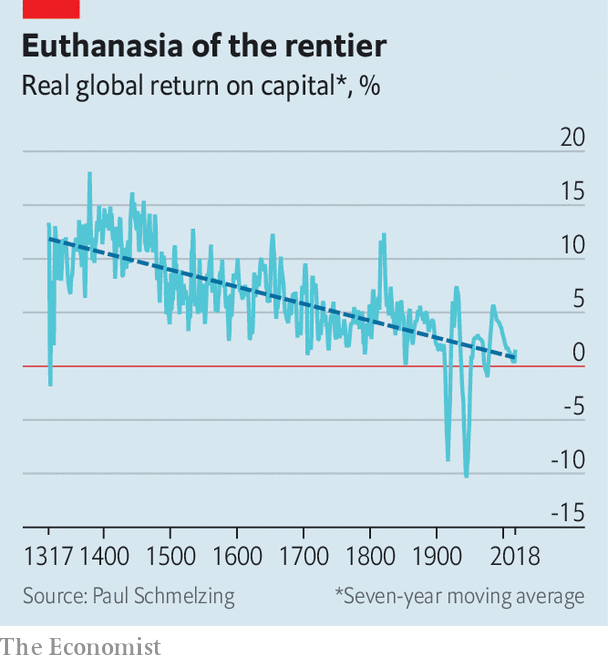

## Capital in the 14th century

# New research suggests that secular stagnation is centuries old

> Central bankers’ biggest problem may be ancient—and getting worse

> Jan 9th 2020

HOW LOW can interest rates go? It is a question that worries central bankers everywhere. Since the global financial crisis of 2007-08 rates have been pushed down to unprecedented levels in order to prop up growth. With central banks’ interest rates near or below zero across much of the world, room for further cuts to combat the next downturn is limited. If America’s Federal Reserve can manage to keep nominal rates at 2% or higher over the long term, it should be able to cope with the help of policies such as quantitative easing, mused Ben Bernanke, a former Fed chairman, at the conference of the American Economic Association (AEA) on January 4th. Alas, a working paper* published by the Bank of England the previous day suggests that rates could have further to fall.

Most research on long-term trends in interest rates relies on data from the past century. But Paul Schmelzing of the Yale School of Management has gathered information on real interest rates (that is, corrected for inflation) covering 78% of advanced-economy GDP going back to the early 14th century, when capitalism and free markets began to emerge. He found that real rates have declined by 0.006-0.016 percentage points a year since the late Middle Ages (see chart). That may not seem much, but it means real interest rates have fallen from an average of around 10% in the 15th century to just 0.4% in 2018.

That conclusion undermines the claim that “secular stagnation” is a recent economic malaise. The concept gained prominence after Larry Summers of Harvard University used it in 2013 to describe the falling rates of return on investment and economic growth in the American economy since the 1970s. Mr Schmelzing’s data instead suggest that secular stagnation, insofar as it means falling interest rates, has been a feature of capitalism since its birth. Rates falling since the early 1980s may be less the result of acute problems, such as an ageing population, than markets simply snapping back to a centuries-old trend.

The data also challenge some of the arguments of Thomas Piketty’s “Capital in the Twenty-First Century”, one of the best-selling economics books of all time. These rely on the claim that the return on capital has stayed constant and been consistently higher than economic growth. Under such conditions capitalism produces ever-greater income inequality, Mr Piketty claims, since there are no forces acting against the steady concentration of wealth. If real interest rates—and hence, returns on capital—have been falling for centuries, however, there may well be such a force.

Mr Schmelzing’s conclusions pose an even starker challenge to central bankers. If the historical trend continues, by the late 2020s global short-term real rates will have reached permanently negative territory. By the late 21st century, long-term rates will have joined them. Even unconventional monetary policies, which rely on driving down long-term rates, would then lose traction. Any hopes for nominal rates of 2% or more, in the long term, may prove to be a pipe dream. ■

*P. Schmelzing, “Eight centuries of global real interest rates, R-G, and the ‘suprasecular’ decline, 1311-2018”, Bank of England Staff Working Paper No. 845, January 2020.

## URL

https://www.economist.com/finance-and-economics/2020/01/09/new-research-suggests-that-secular-stagnation-is-centuries-old
