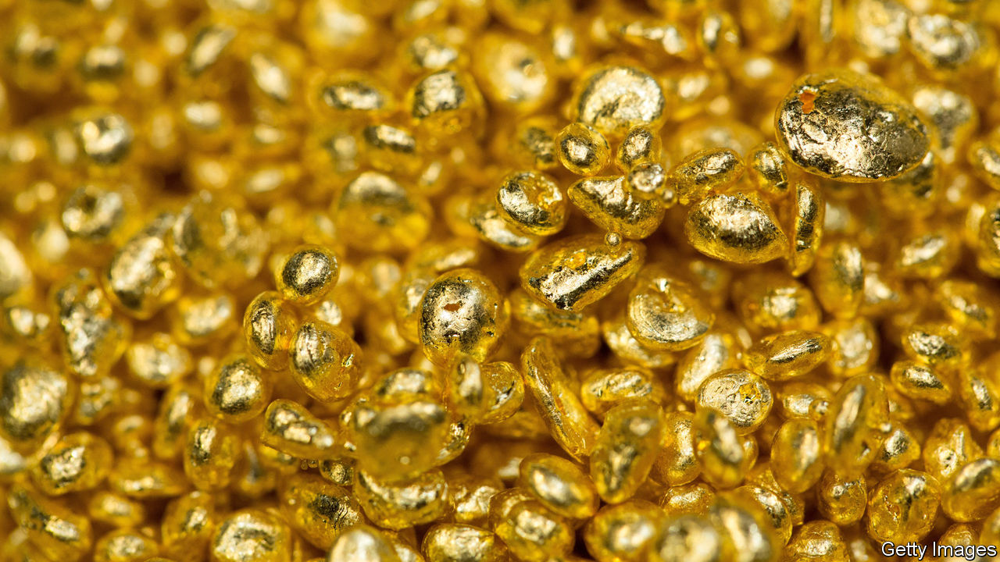
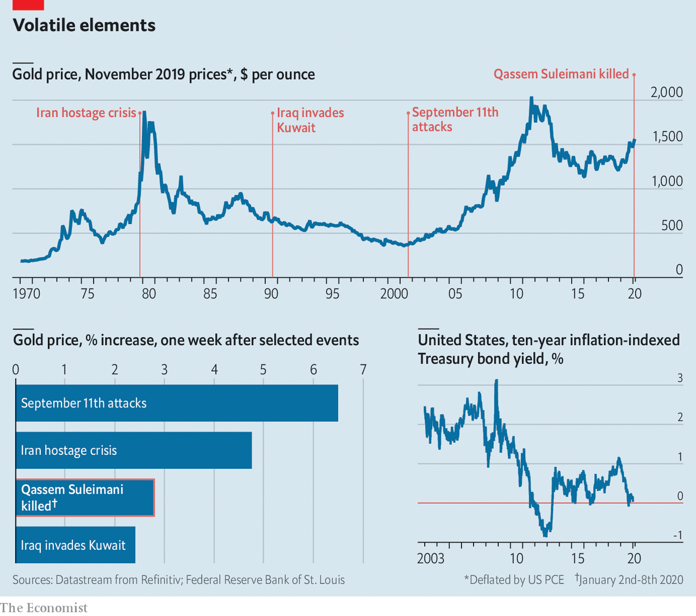

## Worth its weight

# The killing of Qassem Suleimani sends gold to a seven-year high

> But the precious metal had already been on a long rally

> Jan 9th 2020

“NOBODY REALLY understands gold prices, and I don’t pretend to understand them either,” said Ben Bernanke, then chairman of the Federal Reserve, in 2013, after a turbulent few months in the market for the metal (it hit its all-time peak in 2011, at the height of the euro-zone crisis and following a downgrade of America’s credit rating). Yet it is not hard to see why the metal hit its highest level since early that year—$1,588 per ounce—on January 6th.

The jump followed the drone strike that killed Qassem Suleimani, leader of the Quds Force of Iran’s Islamic Revolutionary Guard Corps, three days earlier. The rise of 2.9% over two trading days is similar to those after other Middle Eastern flare-ups. (Oil prices also leapt: Brent crude rose by 5%, briefly topping $70 a barrel.) Iran’s attack on the Al-Asad airbase on January 8th caused a further 2% jump, to $1,611 per ounce, before investors concluded that Iran was saving face, rather than escalating.

Investors typically rush into gold when geopolitical risk soars. However, its price has been rising for a while, climbing by more than 25% since November 2018. The reason is falling real (ie, inflation-adjusted) interest rates. The most common measure is the yield on ten-year inflation-indexed American Treasury bonds (TIPS); after the Federal Reserve began cutting rates this slid from around 1.1% in November 2018 to near zero last August. That was the lowest since 2013, the last time gold was so dear.

Analysts at PIMCO, a fixed-income asset manager, think of gold as an asset with no default or inflation risk (in inflationary times, investors often regard it as a hedge against rising prices). That makes it pretty similar to TIPS, except that gold never yields any interest. If real rates rise, gold’s relative attractiveness falls; when they fall, it rises.

Gold is not for everyone. Warren Buffett, probably America’s most celebrated investor, is certainly no fan. He once said that the metal “gets dug out of the ground in Africa, or someplace. Then we melt it down, dig another hole, bury it again and pay people to stand around guarding it. It has no utility.” John Pierpont Morgan, eponymous founder of America’s biggest investment bank, held a different opinion, quipping that “gold is money, everything else is credit”. And when the return for providing credit is close to zero, it is little surprise that investors want their money in gold.