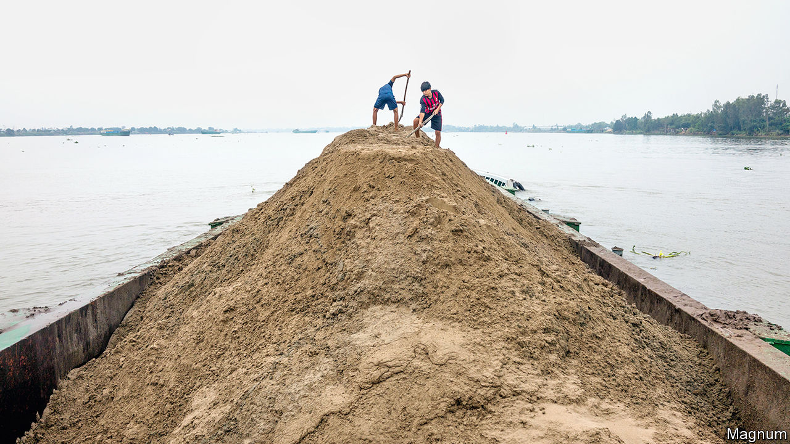

## Bring me a nightmare

# Asia’s hunger for sand is harmful to farming and the environment

> But governments struggle to curb illegal sand-mining

> Jan 18th 2020CAM DINH

THE MINERS usually prefer to work under cover of darkness. This dredger is more brazen. It is not yet sunset when the boat’s crew begin hoovering sand up from the riverbed and pumping it onto a nearby bank, where it will be collected and sold. At least seven barges are doing the same thing on this stretch of the Red River, about an hour’s drive from Hanoi, the capital of Vietnam. Such teams often work without the right permits, but the rewards outweigh the risk. Whereas the average Vietnamese makes $269 a month, miners can earn between $700 and $1,000 for every boatload they scoop up. The teams working here have deposited so much sand on the bank that dunes have formed.

There has probably never been a better time to be in the sand business. The world uses nearly 50bn tonnes of sand and gravel a year—almost twice as much as a decade ago. No other natural resource is extracted and traded on such an epic scale, bar water.

Demand is greatest in Asia, where cities are growing fast (sand is the biggest ingredient in concrete, asphalt and glass). China got through more cement between 2011 and 2013 than America did in the entire 20th century (the use of cement is highly correlated with that of sand). Since the 1960s Singapore—the world’s largest importer of sand—has expanded its territory by almost a quarter, mainly by dumping it into the sea. The OECD thinks the construction industry’s demand for sand and gravel will double over the next 40 years. Little wonder then that the price of sand is rocketing. In Vietnam in 2017 it quadrupled in just one year.

In the popular imagination, sand is synonymous with limitlessness. In reality it is a scarce commodity, for which builders are now scrabbling. Not just any old grains will do. The United Arab Emirates is carpeted in dunes, but imports sand nonetheless because the kind buffeted by desert winds is too fine to be made into cement. Sand shaped by water is coarser and so binds better. Extraction from coastlines and rivers is therefore surging. But according to the United Nations Environment Programme (UNEP), Asians are scooping up sand faster than it can naturally replenish itself. In Indonesia some two dozen small islands have vanished since 2005. Vietnam expects to run out of sand this year.

All this has an environmental cost. Removing sand from riverbeds deprives fish of places to live, feed and spawn. It is thought to have contributed to the extinction of the Yangzi river dolphin. Moreover, according to WWF, a conservation group, as much as 90% of the sediment that once flowed through the Mekong, Yangzi and Ganges rivers is trapped behind dams or purloined by miners, thereby robbing their deltas both of the nutrients that make them fecund and of the replenishment that counters coastal erosion. As sea levels rise with climate change, saltwater is surging up rivers in Australia, Cambodia, Sri Lanka and Vietnam, among other places, and crop yields are falling in the areas affected. Vietnam’s agriculture ministry has warned that seawater may travel as far as 110km up the Mekong this winter. The last time that happened, in 2016, 1,600 square kilometres of land were ruined, resulting in losses of $237m. Locals have already reported seeing dead fish floating on the water.

Nguyen Van Thoan, a farmer whose pomelo orchard lies not far downstream from the barges scouring the Red River, says that 30 years ago a kilometre of land stood between his house and the river. Today only 20 metres separates them. He blames sand-miners. So do the 6,000 fishermen who have had to abandon their coastal villages in the Indian state of Kerala in recent years, after extraction and erosion left them vulnerable to flooding.

Curbing sand-mining is difficult because so much of it is unregulated. Only about two-fifths of the sand extracted worldwide every year is thought to be traded legally, according to the Global Initiative Against Transnational Organised Crime. In Shanghai miners on the Yangzi evade the authorities by hacking transponders, which broadcast the positions of ships, and cloning their co-ordinates. It is preferable, of course, to co-opt officials. Ministers in several state governments in India have been accused of abetting or protecting illegal sand-mining. “Everybody has their finger in the pie,” says Sumaira Abdulali of Awaaz Foundation, a charity in Mumbai. She says she has been attacked twice for her efforts to stop the diggers.

Ms Abdulali is nonetheless “a bit hopeful”. Scientists are experimenting with alternatives to concrete and cement. Architects are trying to find ways to use such materials more sparingly. Even the odd government is taking action. In 2018, Maharashtra passed regulations requiring contractors to use plastic waste as filler when building or repairing roads. Singapore is creating a new patch of land by draining it of water rather than piling it with sand. Kiran Pereira of SandStories.org, which promotes awareness of the issue, says “there are plenty of solutions” if only governments would find the will to implement them. Time to pull heads from the sand. ■

Correction (January 24th 2020): The original version of this article wrongly stated that sand was the biggest ingredient in cement. Sand is in fact the biggest ingredient in concrete, which also uses cement.