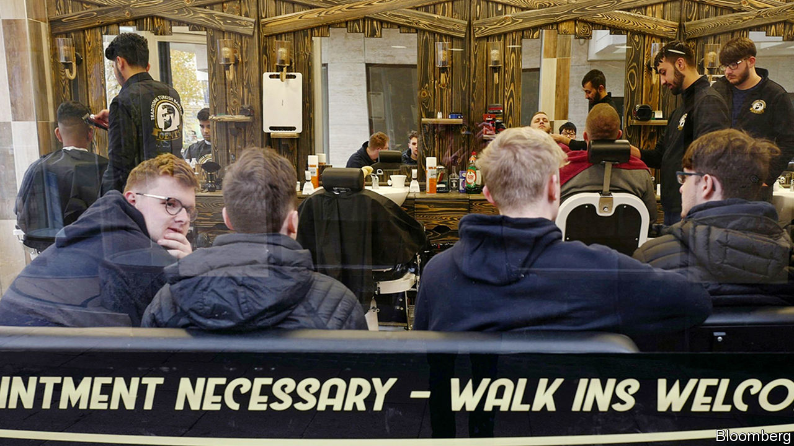

## Turkish delight

# Why Turkish barbers are taking over Britain’s high streets

> Last year, 675 new barbers’ salons opened, making them the fastest-growing independent sector

> Jan 16th 2020MELKSHAM

MELKSHAM, A SLEEPY town in Wiltshire, is not generally thought to sit at the apex of gentlemen’s fashion. Yet a stroll down its high street reveals a tonsorial revolution deep in the heart of Britain. A coincidence of economic, cultural and political factors has transformed Britain’s barbershops, once the preserve of staid men demanding a uniform “short back and sides”.

Inspired by “Peaky Blinders”, a BBC period crime drama, there is a vogue for complex hairdos—in particular, harshly shaved backs and sides topped with a pompadour-style quiff. Combined with the persistent popularity of beards, which look suave rather than shaggy only if properly maintained, this has fuelled the growing market in male grooming.

Richard Davies, an economist, and formerly this newspaper’s economics editor, regards the boom as the masculine equivalent of the “lipstick effect”, whereby in periods of economic uncertainty women forgo luxury items for cheaper, eye-catching goods. “We have very weak wage growth. People can’t afford a house or a new car, and are falling back on pampering themselves with a small treat.” Rising demand and falling rents have led to an invasion of the high street by men armed with clippers and razors. Last year, 675 new barbers’ salons opened, ranking the business as the fastest-growing independent sector.

Many of them are Turkish. Thanks to a barbering tradition natural to a hirsute region, and a more liberal visa regime than Middle Eastern countries, Turkish barbers have established a potent brand in Britain.

At Moredon Turkish Barbers in Swindon, Mustafa Can explains their success. “People like that it’s traditional, that we burn the hairs out of the ears and nose, that we use a cut-throat razor and a hot towel.” Barbering comes naturally to Turks, says Mr Can: as a boy, he combined his schoolwork with training in the trade. But although all barbers from the region tend to call themselves Turkish to benefit from the power of the brand, success has brought competition from farther afield, and with it echoes of regional tensions.

“A lot of Kurdish are freedom fighters, they like the gun,” says Ramzi Mawloud, an Iraqi in Swindon. “So when…they see that I’m making money, without any respect, they open a shop next door.” Aziz Buyukertas, a Turk operating in Melksham, says, “Kurdish barbers are going everywhere, some of them are taking the piss. Every town there are three, four, five of them.” Mr Can warns of newcomers’ suspect scissoring. “They don’t have a clue. They are going to burn your ears or cut your skin.” Fresh locations, he says, are drying up. “I google other places and see that they have one already. There is nowhere left to go.”

Competition is forcing British barbers to change their practices. “The Turks keep us on our toes,” laments Gary Hatto, who has a chain of barbershops. “Turks are willing to work seven days a week and you’ve got to admire a man who does that…we’ve started trying to do that now.” But Mr Hatto is unlikely to be put off by intensifying competition. Four years ago, he was jailed for biting a rival barber. ■

## URL

https://www.economist.com/britain/2020/01/16/why-turkish-barbers-are-taking-over-britains-high-streets
