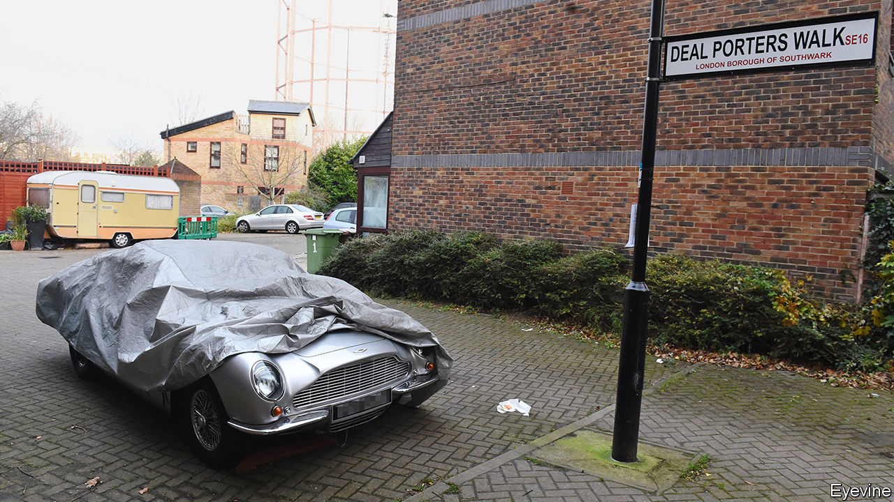

## Driving nowhere fast

# Aston Martin is stuck in neutral

> An attempt to emulate Ferrari’s roaring success has not worked as planned

> Jan 18th 2020

FEW ASTON MARTIN owners dare push their sports cars to the edge of losing grip in a fast corner. The same cannot be said of shareholders in Aston Martin Lagonda (AML), which owns the prestige brand. An ill-judged initial public offering in 2018, predicated on rapid growth, has the company careening.

The IPO was an attempt to emulate the success of Ferrari, which floated in 2015. (The chairman of Exor, which has a significant stake in Ferrari, also sits on the board of The Economist’s parent company.) The Italian supercar-maker enjoys 25% operating margins, closer to what LVMH makes on its Louis Vuitton handbags than what Daimler gets for Mercedes cars. Ferrari’s share price has trebled since going public. AML’s, by contrast, has plunged by three-quarters. Its market value now stands at just £1.1bn ($1.4bn). After turning an operating profit in 2017 and 2018, in November it reported a loss for the first nine months of last year. On January 7th the company issued its second profit warning since July.

AML is selling far fewer cars than it hoped—20% fewer relative to early forecasts for 2019, when around 5,800 actually rolled off the production line. The goal of making 14,000 cars a year by 2023 looks fanciful. Attempts to meet it, by investing in new models, have left AML with net debts of around £900m. Wary bond investors are demanding coupons as high as 15% to refinance £100m about to come due. Aston Martin has pasted its logo on helicopters and blocks of flats. But if Max Warburton of Bernstein, an equity-research firm, is correct in his heretical suggestion that perhaps the brand is not that strong after all, such non-auto ventures may flop.

Aston’s legacy of losing money is as rich as that of making fast and glamorous cars. In its 106 years James Bond’s wheels of choice have endured seven bankruptcies. This time investors bet on AML thanks to a credible leader—Andy Palmer, a shrewd industry executive—and a plausible plan to expand its range of vehicles. It has already launched three new GT cars, suited to long, comfy journeys. Next year it plans to unveil a mid-engined car, the Valhalla, to take on Ferrari, better-known for such machines. And it has taken 1,800 orders for its SUV, the DBX, following in the tyretracks of Bentley, Rolls-Royce and Lamborghini. 

Even if all these AML offerings prove wildly successful, they may not bring in enough cash to ensure a succession of new models needed to keep wealthy petrolheads coming back to the brand. Philippe Houchois of Jefferies, a bank, reckons that if AML sells 5,000 of the cars that start at £158,000 at a 15% margin, that would only bring in enough cash to cover £100m in annual interest on its debts. The overall market for sports cars is not growing fast and Evercore ISI, a broker, points out that rivals’ SUVs have eaten into sales of their other cars. AML can expect the same.

Mr Houchois reckons that AML needs £400m-500m to tackle its debts and invest in its future. The firm says it is “reviewing its funding requirements”. Lawrence Stroll, a Canadian billionaire who co-owns a Formula 1 team, is said to be ready to inject £200m into the business. Apparent interest by Geely, a Chinese carmaker that also owns Volvo, Lotus and 10% of Daimler, pushed AML’s shares up this month. But any rescuer, should one come forth, risks looking like an Aston Martin buyer—stuck owning a fast-depreciating trophy asset. ■

## URL

https://www.economist.com/business/2020/01/18/aston-martin-is-stuck-in-neutral
