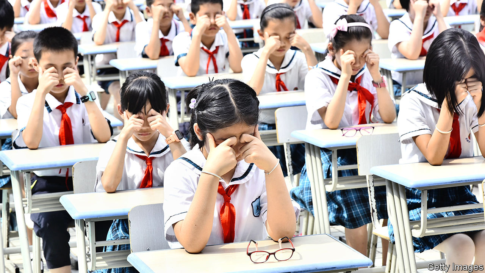

## Hope for myopes

# Most 12- to 14- year-olds in China are short-sighted

> Experts say they should get out more

> Jan 18th 2020BEIJING

THE PHONE on Wang Xiaoying’s desk rings incessantly on a weekday morning. An optometrist in Shanghai, Ms Wang doubles as a part-time operator for China’s first publicly funded call centre providing information about myopia. It began operating on January 7th. Most callers are parents who worry about the deteriorating eyesight of their young offspring. “Make sure your child spends two hours outdoors each day!” Ms Wang often urges them. Another tip she offers is to avoid reading when supine. Trying to focus on an object held up by an unsteady arm is likely to strain the eyes, some experts believe.

The government reckons that more than 450m people in China, or at least one in three, are short-sighted (meaning that distant objects appear blurry). Globally just over one in five are. The prevalence of myopia among Chinese schoolchildren is even more alarming. In 2018 an official survey of 1m pupils found that among those aged between 12 and 14, 72% had myopia, up from 58% in 2010. Early onset of myopia is associated with a higher risk of eye diseases such as glaucoma, which can lead to blindness. In 2018 Xi Jinping, the president, declared the swelling ranks of young myopes a “big problem concerning the future of the country” which “must not carry on”.

The affliction’s spread in China is partly related to genes. Myopia is more common among East Asians than among white people. A study in 2016 found that just 19% of white 17-year-olds in Britain were short-sighted. But lifestyle plays a big role. A report by the World Health Organisation says the genetic contribution is “considered small”. To the extent that genes are involved, they “may determine susceptibility to environmental factors”. These are often a lack of outdoor activity and excessive “near work”, ie, too much time staring at close objects. The combination of an exam-crazed culture with the rapid spread of smartphones and computer-game technology explains much of China’s problem.

A paper in 2008 by a group of Australian researchers supports this idea. The study tracked hundreds of ethnic Chinese children in Sydney and Singapore. Whereas only 3% of the children in Sydney had become myopic by the age of seven, 29% had in homework-obsessed Singapore.

Officials fret about rising myopia not only because they care about people’s health. Legal Daily, a government-owned newspaper, recently suggested that China’s security could be compromised by its shortage of military recruits with normal eyesight. Last year China’s navy relaxed requirements for new pilots, no longer insisting on 20/20 vision.

The Communist Party is trying to reverse the trend. In 2018 it pledged to ensure that, by the end of this decade, less than 60% of 12- to 14-year-olds would be short-sighted. It also said the proportion of 15- to 17-year-olds with myopia should fall below 70% by then, down from 80% two years ago. Since 2018 periodic eye exams have been made compulsory at schools. Qiu Yu, a headmaster in Beijing, says his 1,800 pupils take eye tests twice a year. Headmasters whose pupils show a worsening trend in eyesight are summoned for “talks” by education officials, Mr Qiu explains—ie, a dressing down.

The party’s remedies include evidence-based as well as unorthodox prescriptions. Schools must ensure that students have at least an hour a day of outdoor activity (many experts believe sunlight helps prevent myopia or slow down its progression). Pupils in the first two years of primary school—a time of life when eyes are highly sensitive to strain—must not be given written homework. Those in the final year of primary school should receive at most one hour of it daily. Video-game makers must release fewer new products and devise ways of limiting the time children spend playing them. Schools and families must encourage children to avoid sweets and eat more fish. Experts agree that fish, which has high levels of omega-3 fatty acids, is good for eye health. Many doctors also recommend avoiding sugary foods, though why this helps is unclear.

More controversially, schools must ensure that pupils do “eye exercises” twice a day. These involve massaging the region around the eyes using the knuckles, with the thumbs placed on the temple (see picture). Mr Qiu, the headmaster, says that each set of exercises takes five minutes. The practice has its origins in traditional Chinese medicine. As with many remedies of such provenance, there is no sound evidence that it works.

The government could be doing more. Academics believe the proportion of pre-teens in China’s countryside who suffer from myopia may be five percentage points lower than in urban areas. That may be because they spend more time outdoors. But only one in seven rural schoolchildren who need glasses wear them, says a recent report by James Chen of Clearly, an international charity. A pair of cheap spectacles costs less than 50 yuan ($7). Yet many rural Chinese think that wearing glasses aggravates myopia. In fact, squinting without glasses puts more strain on the eyes, and may cause sight to worsen. Officials should try harder to discredit mistaken beliefs.

Yang Lili, a mother of a bespectacled 12-year-old in Beijing, is grateful that officials are belatedly paying attention to “the poison” of myopia. But they are “only scratching the surface, not solving the real problem”, she says. Ms Yang blames the entire culture of education. The fact remains that admission to the best universities involves intense cramming for a single exam. Schools may reduce homework. But parents “will continue to find private tutors and anything that gives their child an edge”. Another plan may be needed. ■