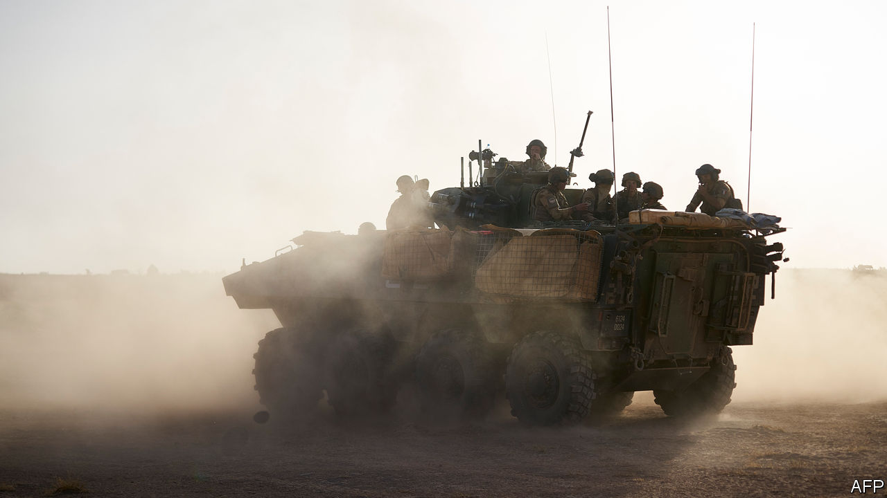
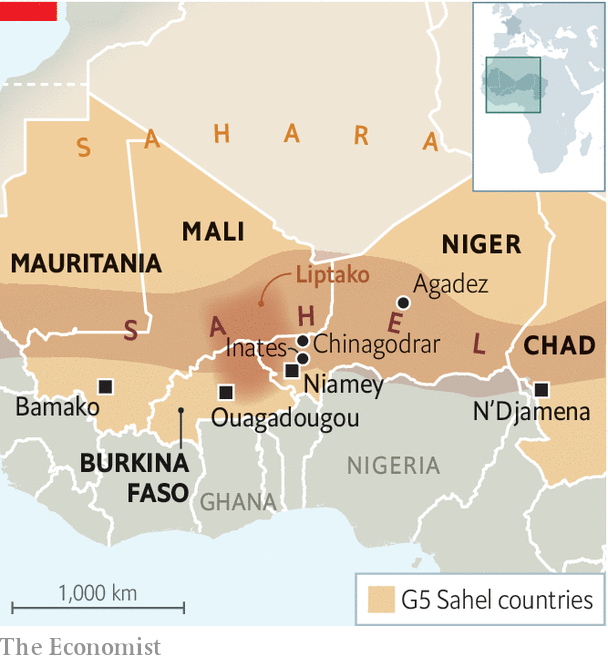

## A small Afghanistan

# France weighs up its thankless mission fighting jihadists in Africa

> African governments want French help, but not all Africans agree

> Jan 18th 2020PARIS

AFTER NIGHTFALL on a moonless evening last November, three French combat helicopters, backed by fighter jets, took off from military bases deep in the African Sahel. Their mission was to support a French commando operation on the ground, tracking terrorists in pickup trucks and motorbikes in the Liptako region of Mali. Flying in tight formation and close to the ground in total darkness, two of the helicopters collided. Thirteen French soldiers, the youngest aged 22, were killed.

The deaths shook France. They also revived questions about what exactly the country is doing in this vast semi-arid belt south of the Sahara desert. On January 13th, at a summit he hosted in the French south-western town of Pau with the leaders of five Sahel countries, President Emmanuel Macron tried to provide an answer. France is there to bring “security and stability”, he declared, and nothing else. “If at any time an African state asks the French army not to be there any longer,” Mr Macron said irritably, “we’ll leave.”

The paradoxes and agonies of the French operation, known as “Barkhane”, have been brutally exposed by these deaths, as well as those of (many more) troops from other African countries. In early January 89 soldiers from Niger died in a jihadist ambush of a military post in Chinagodrar, near the border with Mali. This followed a separate attack on a military base in Niger, at Inates, that killed 71 soldiers. The borderlands between Niger, Burkina Faso and Mali have become a zone of chronic instability, trafficking and jihadist activity. This has thrived in the Sahel following the collapse of Islamic State in Syria and Iraq, and Libya’s descent into chaos. France, says Marc-Antoine Pérouse de Montclos, author of a new book on France in the Sahel, has been dragged into what he calls “mission impossible”.

It was President François Hollande who originally dispatched French troops to Mali back in 2013 in order to beat back a jihadist incursion. This was not supposed to be a permanent operation. Yet, seven years on, France still has 4,500 troops there. In theory they help train and work alongside a joint force of 5,000 from Burkina Faso, Chad, Mali, Mauritania and Niger, known as the G5 Sahel. But these forces—Chad’s apart—are not considered to be up to the job. There is also a United Nations peacekeeping force in Mali some 15,000 strong.

Mr Macron, who belongs to a generation that has never known Africa under French colonial rule, took office in 2017 keen to take a less paternalistic approach than his predecessors did. He has forged links with non-Francophone countries, including Nigeria and Ghana, promised to give back African art works from Paris, and spoken of the “crimes of colonisation”. Mr Macron considers the French anti-jihadist operation in the Sahel to be “absolutely essential” in the struggle against terrorism, which France feels is a burden it is carrying on others’ behalf.

So it is with evident frustration that Mr Macron now also finds himself the target of a hostile anti-France campaign in the region. Protesters in the Malian capital of Bamako, and in neighbouring Niger, have demanded that French troops should leave. Critics accuse France of propping up autocrats. Some political leaders, meanwhile, are lukewarm about France’s effort.

Amid the charges and countercharges, the purpose of this week’s summit in Pau, says a French official, was “clarification”. Mr Macron declared in December, while at the NATO summit in London, that he “cannot and will not” keep French soldiers on the ground in the Sahel as long as there is ambiguity about whether they are welcome. In Pau he secured from the leaders of the five Sahel countries a formal affirmation of their “wish that the French military engagement in the Sahel should continue”.

Yet France finds itself increasingly alone. It has some limited help from the British, Danes, Estonians and Germans. And it is trying to help build up local capacity. Its real partner, though, is America, which runs its own counter-terrorism activities in the region, including an air and drone base in Agadez, in the desert in central Niger, and another surveillance facility in the north. Now the Pentagon is considering scaling back its operations. “We are stuck,” says François Heisbourg of the Foundation for Strategic Research, “We’re in exactly the sort of place we wouldn’t want to be; it’s a small Afghanistan.” ■

## URL

https://www.economist.com/europe/2020/01/18/france-weighs-up-its-thankless-mission-fighting-jihadists-in-africa
