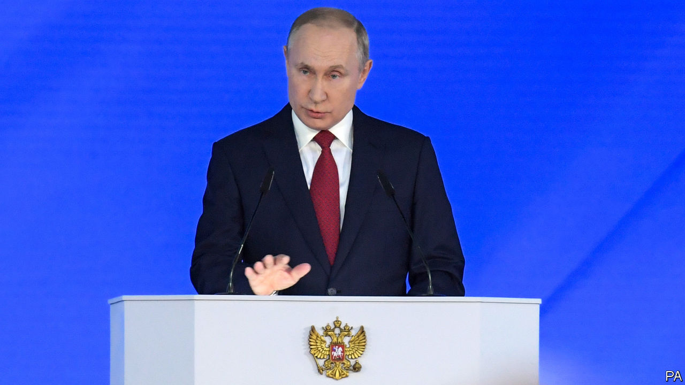

## Glued to the throne

# How Vladimir Putin is preparing to rule for ever

> The details are murky, but Putin’s plan for constitutional change looks like a long-term power grab

> Jan 16th 2020

WHAT IS VLADIMIR PUTIN playing at? On January 15th Russia’s president took Kremlin-watchers by surprise. In his state-of-the-union speech, he announced a radical overhaul of the Russian constitution and a referendum on its proposed (still very unclear) terms. This bombshell was immediately followed by another. The prime minister, Dmitry Medvedev, resigned along with the entire cabinet. As The Economist went to press, the reasons for Mr Medvedev’s ejection and replacement by an obscure technocrat remained a riddle wrapped in a mystery.

To understand what might be going on, start with a simple fact. In the past 20 years Mr Putin’s regime has killed too many people, and misappropriated too many billions, to make it plausible that he would ever voluntarily give up effective power. Under the current constitution he cannot run again for president when his term expires in 2024, since no one is allowed more than two consecutive terms. So everyone has always assumed that one way or another he would game the rules to remain top dog. He already has form on this. His first two terms as president ran from 2000 to 2008. Term-limited out for the first time, he became prime minister for four years, during which time Mr Medvedev served as a distinctly neutered president. In 2012 Mr Putin was back in the suddenly re-empowered presidency, and was re-elected to a second term in 2018. The only enigma has ever been what job he would jump to in 2024.

We still do not know. One option, clearly, is for Mr Putin to return to being prime minister; an argument for this happening is his statement that the new arrangements he is seeking will make the post more important, with full powers to appoint the cabinet (subject to confirmation by parliament, which Mr Putin’s loyal United Russia party controls), rather than letting the president pick them. Another, and more likely, option is that Mr Putin will seek to maintain his hold on power by continuing to head a vaguely defined but powerful body called the State Council, which (funnily enough) Mr Putin said in his speech should be given more powers under the rejig.

In reality the details do not much matter. Russia is a dictatorship masquerading as a democracy. Mr Putin’s electoral successes owe much to years of economic growth (now brought to an end by corruption, uncompetitiveness, the end of the oil boom and Western sanctions following the annexation of Crimea in 2014) and the popularity of his reassertion of Soviet-era imperium. But they owe perhaps even more to state control of television, the barring of popular opposition candidates, the co-opting of tame opposition parties and the arrests and intimidation dished out to the less tame ones. The murder of political opponents is no way to foster genuine competition for power.

Whether Mr Putin is president, prime minister, head of the State Council or honorary chairman of the National Bridge Association (the post through which Deng Xiaoping ruled China for years after stepping down from his more prestigious offices), makes a lot less difference than it would in a real democracy. Nor does anyone know what the final shape of the new constitution will be. Mr Putin may decide, as many a despot has done before him, that a new constitution means resetting the existing term limits. Or, as Xi Jinping did in China in 2018, he could simply scrap term limits altogether (he says he does not want to do this). Mr Xi did not even bother with a referendum, pushing the change that will allow him to rule indefinitely through the supine National People’s Congress with 2,959 votes out of 2,964. Another model is offered by Kazakhstan, where Nursultan Nazarbayev, who became his independent country’s first president in 1990, stepped down last year—only to stay on as leader of the ruling party and holder of the title “Leader of the Nation”.

America would once have spoken out against such rule-twisting. Under Donald Trump, it does not; the American president makes little secret of his admiration for strongmen. Nor is the EU likely to do more than mutter as Mr Putin glues himself to the throne. It is spooked by a rising China and dependent on Russia for its gas supplies. The world’s autocrats will watch events in Moscow with interest, to see if Mr Putin can offer them useful tips for extending their own rule. For democrats everywhere, the only comfort is that even rulers-for-life don’t live for ever. 