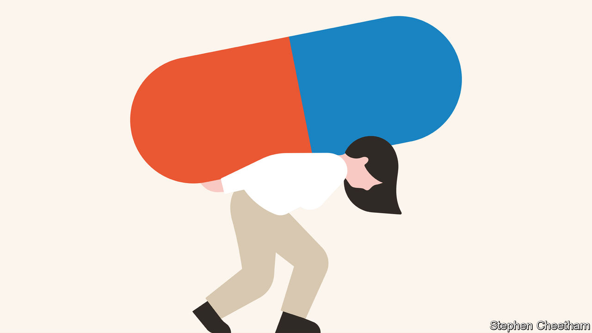

## Backs on the rack

# Vast sums are wasted on treatments for back pain that make it worse

> Most patients should be prescribed exercise and patience, not invasive surgery

> Jan 16th 2020

FOR SOME people it starts with an injury: a skiing accident or a car crash. For others it starts with something seemingly innocuous, like picking up a pair of socks from the floor. But for most, back pain is as mysterious as it is excruciating. Some 85% of chronic sufferers have what doctors call “non-specific” back pain, meaning it has no clear physical cause.

In most countries, whether rich or poor, back pain is the leading cause of disability, measured by the number of years lived in poor health (see [Briefing](https://www.economist.com//briefing/2020/01/18/back-pain-is-a-massive-problem-which-is-badly-treated)). It often strikes people in middle age and keeps them wincing, on and off, for the rest of their lives. Many lose their jobs, either because they feel physically unable to work or because they become depressed. Back pain is the main reason why Europeans drop out of work and a big reason why Americans get hooked on opioids.

The problem is not that back pain is undertreated. Far from it. Americans spend $88bn a year to treat back and neck pain—almost as much as the $115bn spent treating cancer. Add lost productivity to the medical bills, and chronic pain (the lion’s share of which is back pain) costs America an estimated $635bn a year—only a bit less than its defence budget. The scandal is that the treatments offered are mostly the wrong ones.

Doctors in rich countries are far too quick to prescribe addictive painkillers—a practice that is now spreading to the developing world. They are also too quick to offer magnetic-resonance imaging (MRI) scans. In rich countries perhaps 80% of MRIs for back pain are unnecessary. The scans often find an “abnormality”, such as disc degeneration or a “slipped” disc. These are common even in people who do not suffer back pain, but desperate patients often demand swift intervention to “fix” the “problem” the scan has revealed. Surgery with unproven benefits, or which has been shown not to work, is common. Cigna, an American insurer, found that 87% of customers who had spinal-fusion surgery for wear and tear of spinal discs were still in so much pain two years later that they needed more treatment. And spinal injections, another treatment, often do little good.

For most back pain, the best treatment is non-medical. Do some stretching exercises. Keep moving. Don’t give up work or lie in bed for days on end—that will probably make things worse. Above all, be patient. The problem may not be your back; it may be that the brain’s pain-signalling system is not working properly—and, alas, medical science does not know why. The pain may be partly psychosomatic. The stress of a bad marriage, a horrible boss or a sick kid may bring it on. People who suffer mental trauma when young are more likely to experience back pain in middle age. In many cases, the right exercises and the passage of time can ease the pain. And unlike surgery, they cost very little and are unlikely to make things worse.

Health systems get back pain wrong for several reasons. People who are in agony unsurprisingly want something to be done about it. It is easier for a doctor to prescribe painkillers, scans or injections than to explain to patients that such treatments are unlikely to work. Doctors and hospitals are often paid more for doing things than for giving advice. In America, Australia and the Netherlands, insurers pay for back operations costing tens of thousands of dollars, but barely cover physiotherapy.

The answer is to educate patients better, so they don’t feel they are being fobbed off when told to do stretching exercises. Doctors need better training, too—back pain gets short shrift in medical curriculums. More research is needed into the effectiveness of surgery. But most of all, governments and insurers need to start paying for the right things. This will be hard. Costly interventions have a powerful lobby, and there is no exercise-industrial complex to counterbalance it. With luck, more effective treatments for back pain may be developed in the coming years. But for now, policymakers should show some spine and turn their backs on treatments that don’t work.■