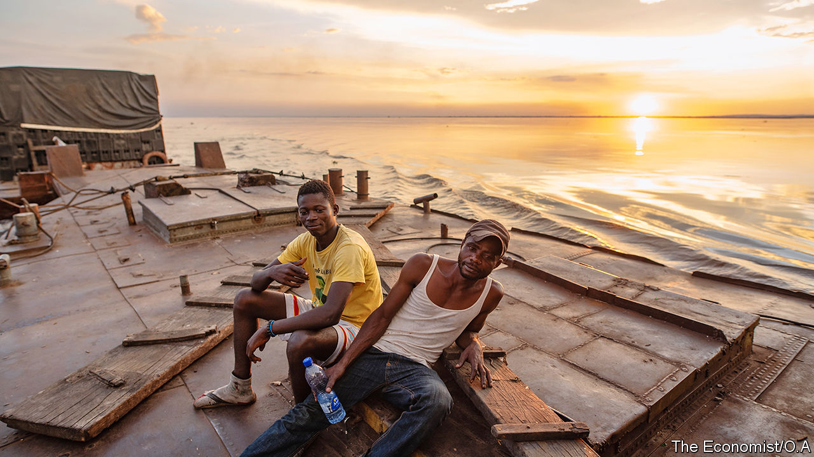
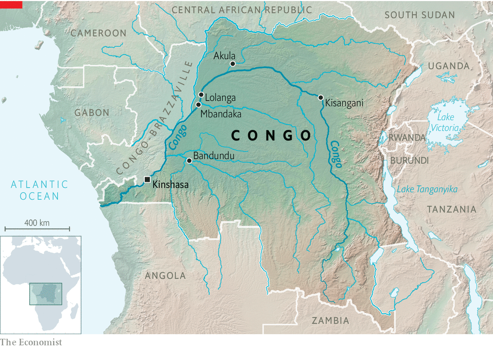
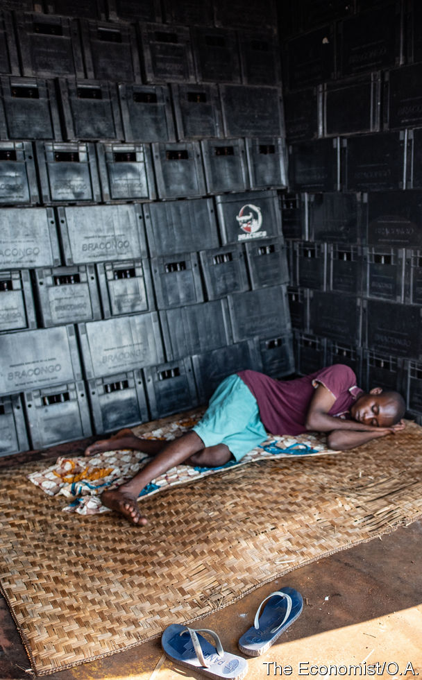
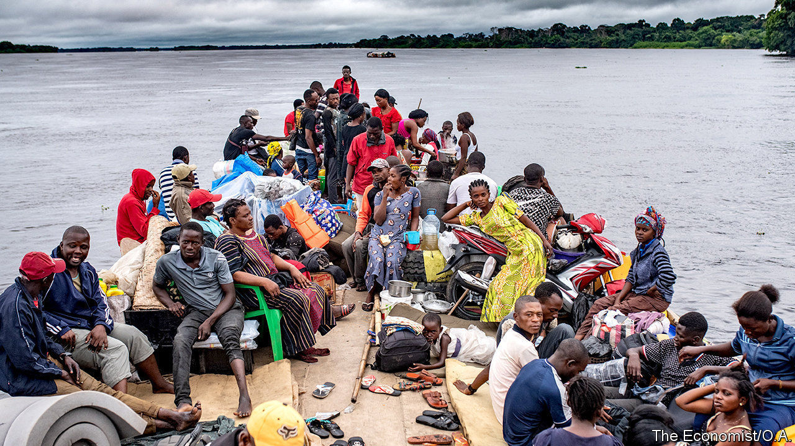
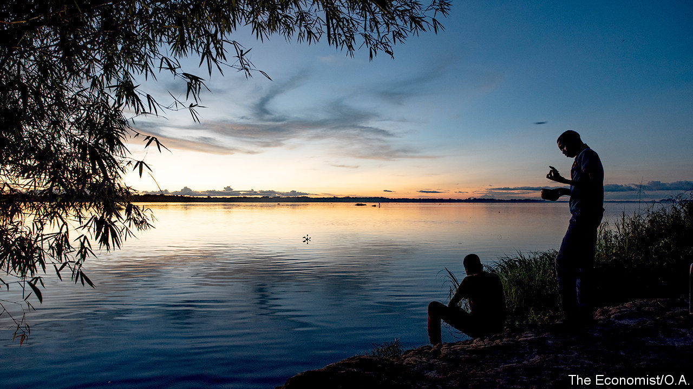
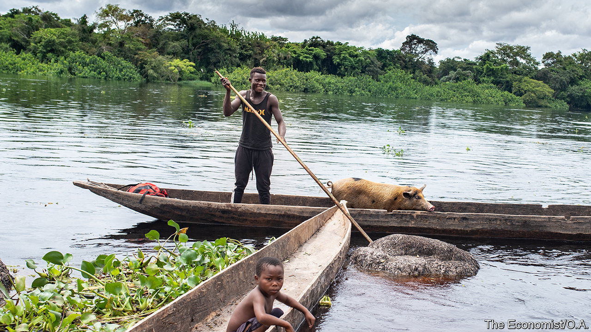

## Follow the bottle

# How to get beer around Congo, a country with hardly any roads

> A journey up the Congo river

> Jan 18th 2020MBANDAKA

THE BARGE, weighed down by half a million bottles of beer, pulls out into the middle of the Congo river. At its tip, breezy rumba music drifts out of a small radio and a group of young men sit around grumbling about the hardships of life on board. “We stay on this boat until death,” claims one sailor (pictured, above right). In reality, the crew spends a total of only six months on the barge a year—although the risk of it sinking is not trivial. Laden with beer belonging to Bracongo, a brewery, the boat is travelling from Kinshasa, the capital of the Democratic Republic of Congo, to the city of Bandundu, 387km (240 miles) upstream.

Omar Barcat, the barge’s owner, has been running a fleet of five cargo ships for 20 years. He predicts that various apparatchiks, some wielding Kalashnikovs, will intercept the boat at several points along the river. They will try to extort payoffs that amount to around $500. Unruly sailors are another problem. Far away from their bosses back in the capital, they are sometimes tempted to stop off in villages and visit friends. Occasionally they drink beers they claim have exploded or broken (which can lead to worse misdemeanours). “But they know that if anyone is caught doing that he will immediately be fired,” he says.

Much is at stake for Mr Barcat and for Bracongo. The brewery, owned by Castel, a French firm that operates across Africa, has been competing with Bralima, owned by the Dutch company Heineken, for customers in Congo for 70 years. Both breweries have been around since colonial times; unlike most foodstuffs in Congo, beer is local. And yet the difficulty for both companies is getting bottles from the factory to the bar.

Congo is not an easy country to get around. China has three metres of road per citizen; Congo has three centimetres. Only four out of 26 provincial capitals have roads that reach Kinshasa. Some villages are so isolated that they still use a currency that was abolished in 1997. It is no surprise that, in the east, the government has little control and the people in power are those with guns. Millions have fled the violence there over the past 20 years.

For most people the only way to travel long distances is to go on boats that ply the Congo river and its tributaries. All the beers that reach the country’s dense, forested interior will have been shipped up the river. The journey on Mr Barcat’s boat will take a week. If the roads in Congo were made of tarmac instead of undulating mud and sand, then the beers would reach Bandundu in less than a day. But the rusting carcasses of overturned vehicles languishing in ditches serve as a reminder of what can happen if that journey is attempted by a lorry with a heavy load.

In 2019 Bracongo had the edge over its competitor: it provided 53% of beers in the country, compared with 47% from Bralima, according to the brewery’s own statistics. In Kinshasa the two companies race to load up trucks each morning. “We try hard to get everything out by 7.30am. Bralima’s lorries leave between 7.30am and 8am,” says Teddy Junior Mena, head of Bracongo’s distribution. “And we are also trying to get a beer to every last village in Congo,” he adds.

Indeed, despite the country’s abysmal infrastructure, beer gets everywhere. Like the rumba music which is blasted from fuzzy speakers at every run-down bar, it is one of the few things Congolese can rely on. To understand how one brewery gets its wares to thirsty customers, your correspondent embarked on a series of voyages.

The Congo river traces a huge arc across the country from the south-east, through the city of Kisangani, past Kinshasa and out into the Atlantic Ocean (see map). It is both the second-longest river in Africa and the deepest. If its roaring water mass was turned into energy through hydroelectric dams, it could light up most of the continent.

For centuries the river has served as a trade route—for better and for worse. King Leopold II of Belgium, who ran Congo as his personal fief from 1885 to 1908, forced armies of villagers to harvest ivory, tap rubber and load these precious commodities onto boats. Wives were held hostage to ensure that their husbands submitted to forced labour. Those who did not work hard enough were killed or dismembered. Countless villagers hid deep in the forest to avoid enslavement. Fishing and subsistence farming collapsed. Deaths from starvation and disease soared; births plunged, since so many couples were separated. By one very rough estimate, Congo’s population fell by half, from 20m to 10m, between 1880 and 1920.

Leopold’s misrule attracted global condemnation. In 1908 the Belgian government prised Congo from his grip and ruled it somewhat less atrociously until 1960, when it became independent. Mobutu Sese Seko, a military despot, re-christened the country “Zaire” in 1971. In Kongo, a local language, this means “the river that swallows all rivers”. The name changed back when Mobutu was overthrown in 1997.

Today the river is a source of pride. Photos of fishermen in canoes on the river are stamped across the country’s banknotes. Just after setting out, Mr Barcat’s barge passes a man sitting astride four floating tree trunks, bound together with rope. Using a single oar, he guides his vessel towards the port where he will try to sell the wood. He has probably travelled from Mbandaka, a city in the heart of the Congo basin rainforest, some 586km upstream. If so, he will have spent two weeks punting down a wide stretch of murky water that is home to hundreds of crocodiles.

After a week Mr Barcat’s barge reaches Bandundu. From here, as in Mbandaka, smaller vessels carry the beers to tiny villages on the banks of the river. At the port in Mbandaka, Christine, a 40-year-old bar owner, picks up 70 crates of beer from the Bracongo depot. She travels to the city twice a month on one of these smaller vessels to collect beers for her bar and to sell to other bartenders. The trips are tough: she has to sleep out on deck in the rain and the muggy heat. “We are exposed to all the elements,” she sighs.

The second, spluttering wooden boat, which along with Christine and her beers carries around 150 people, 60 sacks of charcoal, palm oil, peanuts, two charred cobras (a regional delicacy) and a mournful-looking chicken, finally sets off, after a five-hour delay, at 9pm. Rumba music hums from several battery-powered radios. Modified Chinese generators power the boat. Fiston, a member of the crew in his early 20s, explains that there are five generators so the boat will not have to stop when one or two inevitably conk out. Indeed, a few hours into the journey, the first so-called engine splutters and dies.

It is not the only sign that this vessel is not entirely river-worthy. Fiston’s list of passengers, presented to the official at the harbour, has only 15 names on it. If the boat goes down and more than 15 people survive, he will have no problems with those in charge. Creative accounting like this makes it almost impossible to know how many people die in the river each year.

Soon after the boat starts off, the smell of marijuana wafts down from the upper deck, nicknamed “The United States”, because “it’s as high as you can go in life”, a passenger explains. Below, people huddle around smoky stoves and share saucepans of rice and stew. Old men nestle down for the night under their coats. Passengers step over them to get to the toilet, which is a hole in the deck and a bucket of river water.

In one of the four cabins available to passengers, your correspondent’s bed is a sagging foam mattress supported by slabs of plywood with a grubby mosquito net hanging over it. Sleep is elusive: the generator is so loud that it is hard to doze off.

The next morning bleary-eyed passengers shuffle, one by one, to the back of the boat, clutching toothbrushes. A woman fries dough balls and sells plastic cups of sugary tea for breakfast. An argument breaks out between the captain and a couple of young men. A group of boys on the United States deck lean over to get a better view of the ruckus. Angel, a peanut vendor, wags one of her fingers and shouts something in Lingala, a local language. Suddenly everyone cheers. A drunk man blows a whistle. “One of the boys was winding up the driver,” Christine explains. “But that woman put him in his place.”

Your correspondent gets off, grateful for dry land, at a village called Lolanga. Christine will continue on the boat for three more days, to its final stop, a larger village called Akula. It is less than 350km—about as far as New York is from Washington, DC, a journey of around four hours in a car. Each round trip takes Christine just over a week. She dreads it, but knows that her bar will not survive without beer.

Christine’s travails are passed on to her customers. Her beers cost a third more than those in Kinshasa, at $1.80. She has to factor in her $60 boat ticket and the money she pays a friend to run her bar when she is away. Her profits are slim. She does not make enough money to save, she says, but enough to survive.

For many Congolese, potent home-brews offer better value for money than factory-made beer. Old ladies produce buckets of fizzing moonshine in the backs of their houses. One drink, called Mbandule, or “turn your mind upside-down”, is made from a fermented cereal crop and is particularly popular in the east, or with those seeking cheap oblivion. A glass costs just 30 cents.

Beer is a status symbol, observes Mr Mena, like owning a mobile phone. The two often go together, he laughs: “Nowadays people drink a beer with their phone in one hand.” Rumba musicians, too, are sponsored by different beer companies; when Werrason, a famous one, switched sponsor from Bracongo to Bralima in 2005, he prompted gasping headlines.

Partly as a result, beer sales in Congo do not reflect the state of the economy, which shrank by 1.5% in 2019. According to Bracongo people are drinking more beer than ever before. “Even we don’t understand it sometimes. This dry season [April to August] we have some of the biggest figures ever,” says Mr Mena.

Since 2010 Bracongo has started to promote different kinds of beers to different slices of the population. Those without jobs inevitably pick the cheapest in the market: small bottles of the weakest brew called Beaufort. Young people tend to go for lighter lagers, says Florent Muteba, head of Bracongo’s commercial analysis. Farmers and street vendors seem to like malty dark ales. Clever, aspirational marketing and Herculean logistics help explain why the company manages to sell alcohol even when people are getting poorer. (Its addictive qualities probably help, too.)

On the journey back to Mbandaka, this time on a wooden canoe which threatens to capsize as a priest and his friends get on board, your correspondent stops in a tiny riverside village. Here a woman complains that the nearest pharmacy is a three-hour boat trip away. Getting antibiotics quickly is impossible, but getting beer is not—just next door to her an old man, Garus, sells large, warm bottles of dark ale. Fishermen pool their day’s earnings to buy them. There is no electricity, but Garus turns his straw-roofed house into a bar at night, using torches to light it. He too pumps rumba music out of a battery-powered radio. “People here drink beer to forget their worries, to de-stress,” he explains.

Mr Barcat would be out of business if Congo had proper roads. Politicians keep promising to build them, but somehow never do. Mr Barcat jokes that he will be able to retire comfortably; his barges also take the empty bottles back to Kinshasa on the return journey, so he makes money both ways. The river will remain Congo’s main artery for years to come. And poor people will continue to club together to buy one of the few colonial relics that nearly everyone loves: clear, refreshing, temporarily worry-dispelling beer. ■

## URL

https://www.economist.com/middle-east-and-africa/2020/01/18/how-to-get-beer-around-congo-a-country-with-hardly-any-roads
