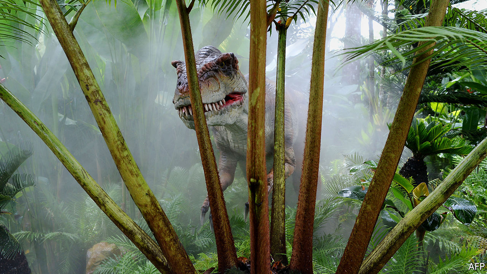

## Palaeontology

# What really killed the dinosaurs?

> Lingering doubts about the cause of a mass extinction are put to rest

> Jan 18th 2020

ONE THING about the prehistoric past which almost everybody thinks they know is that the dinosaurs (those, at least, that did not belong to the group of animals now known as birds) were wiped out more or less instantaneously by a collision between Earth and a very large space rock. The crater from that collision was discovered decades ago in southern Mexico. The effects of the giant waves created by the impact can be seen in places like Hell’s Creek, near Bowman, North Dakota, where marine creatures were swept far inland. And modelling suggests the planet would have been a pretty uncomfortable place for quite some time afterwards, with ejecta suspended in the atmosphere blotting out the sun, and acid rain changing the chemical composition of the oceans.

And yet... a small group of holdouts paint a different picture. Yes, they say, Earth was indeed hit by an asteroid or comet some 66m years ago at the end of the Cretaceous period. But that was either a coincidence or the straw that broke the planet’s ecological back. For the rocks also show that a series of huge volcanic eruptions was happening at the time in what is now India. Toxic and climate-changing gases from these eruptions, they suggest, were the underlying cause of the mass extinction that did for the dinosaurs—a point of view backed up by the fact that two earlier mass extinctions, those at the ends of the Permian and Triassic periods, coincided with similar eruptions while showing no sign of an asteroid strike. Conversely, several other large bolides are known to have arrived at various times in the past without accompanying extinctions.

A paper just published in Science, by Pincelli Hull of Yale University and her colleagues, casts further light on the matter. It shows that though the Deccan Traps eruptions, as this period of volcanism is known, went on over the course of around 1m years, they did most of their atmospheric damage about 200,000 years before the dinosaurs disappeared. So it was indeed, the team conclude, the impact that caused the extinction, not the volcanoes.

Dr Hull and her associates gathered data from hundreds of sources. These included analyses of fossil leaves, soil, mollusc shells, foraminifera (a type of shell-growing amoeba) and general marine sediments. Such sources record palaeotemperatures in several different ways. One is through the ratio in shells between two isotopes of oxygen. This ratio varies with ambient temperature in a predictable manner. A second is the ratio of magnesium to calcium in foraminifera shells. A third, called TEX86, relies on the composition of the membranes of a group of single-celled organisms called Archaea. And so on.

By combining all of these data the researchers show pretty conclusively that the temperature rose by about 2°C between 400,000 and 200,000 years before the mass extinction. It then fell gradually back over the subsequent 200,000 years to its previous level. They interpret this temperature spike as a consequence of global warming brought about by carbon dioxide released in the Deccan Traps eruptions. This would also have coincided with the rise and decline of other nasties, such as sulphur dioxide, which the Deccan volcanism pumped into the atmosphere. By the time of the mass extinction, in other words, it looks as though things atmospheric had returned to normal. It therefore seems unlikely that the Deccan Traps were responsible for the extinction. Rather, it was the asteroid wot done it.■

## URL

https://www.economist.com/science-and-technology/2020/01/18/what-really-killed-the-dinosaurs
