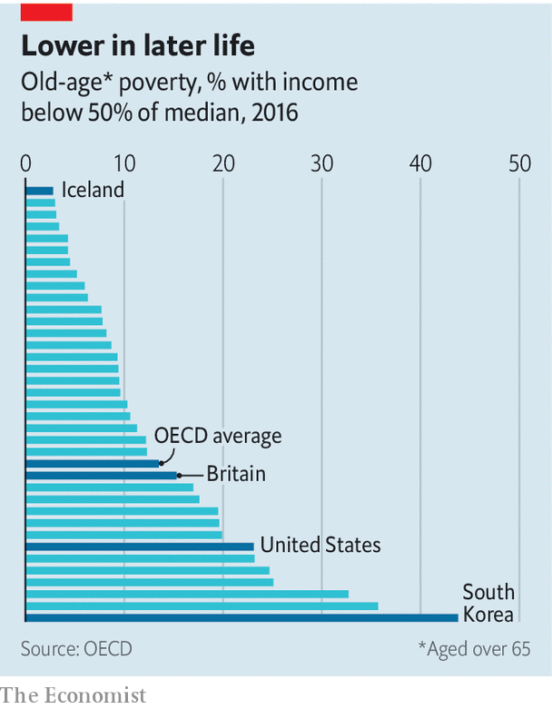

## Baby steps

# America’s pensions system is now less of a mess

> But the country still has more cleaning up to do

> Jan 16th 2020

THE LATEST jobs report shows that the unemployment rate in America stayed at 3.5% in December, confirming that things are looking pretty good for workers right now. Less well known is that there are plans afoot to improve workers’ prospects once they have laid down their tools. Shortly before Christmas, America enacted its first big reform to the retirement system in over a decade. The Setting Every Community Up for Retirement Enhancement Act of 2019, better known as the SECURE Act, is a good start. But much more is needed.

Americans could certainly do with additional retirement security. The median balance held in retirement accounts is $60,000 per family, enough for only a pitiful income in old age. Yet by one estimate 40% of working-age Americans have no retirement-account savings at all, meaning that they will probably have to rely on Social Security (public pensions) in their dotage. That safety-net is thin. America’s rate of old-age poverty is one of the highest in the rich world (see chart).

The new law’s many provisions may help turn things round. One of the most promising relates to the age at which people must start to withdraw cash from their retirement accounts. It will rise from 70.5 years to 72, meaning that workers who can afford to delay retirement will have more time to amass tax-favoured savings. That policy is expected to cost the federal government some $9bn over a decade. But the government will raise extra revenue by tightening the tax rules on inherited retirement accounts. The overall fiscal cost of the new act is likely to be tiny—perhaps one reason why it went through Congress with bipartisan support.

Economists are particularly intrigued by provisions in the new law governing income annuities, financial products which, once bought, provide preset monthly payments until the holders die. Despite their advantages, income annuities are oddly underused. Provisions in the SECURE Act, however, should encourage more firms to offer annuities. So long as employers choose a firm in good standing with regulators to provide the annuity, from now on they will be legally protected if the provider goes bust.

Finally, the new law may help encourage some Americans without a retirement-savings account to get one. A series of provisions should make it easier for small businesses to club together to provide retirement plans to their staff, point out J. Mark Iwry and David John of the Brookings Institution, a think-tank. Another part of the legislation offers financial incentives, in the form of tax credits, to firms which create retirement schemes for their staff and enroll them automatically.

America could go further. Many pensions experts argue that the single most effective reform would be if workers were to be automatically enrolled in retirement plans. Some countries have made bold changes. A few years ago Britain enacted a scheme along these lines, leading to a jump in the share of employees with a workplace pension of 36 percentage points, according to research from the Institute for Fiscal Studies, a British think-tank. If American politicians are serious about improving people’s prospects in retirement, tweaking around the edges will not be enough. ■

## URL

https://www.economist.com/united-states/2020/01/16/americas-pensions-system-is-now-less-of-a-mess
