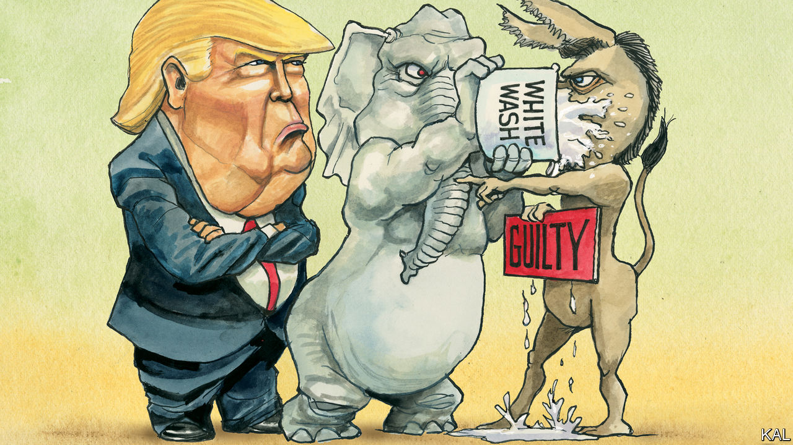

## Lexington

# The Senate’s coming test

> Donald Trump’s acquittal is certain; how the constitutional system survives it is not

> Jan 16th 2020

IF FACTS AND evidence still matter in American governance, the Senate will have no alternative but to take up the latest revelations of Donald Trump’s Ukrainian influence scheme when his impeachment trial begins next week. On the face of it, the clutch of notes and text messages released by House Democrats on January 14th appear to be as incriminating as anything levelled at Mr Trump’s presidency to date.

Stripped from an iPhone belonging to Lev Parnas, a Ukrainian-born businessman and Republican donor who has been indicted for political corruption, they suggest Mr Trump was thickly involved in the plot hatched by his lawyer, Rudy Giuliani, to shake down Ukraine’s newly elected government for political favours. In a letter sent last year to President Volodymyr Zelensky, requesting a meeting, Mr Giuliani stressed that Mr Trump had “knowledge and consent” regarding his activities in Ukraine. He also emphasised that he represented Mr Trump’s personal interests—“as a private citizen, not as president of the United States”. And in interviews on January 15th, Mr Parnas said the president was fully aware of his efforts in Ukraine.

This appears to contradict Mr Trump’s two main defences against the charge that he abused his office by suspending military aid to Ukraine in order to coerce Mr Zelensky into opening a spurious corruption investigation into Joe Biden. Mr Trump claims to have had no knowledge of the steps Mr Giuliani took to that effect in Ukraine. He also claims that the pressure he exerted on Mr Zelensky was motivated by his broader worry about corruption in Ukraine, and therefore was in America’s interest, not his own.

Other revelations in Mr Parnas’s trove are more lurid. They include texts from a previously unknown actor in the Trump-Giuliani scheme, a Republican congressional candidate called Robert Hyde, who appears to have been spying on America’s then-ambassador to Ukraine, Marie Yovanovitch, on Mr Parnas’s behalf. In exchanges with Mr Parnas early last year, Mr Hyde described the physical and electronic movements of Ms Yovanovitch, who had been identified by Mr Giuliani as an obstacle to his scheme: “She’s talked to three people. Her phone is off.” He also appeared to discuss the possibility of having her interfered with in some way. “That address I sent you checks out…they are willing to help if we/you would like a price…Guess you can do anything in the Ukraine with money,” wrote the Republican hopeful from Connecticut. “Can’t believe Trump hasn’t fired this bitch.” Mr Trump, who would later tell Mr Zelensky that the veteran diplomat was going to “go through some things”, fired her the next month.

Yet it is unlikely the Republican-controlled Senate will take much note of this apparently devastating evidence. Despite the administration’s efforts to stymie the impeachment probe run by House Democrats last year, there were already circumstantial indications that Mr Trump’s defence is as baseless as his allegations against Mr Biden. Even so, Mitch McConnell, with the backing of most of his 52 Republican colleagues, has said “there’s no chance” Mr Trump will be convicted. Though that might appear to make his conduct of the coming trial an irrelevance, the Senate leader has further made clear his unwillingness to weigh any evidence not attached to the narrow, because stymied, impeachment articles sent to him this week. If he gets his way—and there are currently only four quibbling Republican moderates tempted to resist—Mr Trump could be acquitted by the end of the month; or in time for his state-of-the-union message on February 4th.

This was predictable. Most Republican voters are behind Mr Trump for the same reasons that they have felt able to disregard the corruption and other abuses of the past three years. Their media outlets downplay or ignore the president’s misdeeds even as they accuse his accusers of the same or worse. Mr McConnell was therefore bound to do likewise. His refusal, thus far, to consider fresh evidence, including the handful of fresh testimonies Democrats want (starting with that of John Bolton, the former national security adviser) is merely an effort to downplay Mr Trump’s wrongdoing. Meanwhile he and other Republicans are blaming the Democrats for everything Mr Trump and they themselves stand accused of. The shakedown of Mr Zelensky was the sort of thing all presidents do; Mr Biden, in some unstated way, has done worse; the House inquiry was hopelessly biased; Nancy Pelosi’s brief effort to force Mr McConnell to relent was pure politics—so the impeachment is a charade! These mangled half-truths and partisan nonsenses are all the defence Mr Trump needs.

Even if predictable, this is unprecedented. Every previous presidential impeachment or near-impeachment (involving Andrew Johnson, Richard Nixon and Bill Clinton) was infected by partisanship. Yet, if Mr McConnell gets his way, this will be the first Senate trial conducted in head-on defiance of the principle of shared facts and evidence. The consequences would be graver even than the degrading of impeachment that would inevitably result. (Some Republicans are already muttering about impeaching Mr Trump’s next Democratic successor.) The Enlightenment tradition on which the American system depends—“of giving a damn about whether facts are facts”, as Frank Bowman, a pre-eminent impeachment scholar, puts it—would have suffered a jarring blow.

This is what the handful of moderate Republicans who might yet force Mr McConnell’s hand should consider to be at stake. They, namely Lamar Alexander of Tennessee, Susan Collins of Maine, Lisa Murkowski of Alaska and Mitt Romney of Utah, will have little bearing on Mr Trump’s future either way. There is nothing Mr Bolton could say to turn many Republicans against the president. Yet merely by standing for a weighing of the available facts, in sober respect for the truth, Mr Alexander and the rest would signify that disavowing them, however tempting, may also carry a cost.■

## URL

https://www.economist.com/united-states/2020/01/16/the-senates-coming-test
