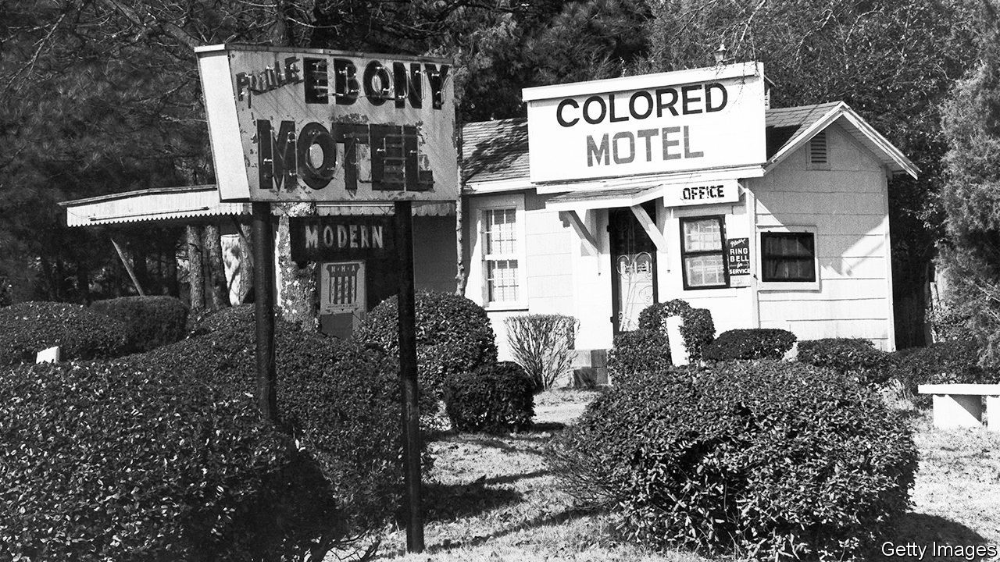

## Safe havens

# When America’s open road wasn’t open to all

> Candacy Taylor tells the story of the real “Green Book”

> Jan 25th 2020

Overground Railroad: The Green Book and the Roots of Black Travel in America. By Candacy Taylor. Abrams Press; 360 pages; $35.

ESPECIALLY IN AMERICA, travel has always been associated with freedom and opportunity. Immigrants sailing to a new world, pioneers heading West in search of virgin land, or lost souls hoping for a second chance—in each case, physical mobility has seemed essential to the social kind. But as Candacy Taylor demonstrates in her new book, “the open road wasn’t open to all”. As the author sets out in heartbreaking detail, for Americans of African descent the simple act of leaving home was often a dangerous undertaking.

Published from 1936 to 1967, the “Negro Motorist Green Book”—from which the Oscar-winning film of 2018 takes its name—helped make travel possible, if not exactly worry-free. In a country where lynchings and other attacks on black people were common, the guide was not only a convenience but often a lifesaver. As the understated tag-line on the edition of 1956 put it, “Carry your GREEN BOOK with you—you might need it.”

Along with informative articles, the guide listed hotels, restaurants, petrol stations and other essential services, many of them black-owned, where African-American customers would not be harassed or humiliated. It enabled readers—up to 2m at the height of its circulation in 1962—to avoid businesses where they were unwelcome and steer clear of “sundown towns”, where black visitors spotted after dark faced arrest, or worse. The Royce Café in Edmond, Oklahoma, for instance, proudly puffed the town as, “A Good Place to Live. 6000 Live Citizens. No Negroes.”

Though the “Green Book” mapped a geography of hate, it strived to maintain an upbeat tone, urging its readers to participate in the increasingly popular pastime of leisure travel. A feature titled “Let’s Go Places” identified the limited number of public places where, Ms Taylor says, black Americans could “swim, picnic and relax on the beach”. The “Railroad Edition” of 1951 insisted that “every effort has been made to assure a more pleasant journey”.

Despite the grim history that it recalls, “Overground Railroad” is not simply a chronicle of cruelty and despair (though both are abundant). In the face of systemic oppression, black culture and many black communities thrived. The book is full of stories featuring Duke Ellington, Ella Fitzgerald, Langston Hughes and countless other luminaries who led creative lives in the face of almost daily indignities. Prevented from mingling freely with their white compatriots, African-Americans created their own vibrant hubs, in Harlem, Denver’s Five Points and South Central Los Angeles. All this is documented in loving detail by Ms Taylor, through both text and photographs, many taken as she made her own pilgrimage to sites listed in the guide.

“Overground Railroad” is at its best in the small details that capture both the bitter and the sweet of lives and pleasures pursued in the teeth of injustice. Descriptions of “Green Book” favourites conjure a bygone era—such as Dooky Chase’s Creole restaurant in New Orleans, which Ray Charles celebrated in song, or the Dew Drop in the same city, which hosted performances by the drag queen Patsy Vidalia, as well as singers including James Brown, Sam Cooke and Otis Redding. By contrast, for all her legitimate indignation at past and present outrages, Ms Taylor’s musings on the wider political context rarely offer fresh insights. The strength of this book about a book lies in the street-level views through which the American road unspools in all its compromised glory. ■