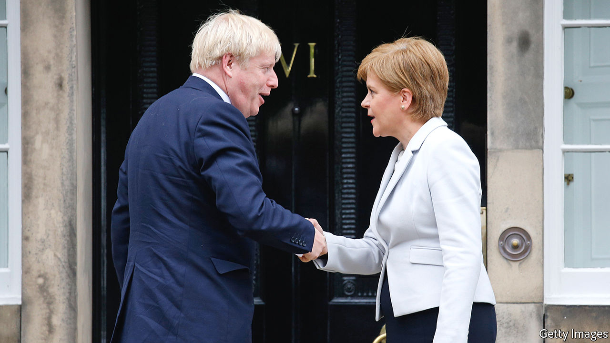

## In the dock

# Alex Salmond’s trial will coincide with a reassessment of the SNP’s record

> The party faces questions over its health, education and economic policies

> Jan 25th 2020EDINBURGH

THE SCOTTISH NATIONAL PARTY (SNP) looks in fine fettle. In the general election it secured 48 of Scotland’s 59 seats in the British Parliament, an increase of 13. Surveys regularly show about 40% of voters back it, far more than can be said for its rivals. After 13 years in charge of Scotland’s devolved government, this is an extraordinary achievement. Its pro-EU views chime with those of the majority of voters north of the border. And Scots are unimpressed by the two main Unionist parties under Boris Johnson and Jeremy Corbyn.

But things are not necessarily as rosy as they seem. Nicola Sturgeon, the party’s leader and Scotland’s first minister, is in for a tougher year than she has grown used to. The trial of her predecessor, Alex Salmond, on charges of sexual assault is scheduled to begin in March. Mr Salmond’s case will likely dominate the headlines for months.

The timing is unfortunate for Ms Sturgeon, who wants to use this year to build momentum ahead of Scottish Parliament elections in May 2021. A victory would boost her hopes of calling a second independence referendum (the “yes” campaign failed to convince voters in the first one, in 2014). Mr Salmond’s trial has the potential to derail both ambitions.

If that does not scupper Ms Sturgeon’s plans, the British government is ready to have a go, too. The Tories are determined to avoid another referendum, and have made noises about blocking it however Scotland votes next year. They have set up a Union Unit in 10 Downing Street, with the task of producing arguments and policies that will keep the country together. Lord Dunlop, a former adviser to the Scotland Office, is due to publish a report on strengthening the Union before the summer.

The government is also ready to open its wallet to illustrate the financial benefits of the Union. Though it has yet to decide where and how to deliver the bung, the recent City Deals—which sent billions of pounds to Scotland’s cities—provide a precedent. Cabinet ministers will make regular forays north of the border, which have grown rarer as the SNP has consolidated its grip on power.

Closer to home, she faces another obstacle: her own party’s record in government, which is attracting growing criticism. The SNP’s education reforms are in trouble. Recent surveys show Scotland’s schools are mediocre or failing, and the administration has been forced to concede a review of its reform agenda. It has also been accused of cherry-picking metrics that show the system in a good light while withdrawing Scotland from several measures that allow international comparison, which critics say is to avoid embarrassing results. “We know less now about the performance of Scotland’s schools than at any time since the 1950s,” says Lindsay Paterson of Edinburgh University.

There have also been a series of health scandals. Jeane Freeman, the health secretary, has been accused of covering up allegations that an infection caused by contaminated water at Glasgow’s flagship hospital killed a child with cancer. A new hospital for sick children in Edinburgh was due to be completed last July, but has yet to open its doors.

Nor is the Scottish economy anything to shout about. Its growth rate lags Britain’s and the Scottish government puts the nation’s notional deficit at £12.6bn, or 7% of GDP, compared with 1.1% for Britain as a whole. Scotland has fewer businesses per head than any other part of the country, save for north-east England. Its businesses pull in less revenue than those in the West Midlands, which has a similar population; it has only a little over half the proportion of earners in the highest income tax bracket as in the rest of the UK. Scotland has slipped into the bottom half of the Index of Social and Economic Wellbeing produced by Scottish Trends, an economics consultancy. It now sits alongside Slovenia.

Much lies in the balance. Ms Sturgeon remains Scotland’s pre-eminent politician, and her party is firmly on top. Yet the SNP and the Greens between them hold 68 of the Scottish Parliament’s 129 seats. It would not take much of a shift for a pro-Union majority to be returned next year, and for the prospect of a second referendum to fade. Even if Ms Sturgeon can secure a majority, polls suggest about 50% of voters support independence – higher than the 2014 tally of 45%, but not enough for the SNP to assume victory would be in the bag. It is not only Mr Salmond who is anxiously awaiting a verdict. ■

## URL

https://www.economist.com/britain/2020/01/25/alex-salmonds-trial-will-coincide-with-a-reassessment-of-the-snps-record
