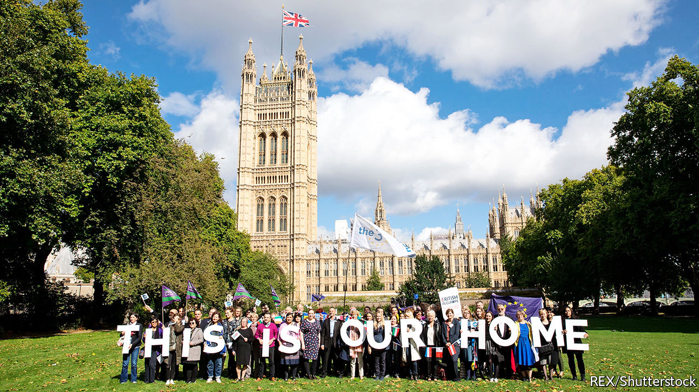

## Another Windrush?

# EU citizens’ rights after Brexit

> Worries about the future disturb EU citizens in Britain—and Brits in Europe

> Jan 25th 2020

THE BIGGEST argument in the final stages of the EU withdrawal bill this week was over EU citizens in Britain. The House of Lords passed an amendment to give them an automatic right to stay, along with a reassuring document. But as The Economist went to press the Tory-dominated Commons was overriding all changes to the bill, leaving many EU citizens nervous about their future. They have reason to worry.

After the 2016 referendum, EU citizens in Britain were reassured that nothing would change and they would not become bargaining chips. Similar pledges were made to Britons in the EU. The withdrawal agreement is meant to protect both groups. Yet the EU has expressed concern about the treatment of its citizens, especially after Boris Johnson chose in December to criticise them for treating Britain as if it were their own country.

The numbers are significant. Around 3.5m EU citizens live in Britain, while 1.2m Britons live in the EU. Contrary to myth, most are in work—including 80% of Brits in Europe, for example. Many have complex cross-border families, often with non-EU spouses or stepchildren. All will be affected by Mr Johnson’s determination to stop free movement of people when the transition period ends on December 31st.

EU citizens who want to stay in Britain must apply for “settled status”. Lobby groups (and the Lords) wanted EU citizens to have an automatic right to stay, verified with a document. The settled-status scheme requires proof of residence and, crucially, knowledge of its existence. The Home Office insists it is going well: it has had almost 2.8m applications, with refusals running only in single figures.

Yet the 3m group, which lobbies for EU citizens, cites cases of unexplained delays. As many as two in five applications have, often incorrectly, been granted only “pre-settled status” that is time-limited. The group also frets about what will happen after the scheme’s cut-off date of June 2021. Kuba Jablonowski of Exeter University says no scheme ever manages 100% coverage, and that gaps in official statistics mean the Home Office has little idea how many are eligible. The government says late applications may be accepted, but only with good reason. Its record of deporting Windrush immigrants is not reassuring.

It also makes supervision of the scheme crucial. Applicants can seek administrative review (at a price), but no right of court challenge is given in primary legislation. The absence of physical documents confirming settled status makes EU citizens especially fretful about satisfying picky employers or landlords. An independent monitoring authority is being set up under the justice ministry, but the government has changed the law to allow it to scrap the authority, upsetting Brussels. As a last resort, there is a role for the European Court of Justice in defending its citizens, but this expires in eight years’ time.

Largely lost in the fuss over EU citizens are the neglected Brits in the EU. Since most are already registered (though in France, which has the second-largest number, not all are), they should be safe after Brexit. But they will lose the right to move to other EU countries. This matters because, notes Jane Golding of the lobby group British in Europe, many lawyers and other professionals work across EU borders. Depending on the future negotiations, their qualifications may no longer be recognised by other EU countries.

And here is a final uncertainty, over the future migration regime. A new immigration act is needed this year. But the government awaits advice from its migration advisory committee. Ministers favour an Australian-style points system that gives no advantages to EU nationals. Some have even cast doubt on Britain’s continuing participation in Europe’s Erasmus student-exchange scheme. EU citizens fear that, even with settled status, they may suffer from a hostile environment in future. And they point to the pain of being seen as bargaining chips when, like most Brits in Europe, they had no say on Brexit.■

Correction (January 23rd 2020): This story originally suggested that France had more resident Brits than any other EU country. In fact it has the second-largest number, after Spain.