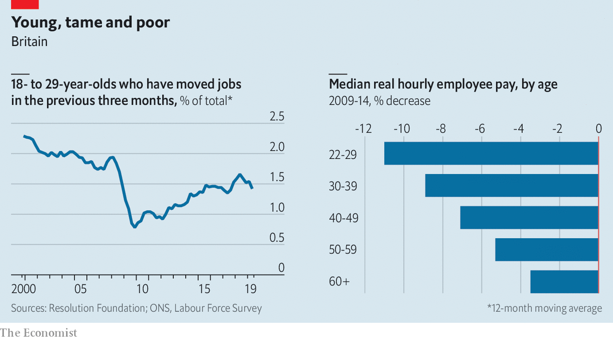

## Jobs

# Why young people in Britain aren’t moving job

> It’s damaging them, and maybe productivity too

> Jan 23rd 2020

OLDER PEOPLE tend to regard 20-somethings as avocado-toast munching types who flit from job to job. The reality is very different. Job mobility among the young has declined over the past decade.

Even though unemployment is hitting multi-decade lows and the job market continues to tighten—labour-market data published this week showed strong growth and the employment rate at a record high—younger workers remain more wedded to their current jobs than they were before the recession (see chart). There is a similar trend in other rich countries, but it is particularly pronounced in Britain. According to Neil Carberry, chief executive of the Recruitment & Employment Confederation, a recruiters’ trade body, the commonest complaint among his members is of a shortage of candidates.

This is a problem not just for employers, but also for employees. In the labour market, loyalty does not pay: shifting jobs tends to be a good way of getting a salary boost. In 2017, the average pay rise for a worker staying with the same employer was just 1.1% after inflation compared to 5.4% for someone making a change. Young people’s reluctance to move may be part of the explanation for their dismal wage-growth figures. In the five years after the crash, they experienced a larger cut in real wages than their older peers (see chart).

Researchers have long argued that having the simple bad luck to enter the labour market during difficult times can have a lasting impact on young workers. Much of that research has focused on the so-called labour market scarring effect, by which those who experience unemployment early in their careers tend both to earn less than those who do not and to be at greater risk of future unemployment. Young people who experienced unemployment after the early 1980s or early 1990s recessions felt these effects for around ten years.

But the 2008-09 recession was different from earlier downturns. It was the first real test of the impact of Margaret Thatcher’s union-bashing on the jobs market. Trade-union bargaining covered more than 80% of workers in the early 1980s and still more than half in the early 1990s, compared with a third in 2008.

In the most recent recession, even though the fall in output was larger, the labour market performed better. Unemployment peaked at just over 8% in 2011 compared with over 10% in the 1980s and 1990s. But the squeeze in real wages was sharper. As a result, British workers in their 20s today are less likely to have experienced unemployment than their equivalents ten years after the early 1990s recession but are also less likely to have seen strong pay growth. This may have led to a new type of scarring, one marked not by the impact of unemployment but by the experience of weak pay growth.

In the past, the pay levels of those who entered the labour market during a downturn recovered after around six years. But a decade after the recession the 2009 cohort’s earnings have not recovered. Laura Gardiner, research director of the Resolution Foundation, suspects that psychology may partly explain this: in focus groups, she says, younger workers lack confidence in either their own abilities or the opportunities on offer.

Not everybody agrees. Bobby Duffy, a former opinion pollster now at King’s College London, argues that the reduced job mobility of younger people is less about an attitudinal shift and more about a change in circumstances. “I don’t think we have a cohort of shrinking violets all of a sudden.” The relatively sluggish pace of the recovery since 2009 has not provided the same kind of opportunities that the 1990s saw for young people. Regional variations in housing costs may also play a role, dampening down on long-distance moves and hence overall labour market mobility.

These figures may help explain the puzzle of Britain’s awful productivity, which is lower than the competition’s and growing only feebly. If workers do not move from job to job, resources will move more slowly from low-productivity firms to high-productivity ones.

On many measures Britain’s labour market looks in rude health. But until 20-somethings start, once again, moving jobs and pushing for higher wages it may not feel that way to many young people. Britain could do with its millennials acting a little more entitled. ■