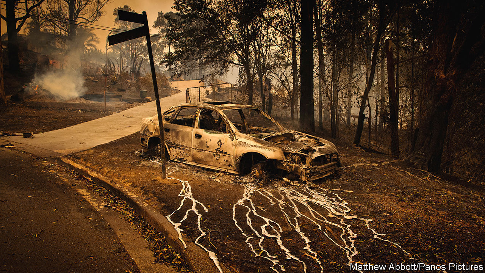

## Singed but not scorched

# Australia’s bushfires have left businesses surprisingly unscathed

> That has not stopped bosses preparing for the next inevitable disaster

> Jan 25th 2020

BY MOST MEASURES Australia’s bushfires have caused destruction on an epic scale. They have killed at least 29 people and perhaps a billion animals. Over 100,000 square kilometres of land, an area bigger than Scotland, has been charred. More than 2,600 homes have been destroyed. In big cities, including Sydney and Canberra, the air has turned toxic. Yet on one measure the fire has done less damage: businesses seem to have got off lightly.

The Australian Council of Insurance, a trade body, reckons insured losses so far amount to about A$1.4bn ($900m), making it only the country’s third-most-expensive fire since 1980. By contrast, California’s fires cost $15bn in 2017 and $18bn in 2018. This is because most of Australia’s industry sits in cities. They account for 64% of GDP, slightly above the average for the OECD, a club of mostly rich countries. The fires have stayed in the countryside, limiting damage to businesses. Australia’s big insurers, SunCorp and Insurance Australia Group, are well covered by reinsurers.

Of non-urban industries, tourism and agriculture, each of which makes up about 3% of GDP, were hardest hit. But severe losses in pockets of Australia look small compared with the industry as a whole. The Australian Tourism Industry Council (ATIC) says places engulfed by the blaze have become no-go zones for holidaymakers and room-cancellation rates hit 60% even in unburnt places. Even so, ATIC’s latest estimate is that the fires have cost the industry A$1bn, or 1% of annual sales.

Agribusiness in one battered area, Kangaroo Island off Australia’s south coast, may lose 100,000-odd sheep, a sixth of local livestock, says Matthew Dalgleish of Mercado, a research firm. But elsewhere much of the blaze has consumed national parks rather than farmland. Livestock losses will probably be around 1% of the national total.

The one thing environmentalists may have hoped the fires would kill is Australia’s coal industry, whose carbon-belching made them worse by fuelling climate change. In an ironic twist, BHP, a big miner, said that bushfire smoke contributed to an 11% fall in its production of electricity-generating coal in New South Wales. Three-quarters of the country’s electricity is generated by coal; it is the world’s biggest exporter of the stuff. The fires are licking energy and resource firms’ “social licence” to operate. But the climate-sceptic, coal-friendly government will not strip them of official permits any time soon.

Despite little immediate damage from flames or threat from regulators, the fires are having an effect on business. Katherine Klosowski of FM Global, an engineer-cum-insurer, says clients are paying more attention to risk-reduction measures like clearing spaces between bushland and buildings. Karl Mallon of Climate Risk Engines, an Australian consultancy, says some firms are at last moving from analysing risk to drawing up climate-resilience plans. Bosses know they may not be so lucky when the next calamity strikes.■

Sign up to our fortnightly climate-change newsletter [here](https://www.economist.com//theclimateissue/)

## URL

https://www.economist.com/business/2020/01/25/australias-bushfires-have-left-businesses-surprisingly-unscathed
