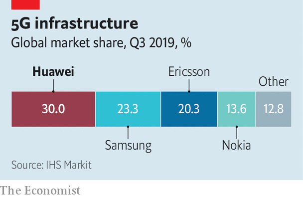

## Cyber-security

# Huawei is a cyber-security risk

> But risks can be managed

> Jan 25th 2020

NO FIRM EXEMPLIFIES the arguments around technology better than Huawei. The Chinese firm has risen from an obscure importer of foreign telecoms gear to one of the world’s biggest makers of equipment for fifth-generation (5G) mobile networks. Its prowess has caused jitters in other countries, which worry that Huawei’s kit might come with “back doors”—deliberate security holes that could act as conduits for Chinese spies or cyber-saboteurs.

America, in particular, has the firm in its sights. It orchestrated the arrest in Canada of Meng Wanzhou, Huawei’s chief financial officer (and daughter of its founder), who was in court this week on charges of sanctions-busting (see [article](https://www.economist.com//business/2020/01/23/huawei-finance-chiefs-extradition-hearings-begin)). It has been lobbying allies to freeze the firm out of their domestic 5G systems. Australia and Japan have already done so. A decision in Britain is due by the end of the month; it seems minded to risk a transatlantic tiff and give the firm the green light. In Germany Angela Merkel is at odds with the many in her party who want to keep Huawei out (see [article](https://www.economist.com//europe/2020/01/23/angela-merkel-is-loth-to-take-sides-over-huawei)). Other countries, from Brazil to India, must make similar choices.

The hawks have a strong case. No back doors have so far been found in Huawei’s gear. But big countries are not above using tech champions for espionage. It is foolish to assume that China, with its long record of hacking and intellectual-property theft, is an exception. The country is a one-party dictatorship. Under Xi Jinping it has become increasingly repressive at home and assertive abroad. Huawei insists it does not aid spying overseas and would refuse to do so if asked. The most generous explanation of its stance is that its bosses are loyally saving face. The idea that Mr Xi would allow such defiance is fanciful.

Yet despite those worries, this newspaper believes Huawei should be allowed to compete. Its products are high-quality and cheap (albeit with help from large dollops of state aid). Excluding it would be costly and risks delaying 5G. It would add to the pressure to reverse the globalisation that has helped keep costs down and progress ticking in the tech industry. And though the risks are real, countries can adopt three broad strategies to mitigate them.

The first is technical. Encouraging encryption would ease spying concerns, since intercepting data would produce only gibberish. Networks should be defended in depth. Attempts to keep intruders out should be backed by monitoring to spot those that nonetheless get through, and systems designed to limit the damage they can do. Britain, for instance, plans to exclude Huawei from sensitive parts of its networks, though geography may limit that approach elsewhere. Because accidental bugs can be as dangerous as deliberate back doors, having several suppliers and spare capacity is a good idea, so that a single flaw does not leave the entire network vulnerable. Redundancy and resilience are the watchwords.

Second, countries should encourage existing industry trends towards openness. Today’s telecoms networks are built with proprietary products. In future they will become just another piece of software running on off-the-shelf computers. That should allay worries about compromised hardware and make it easier for new entrants to compete. Open source is also in vogue. An alliance of tech companies is keen on open-source versions of the antennae and masts that make up a mobile network’s outer edge. Having code and devices open for inspection makes it easier to find security holes, and harder to hide back doors. Open-source software already powers much of the internet. The more that telecoms networks can follow that example, the better.

And third, international co-operation can help. Britain already strips down and inspects all Huawei kit. Sharing its results and experience more widely would make more eyes available to keep Huawei honest. Europe’s efforts to establish a common set of criteria are to be welcomed. In the longer term, an international inspection body, perhaps modelled on the International Atomic Energy Agency, would be a good idea. That may sound unlikely at a time when multilateralism is out of fashion, but it would be in everyone’s interests. Buyers would be reassured that they were not purchasing compromised equipment, and sellers would be able to prove their trustworthiness.

Computer security, like all security, is about trade-offs, not absolutes. It is naive to assume that banning Huawei is sufficient to protect networks from attackers, of any nationality. Back doors are a worry, but most hackers make do with the accidental flaws that plague all digital devices. Russia, for instance, has no domestic electronics industry to speak of, and thus no ability to insert back doors. That does not hamper its hackers—nor those of Iran and North Korea. Designing robust networks, building them with checkable equipment and sharing knowledge and expertise will make life harder for hackers from all countries, not just China. Such measures would be worthwhile even if the doubts surrounding Huawei did not exist. The fact that they do simply makes the need more pressing. ■