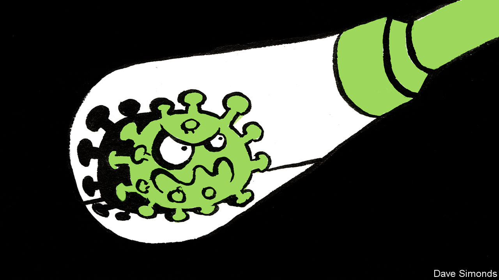

## Out of China

# The world is better prepared than ever to stop the Wuhan coronavirus

> But its true dangers will not be known for some time

> Jan 25th 2020

Editor’s note (January 23rd): This article has been updated to mention new cases of the virus and restrictions in Wuhan.

HOW AND when it infected the first human being, by making the jump from an animal, is anybody’s guess. But one thing is certain about the new coronavirus which was discovered in December in China and is now causing a global scare: it is a known unknown. And this, along with the health authorities’ response so far, is mostly good news.

People’s fear is understandable. As The Economist went to press, over 600 cases had been confirmed in six countries, of which 17 were fatal. The new virus is a close relative of SARS (severe acute respiratory syndrome), which emerged in China in 2002 and terrorised the world for over half a year before burning out. SARS afflicted more than 8,000 people and killed about 800, leaving in its wake $30bn-100bn of damage from disrupted trade and travel (see [article](https://www.economist.com//china/2020/01/23/the-coronavirus-discovered-in-china-is-causing-global-alarm)).

That toll would have been lower if the Chinese authorities had not hushed up the outbreak for months. But things are very different this time. The Chinese have been forthcoming and swift to act. Doctors in Wuhan, the metropolis where it began, have come in for criticism, but the signs are that they promptly sounded an alarm about an unusual cluster of cases of pneumonia—thereby following a standard protocol for spotting new viruses. Chinese scientists quickly isolated the pathogen and shared its genomic details with the world. Back in the days of SARS, genetic sequencing like this took weeks. The genomic data can help scientists spot cases quickly, both in China and abroad. The government stopped travel in and out of Wuhan and two nearby cities, corralling almost 20m people. That is extreme and heavy-handed. Yet, although it could drive some cases underground, it will also slow the spread of the virus across China and abroad.

Even so, an awful lot rests on some of the known unknowns. The two big questions are how easily the virus can be passed directly from person to person and just how dangerous it is. Data from monitoring people who have had contact with those infected will soon help answer the first question. The second will be harder. The 3% mortality rate among cases confirmed so far is alarming. That puts it within the range for the devastating Spanish influenza pandemic of 1918 which killed 2-10% of those infected. But in many people the new virus causes only mild symptoms, so many cases may not have been recognised for what they are and hence not added to the total. As more such people are identified through expanded screening, the estimated death rate should fall. Conversely, though, that rate could go up as more of those infected become seriously ill—a progression that takes about a week and is seen in 15-20% of patients in hospitals.

The true character of the new virus will become better known in the coming weeks. Public-health measures will adjust accordingly, using lessons learned from SARS and MERS, a still-deadlier cousin discovered in 2012 in Saudi Arabia that spreads only through close contact.

The WHO has long worried about the possible emergence of a “disease X” that could become a serious international pandemic and which has no known counter-measures. Some experts say the virus found in China could be a threat of this kind. And there will be many others. Further illnesses will follow the same well-trodden path, by mutating from bugs that live in animals into ones that can infect people. Better vigilance in places where humans and animals mingle, as they do in markets across Asia, would help catch viral newcomers early. A tougher task is dissuading people from eating wild animals and convincing them to handle livestock with care, using masks and gloves when butchering meat and fish, for example. Such measures might have prevented the new coronavirus from ever making headlines. ■ 

Correction (January 24th 2020): A previous version of this article said the Spanish influenza pandemic in 1918 killed 3-5% of the world's population. The piece has been clarified to note that the pandemic killed 2-10% of those infected.