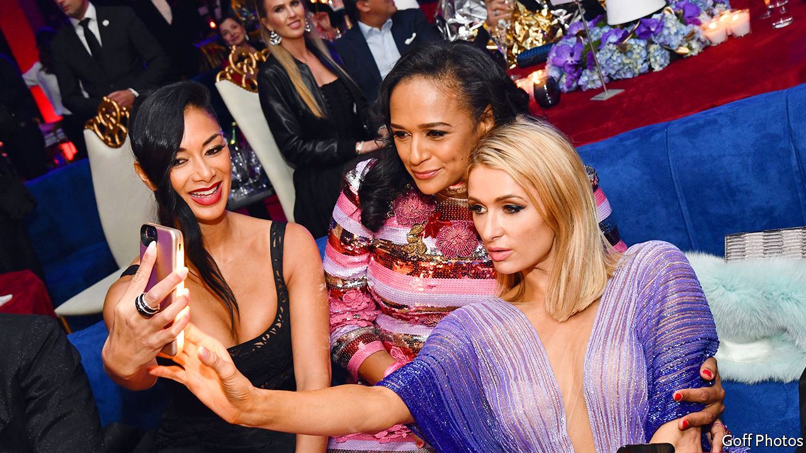

## A self-made something

# What 700,000 leaked documents reveal about Africa’s richest woman

> Isabel dos Santos faces charges at home and investigations abroad

> Jan 25th 2020

ISABEL DOS SANTOS styles herself as a visionary, an entrepreneur and a potential future president of Angola. Her vast fortune was self-made, she boasts. Running Sonangol, Angola’s state oil firm, was a “big personal sacrifice”. Many Angolans “see me as a role model”, she recently told The Economist.

Such claims have always seemed absurd. Ms dos Santos’s father is José Eduardo dos Santos, Angola’s former dictator, who appointed her head of Sonangol from 2016 to 2017. Now more than 700,000 documents obtained by the Platform to Protect Whistleblowers in Africa, a Paris-based advocacy group, and shared with the International Consortium of Investigative Journalists (ICIJ), show how she allegedly milked the state. On January 22nd prosecutors in Angola formally accused her of fraud and mismanagement. She denies wrongdoing.

The ICIJ found a mountain of questionable transactions. There were suspicious payments from Sonangol to companies with links to Ms dos Santos. In 2016, before she was named head of Sonangol, Wise Intelligence Solutions, owned by her and her husband, Sindika Dokolo, was given $9.3m to oversee the company’s restructuring. Wise seemed to have little relevant expertise; it hired Western firms, such as Boston Consulting and PwC, to help. They billed for much less than what Wise received.

In 2017, after Ms dos Santos became chairwoman of Sonangol, Wise was replaced by Matter Business Solutions, owned by one of her friends. After her father stepped down in September 2017, Matter issued a slew of invoices to Sonangol. One, for over €470,000 ($521,000), simply read: “Expenses May-September 2017”. In November, a day after Angola’s new president fired Ms dos Santos, Sonangol made three payments to Matter totalling $58m. Ms dos Santos seems to have approved some after she was fired. She says that’s not true.

A second scheme involved a struggling Swiss jeweller called De Grisogono. Mr Dokolo persuaded Angola’s state diamond company, Sodiam, to invest more than $120m in the firm, of which $98m was borrowed. He says he also invested his own money. But the deal was mostly, if not completely, funded by the state, according to the documents. Nevertheless, Mr Dokolo and his team, not Sodiam, ran De Grisogono—poorly. Glitzy parties provided photo opportunities for Ms dos Santos (pictured, middle), but cost loads. Sodiam, which did not recoup its investment, now wants out. It will be down more than $200m once it pays back the early loans, says its new chief. Those loans, with a 9% interest rate, were issued by Banco BIC, of which Ms dos Santos owns 42.5%.

The firms that helped Ms dos Santos are professing ignorance. But the schemes bear the hallmarks of money-laundering, says Jason Sharman of Cambridge University. Angolan reporters have long argued that Ms dos Santos is less self-made than she claims. Prosecutors in Portugal, the former colonial power in Angola, are digging. (A Portuguese banker implicated in the scandal was found dead, after apparently committing suicide, on January 22nd.) Britain could investigate, too. If a court found that Ms dos Santos’s pads in London and Lisbon were ill gotten, they could be seized. But she is unlikely to end up in jail. She also owns a posh flat in the United Arab Emirates, which isn’t keen on extradition.

## URL

https://www.economist.com/middle-east-and-africa/2020/01/25/what-700000-leaked-documents-reveal-about-africas-richest-woman
