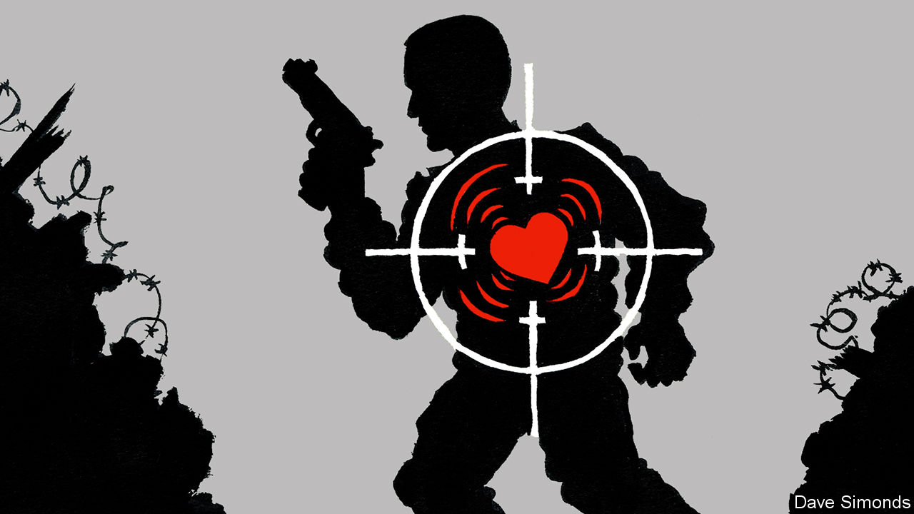

## Personal identification

# People can now be identified at a distance by their heartbeat

> And then dealt with, if they are enemy operatives

> Jan 23rd 2020

BEFORE PULLING the trigger, a sniper planning to assassinate an enemy operative must be sure the right person is in the cross-hairs. Western forces commonly use software that compares a suspect’s facial features or gait with those recorded in libraries of biometric data compiled by police and intelligence agencies. Such technology can, however, be foiled by a disguise, head-covering or even an affected limp. For this reason America’s Special Operations Command (SOC), which oversees the units responsible for such operations in the various arms of America’s forces, has long wanted extra ways to confirm a potential target’s identity. Responding to a request from SOC, the Combating Terrorism Technical Support Office (CTTSO), an agency of the defence department, has now developed a new tool for the job.

This system, dubbed Jetson, is able to measure, from up to 200 metres away, the minute vibrations induced in clothing by someone’s heartbeat. Since hearts differ in both shape and contraction pattern, the details of heartbeats differ, too. The effect of this on the fabric of garments produces what Ideal Innovations, a firm involved in the Jetson project, calls a “heartprint”—a pattern reckoned sufficiently distinctive to confirm someone’s identity.

To measure heartprints remotely Jetson employs gadgets called laser vibrometers. These work by detecting minute variations in a laser beam that has been reflected off an object of interest. They have been used for decades to study things like bridges, aircraft bodies, warship cannons and wind turbines—searching for otherwise-invisible cracks, air pockets and other dangerous defects in materials. However, only in the past five years or so has laser vibrometry become good enough to distinguish the vibrations induced in fabric by heartprints.

According to Jacob Khurgin of Johns Hopkins University, in Baltimore, the best laser vibrometers can measure a displacement of just ten picometres (trillionths of a metre). His team’s development of the necessary photonics—“a sexy word for optics”, he says—has been paid for by the Office of Naval Research, the air force’s Office of Scientific Research, and DARPA, another government defence-research outfit. Such precision cannot be obtained by the obvious means of measuring changes in the time it takes reflected light to travel to and from a surface. Instead, laser vibrometers detect changes, caused by the Doppler effect, in the reflected beam’s frequency. If it is bouncing off something moving towards the detector, its frequency will be shifted to the blue end of the spectrum. If the reflective surface is moving away, the shift is to the red.

According to Candice Tresch, a spokeswoman for the CTTSO, SOC has now received its first batch of Jetson heartprint readers. Though keen to avoid “tipping our hand to an adversary”, she is willing to give out some technical details. The beam involved is infrared, and therefore invisible to the human eye. The devices work best, she says, when a suspect is neither running nor in a moving vehicle. And they have a gimbal that helps keep the beam focused on the suspect for the 30 or so seconds it takes to obtain a good heartprint reading. She will not, however, discuss the process by which heartprint libraries might be built up in the first place. One starting point, presumably, would be to catalogue the heartbeats of detainees in the way that fingerprints and DNA samples are now taken routinely.

Confirming the identity of enemy targets is not the only job imaginable for this high-precision form of laser vibrometry. The stress of telling a falsehood can alter someone’s heartbeat, so it could improve lie-detection technology, according to Wang Chen-chia, an engineer at Brimrose, another firm working on heartprint vibrometry. Dr Wang reckons that it might also be employed by customs officials, as the heartbeats of nervous smugglers are likely to differ from those of ordinary travellers. And it has potential medical uses, too. Brimrose hopes to run a clinical trial employing it for the detection of arrhythmia and other heart problems.

Nor need vibrometry be restricted to optical frequencies. A team at the State University of New York, Buffalo, led by Xu Wenyao, is designing a device that emits radio waves and captures return signals that have bounced off, and been modified by, a person’s vibrating chest cavity. The advantage of this approach is that it can penetrate materials opaque to light waves, such as walls and heavy clothing. A prototype can, says Dr Xu, read heartprints from as far away as 50 metres.

Dr Xu envisages markets for the device ranging from cardiac diagnostics to the identification of authorised users of computers and vehicles. Governments, he says, could employ the technology to identify masked protesters. He does note, though, that this could be stymied by protesters wrapping their torsos in tinfoil—a version of the tinfoil hats allegedly loved by those paranoid about government snooping, perhaps. But this time, one that works.■

## URL

https://www.economist.com/science-and-technology/2020/01/23/people-can-now-be-identified-at-a-distance-by-their-heartbeat
