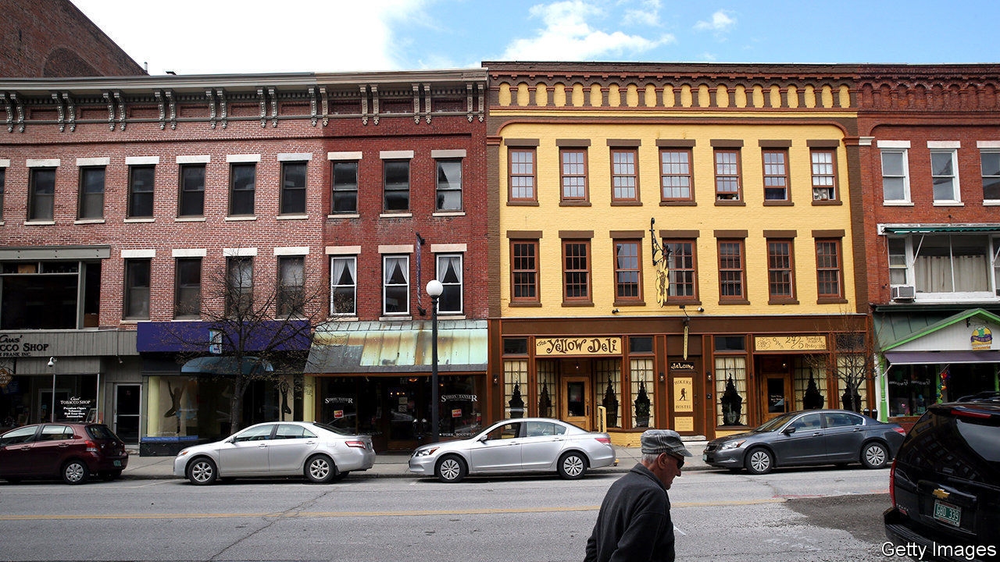
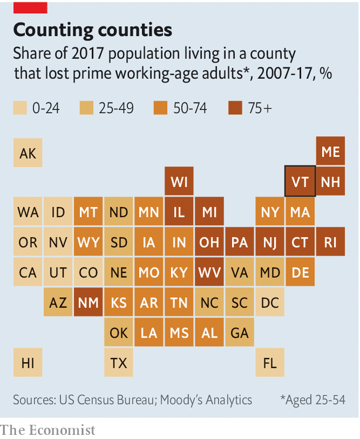

## Homesteading 2.0

# Shrinking states offer perks for new residents

> Incentives include cash, land and job connections

> Jan 23rd 2020MONTPELIER, VERMONT

IT STARTED AS a joke. Beth Dow received an article from her husband about Vermont paying workers to move to the state. But the jest soon became reality. Within a few months, Mrs Dow and her husband had left their home in Denver for Bennington, a town of 15,000 in southern Vermont, and were paid $5,000 to cover their move.

Vermont is one of many states with a population that is dwindling. Around 80% of counties across the country—largely those clustered in the north-east and Midwest—lost working-age adults from 2007 to 2017, according to the Economic Innovation Group (EIG), a think-tank. Some 65% will lose working-age adults over the next decade. The scale of this decline is new, precipitated by an ageing workforce, falling fertility rates and less immigration. Population declines affect housing markets, municipal finance and local economies. Fewer people means less housing demand, tax revenue and business.

To forestall further depopulation, Vermont’s Republican governor, Phil Scott, signed a bill that went into effect on January 1st offering to pay people $7,500 to cover their moving costs if they relocate and work for local employers. This follows the programme that lured the Dows to Vermont, intended for remote workers. (Mrs Dow still works for the same firm she did in Denver, remotely.) Other states, counties and cities—along with a host of local organisations—have recently taken similar measures. They call to mind America’s homestead programmes of the 19th century, when the federal government gave land to settlers willing to move west.

Depopulation is particularly acute in Vermont. During his annual budget address on January 21st, Mr Scott called the current demographic crisis “the greatest challenge we face as a state”. More than half of Vermont’s counties have seen population declines since 2010. The rural ones have been especially hard-hit. In seven counties, more people died than were born. The remaining population can no longer support the local restaurants or hardware store.

In all 371 people, including 79 children, moved to the state last year to claim its remote-worker grants. This included a number of people with six-figure salaries. “For a small state like Vermont, that’s a good number,” says Joan Goldstein, the state’s economic-development commissioner.

Over 1,500 miles away in Oklahoma the George Kaiser Family Foundation, a charity, has run a programme since 2018 called Tulsa Remote. It will give $10,000 and work space to people who move to the city for at least a year. In the first year, some 10,000 people applied for the programme’s 100 slots. Aaron Bolzle, who runs Tulsa Remote, said he is expecting between 350 and 400 people to move in this year.

In central Nebraska, a town of 938 people called Curtis offers free land to new residents willing to build homes on their lots. Families with school-age children are eligible for up to $1,000 in cash incentives if they move to Curtis and enroll in local public schools. Massachusetts is considering paying remote workers to move to its four western counties. Some Kansas counties will help pay student-loan debt for recent graduates who move there.

Are such efforts effective? Amy Liu, who directs a metropolitan-policy programme at the Brookings Institution, a think-tank, warns that local attempts to woo companies can backfire. Sometimes companies leave when incentives such as tax breaks expire. Attempts to woo people could suffer from some of the same pitfalls. Ms Liu also wonders if such experiments might be too small to have an impact.

John Lettieri, the head of EIG, says place-based visas for immigrant workers may help areas with population and labour shortages. Vermont could certainly do with an immigration boost. Fewer than 500 people arrive each year. Those counties that are growing have immigrant populations.

Vermont’s commerce secretary, Lindsay Kurrle, says she is “realistic” about her state’s programme. She says she knows people are not going to move to a new state for only a few thousand dollars. Nor will the programme alone solve the state’s demographic problems. Still, she hopes it will encourage more people to consider Vermont. Had they not read the article, the Dows say they would still be in Denver.■

## URL

https://www.economist.com/united-states/2020/01/23/shrinking-states-offer-perks-for-new-residents
