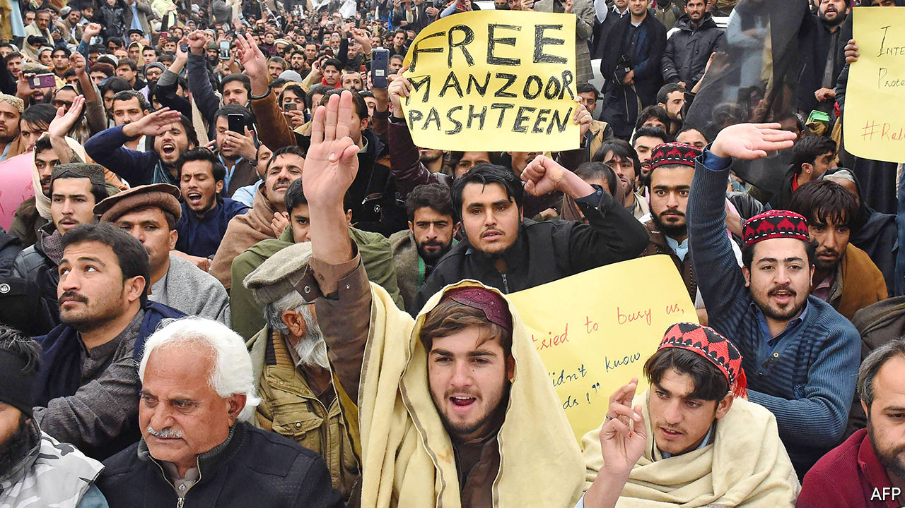

## Arresting the messenger

# A prominent critic of Pakistan’s army is hauled into court

> Meanwhile, the abuses he complained about have gone unpunished

> Jan 30th 2020ISLAMABAD

IN THE EARLY hours of January 27th a charismatic former veterinary student was arrested in Peshawar. Manzoor Pashteen was accused of conspiracy, sedition, stoking ethnic hatred and attacking Pakistan’s state and constitution. Missing from the list was his true crime: criticising the army. The 25-year-old is the founder of a group called the Pushtun Protection Movement (PTM), which has accused the security services of persecuting ethnic Pushtuns in various ways, ranging from harassment at checkpoints to kidnappings and extrajudicial killings.

Pushtuns’ grievances have their roots in the insurgency of the Tehrik-i-Taliban Pakistan (TTP)—the Pakistani arm of the Taliban. The Pakistani army had originally supported the Taliban’s quest for power in neighbouring Afghanistan, and had allowed its fighters to use Pushtun areas on Pakistan’s side of the border as a haven. The militants duly recruited and proselytised within Pakistan, helping to spawn the TTP, which launched a bloody terror campaign. The army’s counteroffensive turned Pushtun areas into a war zone. Towns and villages were flattened; hundreds of thousands of people were displaced. And even when peace returned, the army still treated Pushtuns with suspicion.

When a young Pushtun trader was killed by police in Karachi in suspicious circumstances in 2018, tens of thousands of Pushtuns began joining Mr Pashteen’s rallies. The PTM demanded the removal of mines and unexploded bombs in Pushtun regions, a reduction in raids and checkpoints, and due process for the many Pushtun youths abducted, tortured or killed by the army and police. “It has taken us almost 15 years of suffering and humiliation to gather courage to speak up, and to spread awareness about how the military trampled our constitutional rights through both direct action and a policy of support for the militants,” Mr Pashteen said last year.

Such open criticism of the army is unheard-of. Mere mention of the PTM can induce apoplexy in the top ranks. Its complaints detract from the hard-fought victory over the TTP. Thousands of troops died in the campaign, which has led to a dramatic improvement in security.

Moreover, the army says it has tried to fix the problems the PTM has raised. It claims to have become less heavy-handed at checkpoints and is building schools and markets to help revive shattered towns.

But the generals are more adept with sticks than carrots. Journalists have been told to stop reporting on the PTM. Senior officers have stated ominously that its time is up. In May the army shot into a crowd of PTM supporters heading to a sit-in, killing at least 13. (The soldiers said they were fired on first.) Two PTM-supporting parliamentarians were arrested and spent four months in detention.

The trigger for Mr Pashteen’s arrest may have been the fresh campaign of rallies that the PTM recently initiated. He has been denied bail, and PTM members protesting his detention have themselves been arrested. For the most part, Pakistan’s courts seem unconcerned about the abuses that Mr Pashteen has railed against. But daring to complain about the army’s impunity—now that is a serious offence. ■