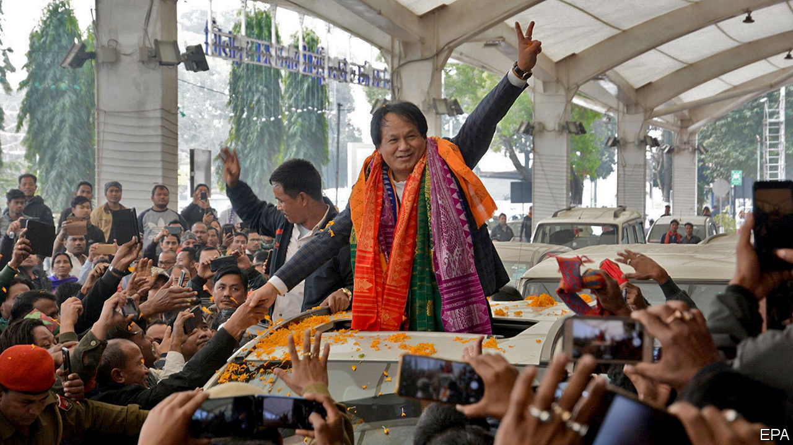
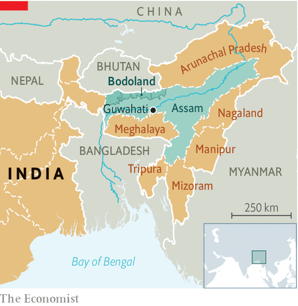

## Bodos and don’ts

# A restive corner of India is becoming more peaceful

> But for every group that is placated there are new malcontents

> Jan 30th 2020DELHI

HOW TO DIVIDE India into administrative units is a question that has vexed all its governments. For a time the main focus was to rationalise, as hundreds of feudal “princely” states were swept into the bigger provinces of the Indian republic. But since 1960 the number of states and territories has been rising, as different groups have successfully lobbied for their own unit, on the basis of language, ethnicity or administrative convenience. There were 20 in 1956; now there are 36.

Few areas have seen as much upheaval as the north-east, an ethnically mixed region of 50m people that was almost cut off from the rest of the country by the creation of East Pakistan (now Bangladesh) in 1947. It began as a single state, Assam, plus two principalities, Manipur and Tripura. It has since splintered into seven states, as Arunachal Pradesh, Meghalaya, Mizoram and Nagaland have been hived off Assam (see map). The region is still replete with disgruntled factions, however: it has spawned more than 125 insurgencies since the 1950s. Their varied struggles for statehood, independence or simply to clobber rival groups—many of these micro-conflicts have pitted “natives” against migrants—have left perhaps 40,000 dead.

Only recently have years of patient carrot-and-stick efforts by the central government, helped by better intelligence, tougher military tactics and stronger co-operation from neighbouring Bangladesh and Myanmar, begun to pay off. Casualties have declined steeply, from a high of almost 1,700 deaths in 2000 to just 17 last year. That has allowed the government to exempt some states from a controversial law that protects soldiers from prosecution for human-rights offences, and prompted the army to begin shifting resources away from internal security.

Underpinning all this has been a series of peace agreements with assorted rebel groups. Ongoing talks with insurgents in Nagaland have made significant progress, with at least one of the state’s main guerrilla factions agreeing to lay down arms. In Assam some 644 fighters from various groups recently surrendered their guns. And in January alone Mr Modi’s government inked two important deals. One, in Tripura, allows for the resettlement in the state of some 34,000 ethnic Bru refugees from neighbouring Mizoram. This should end a 23-year stand-off, as the destitute Brus had rejected efforts to send them back to areas from which they had been violently expelled.

Of bigger import is a deal signed on January 27th with several factions of the National Democratic Front of Bodoland. For Bodos, who speak a language related to Tibetan and Burmese and who number some 1.3m, the terms look generous. In exchange for some 1,500 rebels laying down arms, the Bodos will get a sweeping amnesty, an extra $225m in government funding, more schools, colleges and sports facilities, and a much fuller form of autonomy within their homeland in the western part of Assam, along India’s border with Bhutan. What is more, the boundaries of Bodoland will be redrawn, village by village, to ensure Bodos form a majority within it.

The deal is also good for Mr Modi. Government sources reckon the Bodo insurgency has left some 4,000 dead since 1987, including 88 killed in a series of bomb blasts in the state capital, Guwahati, in 2008. The violence also rendered tens of thousands of non-Bodos homeless as waves of refugees fled repeated massacres that targeted Bengali-speaking Muslim farmers in the floodplains of the Brahmaputra River and rival tribal groups in the hills. Aside from putting a stop to such mayhem, the deal will almost certainly prompt a large vote swing among the small but influential Bodo community towards Mr Modi’s Bharatiya Janata Party (BJP). Its hold in Assam has weakened in recent months due to protests against a controversial new citizenship law. With state elections looming in 2021, the BJP is resorting to “vote-bank” politics.

Of course, the Bodoland deal is clearly not so good for non-Bodos who, despite the insurgents’ efforts at ethnic cleansing, constitute up to two-thirds of the population of the Bodoland region as currently defined. Naba Kumar Sarania, who represents the region in the national parliament, told the Hindu newspaper: “We are not against the peace process, but this accord has ignored the interests of the other ethnic communities in the area.” ■