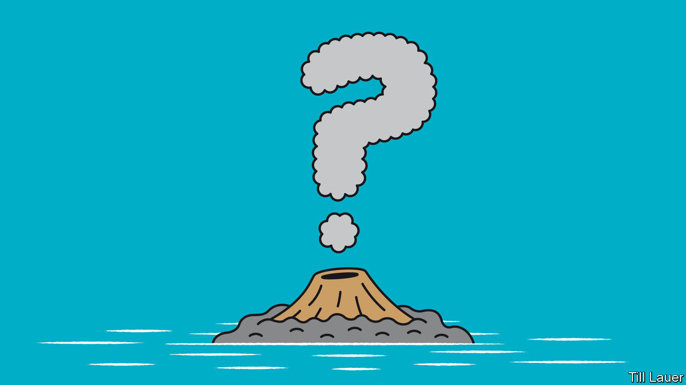

## Banyan

# Taal volcano is a reminder of Asia’s vulnerability to natural forces

> And of the constant temptation to ignore the risks

> Jan 30th 2020

NEARLY TWO weeks after Taal volcano’s first eruption in over 40 years, the Philippines Institute of Volcanology and Seismology has lowered its threat assessment a notch, and local residents have begun to stream back to their homes in jeepneys, pickups and on the backs of motorcycles. When Taal roared to life on January 12th, the plume of steam and ash it sent 32,000 feet into the air was so vast it generated its own weather system, with thunder and lightning. As the falling cinders turned day to night, tens of thousands of evacuees fled for hastily created evacuation centres a safe distance from Taal’s spite.

Usually, Taal is a draw. The volcano has made its own island in the middle of Taal lake, which occupies the caldera of a much bigger volcano which exploded aeons ago. The surrounding slopes are forested. Papayas and vegetables thrive on village plots by the shore. The lake itself provides livelihoods to those farming tilapia fish. More jobs come from catering to visitors from Manila who flock to the lake, or to the resort town of Tagatay on an overlooking ridge, for the fresh air, sweeping views and grilled fish. The country’s capital is just two hours’ drive to the north.

Yet these times are hardly usual. The eruption seems to have caused a lot of the lake’s water to evaporate. One part of the lake, though, is now a metre deeper, since the whole caldera has tilted sharply. Taal’s ash has turned a vast area a monotone grey. Rain following the eruption has hardened the ash to concrete. The tin roofs of villagers’ houses have buckled, trees have lost their main branches and the tomatoes and aubergines in Rosa’s garden have shrivelled to nothing. But life is nothing if not, well, pigheaded. Rosa says she and her husband, a retired soldier, had no choice but to stay, despite the loss of electricity and water: Biggie, their sow, was about to farrow. Fourteen piglets now snuffle around their mother. Girlie, from one of the worst-hit villages on the west side of the lake, cries with joy to find that the food she left out for her family’s dog and kitten have sustained them.

The repair teams from the electricity board, villagers chipping the ash off roofs and even young scientists returning to their lakeside observatory in Talisay to get the solar panels for their sensors working again—life has a yen for normality, too. Not the volcano, however. The earthquakes following the eruption have fallen in number and severity, and an alarming build-up of magma appears to have diminished. But that, says Paolo Reniva, a geologist, says little about how the volcano will behave in future. He expects Taal’s current cycle of activity to last months or years. At the back of all the geologists’ minds is the eruption of 1754. That blast had the force of a nuclear bomb, and the jargon they use to describe it is similar: “ballistic projectiles” fell over seven kilometres away; the “base surge”, a mixture of gas and fragments moving at up to 100m a second, reached up to 20km away. No one died from the direct effects of the eruption on January 12th; a 1754-style explosion, in contrast, would be catastrophic.

This is not what those trying to resume their lives want to hear. The current threat assessment of 3 on a scale of 0 to 5 risks being viewed as normal by locals. And just as President Donald Trump downplays climate change, so populist Filipino politicians downplay nature’s forces. President Rodrigo Duterte promised evacuees he would “pee on that damned volcano”. The vice-mayor of Talisay, Charlie Natanauan, a local businessman who is campaigning to unseat the mayor (his brother, as it happens), goes further by urging locals not to believe the “idiot” scientists. Taal is not going to explode again, he insists, because he knows its history; if he’s wrong, he adds, then throw him into the crater. What’s more, the scientists’ warnings about poisoned tilapia are off-the-mark too, and he will eat as many fish as needed to prove it. It goes down a storm with locals.

Sitting on a veranda by the lake, next to a gold-painted statue of himself toting a rifle and pistol, Mr Natanauan lays out his plans. They include a canal cutting through to the sea so that luxury yachts can travel up it; modernist glass resorts; and firework shows to put any eruption to shame. How, Banyan asks, do his ideas fit with the volcano’s even more sweeping and whimsical plans? Pah, Mr Natanauan says dismissively, the next time Taal causes trouble, we’ll all be dead. Behind him, dozens of dead tilapia float upside down, slapping against his jetty. Just beyond, the volcano gently steams.