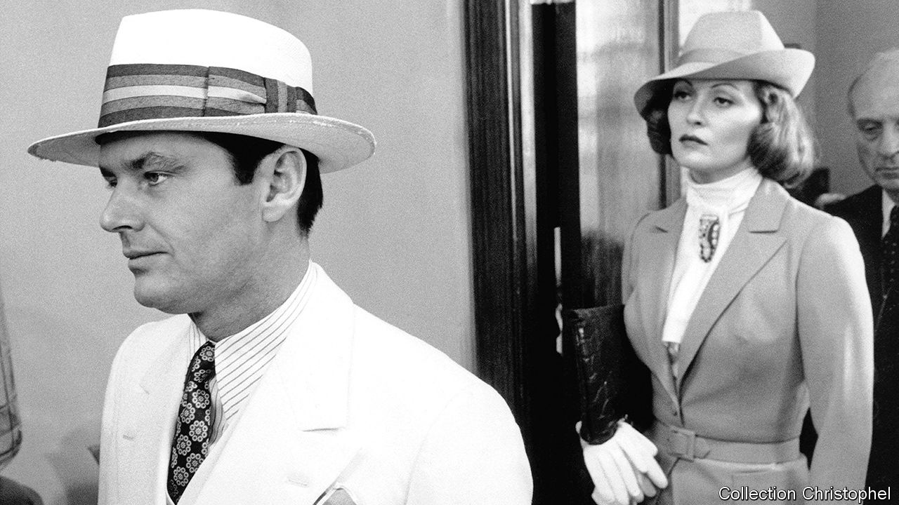

## Forget it, Jake

# It’s the making of “Chinatown”

> Sam Wasson explores the dramas and tensions that created a classic

> Jan 30th 2020

The Big Goodbye: Chinatown and the Last Years of Hollywood. By Sam Wasson. Flatiron Books; 416 pages; $28.99. Faber & Faber; £18.99.

WHEN THE camera pulls back, Jake Gittes is left standing there, slack-jawed, bathed in the cold blue city light. The girl is dead. The bad guy got away. A dreadful crime will go unpunished. There is nothing he can do about it. “Forget it, Jake,” someone whispers. “It’s Chinatown.”

The devastating final scene of “Chinatown” (released in 1974), one of the most famous in film history, only came together at the last minute. Roman Polanski, the director, and Robert Towne, the screenwriter, had argued about it for months. Mr Towne wanted to leave viewers with a sliver of hope, but Mr Polanski was adamant: “You have to show violence the way it is,” he insisted. The villain would get off scot-free, “just like most bad guys really do”.

Mr Polanski already knew something about violence. In 1969 his pregnant wife, the actor Sharon Tate, was brutally murdered by followers of the cult leader Charles Manson. “I don’t mean this unkindly,” Mr Towne later said, “but I think it was impossible for Roman to come back to Los Angeles and not end his movie with an attractive blonde lady being murdered.”

In “The Big Goodbye”, an absorbing account of the making of “Chinatown”, Sam Wasson profiles the creators of the neo-noir classic. For Mr Towne, the film was a homage to the Los Angeles of his childhood, a “haven of pastel and desert moods” before it was choked by smog and traffic. For Jack Nicholson (who played Jake), “Chinatown” was an aesthetic antidote to television, which he saw as a form of philistinism. And for the powerful producer, Robert Evans of Paramount—who had an average of two phones per room in his Beverly Hills mansion—“Chinatown” was a chance to show that artistic achievement and commercial success could go hand in hand.

Mr Wasson is a stylish chronicler of Hollywood politics, and sensitive to how off-screen events contribute to on-screen drama. “Chinatown” was the fruit of many collaborations, including an unsung writing partnership between Mr Towne and his college roommate, Edward Taylor. Conflict enlivened the production, too. When Mr Nicholson kept the crew waiting while he watched the final minutes of a basketball game, Mr Polanski smashed his television screen with a mop.

“The Big Goodbye” evokes the care that went into every frame, from the strict colour palette to the cinematographer’s limited use of zoom. Anthea Sylbert, the costume designer, dressed Faye Dunaway in vintage silk stockings from Paris, hoping that “they would tell [her] body something about the character and bleed their way into the performance.” Mr Polanski spent 40 minutes getting the perfect close-up of an ant crawling over Mr Nicholson’s face (“the costliest ant in human history”).

As Mr Wasson recounts, 1974 was a golden year for Hollywood. Paramount received a staggering 43 nominations for the Academy Awards, including 11 for “Chinatown” (although only Mr Towne took home an Oscar) and a best-picture award for “The Godfather Part II”. But in retrospect, this was the end of a cinematic heyday. More and more, the industry became commercially minded as film budgets swelled to pay for rising promotional costs and rocketing salaries. For its creators, too, “Chinatown” was a farewell. Evans soon lost his career and reputation to cocaine; Mr Polanski fled the consequences of his own crimes against a teenage girl.

Outsiders “pretend to be interested in how pictures are made”, F. Scott Fitzgerald once observed, but “they never see the ventriloquist for the doll.” “The Big Goodbye” is a captivating and revealing look at how the magicians of cinema really work. ■