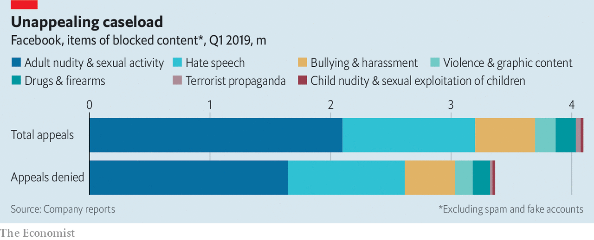

## A court of public opinions

# Facebook unveils details of its content-oversight board

> The social network prepares to hand decisions about contentious content to an independent arbiter

> Jan 30th 2020MENLO PARK

IN NOVEMBER 1999 the Internet Corporation for Assigned Names and Numbers (ICANN), which oversees the web’s address book, held its inaugural annual gathering. Two decades later the online world faces another constitutional moment, this time courtesy of a company which has profited from the internet’s stupendous growth—and is blamed for many of its ills, from privacy abuses to the spread of disinformation. On January 28th Facebook unveiled a draft of the bylaws of what it calls an “oversight board”: an independent group of experts charged with the power to review—and overturn—decisions by the firm’s army of content moderators. The world’s largest social-media conglomerate hopes to have the body up and running in a few months.

Some hope the entity will evolve into an online ombudsman—perhaps even a “supreme court” for other big Western internet platforms—to oversee not just content moderation, but data-gathering and algorithm design. Others view it as no more than Facebook’s figleaf: an attempt to forestall real regulation and palm off responsibility for controversial posts. What should users, regulators and investors make of it?

The board certainly looks like a serious effort at institution-building—something “no firm has ever done before”, in the words of Kate Klonick of St John’s University School of Law in New York, who was allowed to play fly on the wall as the board’s contours were drawn up. Facebook hired a (majority-female) team of 12 people, mostly lawyers, to oversee the body’s creation. Some used to work at the White House and the UN; others came from media firms and consultancies. Over the past year they solicited input from more than 2,500 people at 60-odd workshops around the world.

The result is unique: a sort of regulatory startup. The board will have its own staff of 30-40, budget (Facebook has earmarked $130m over six years) and a trust to manage it all. Facebook will appoint the first three co-chairs, who will then recruit other members (for a total of 40, each serving a twice-renewable three-year term). The board will have its own website to receive and review appeals. These can be lodged by users of Facebook (and of Instagram, its photo-sharing app) who feel their post has been unfairly removed and not restored. If the company itself is having trouble deciding whether to restore content, it too can file “emergency requests”.

Each submission triggers a 90-day process. The emergency requests will be handled faster: in 30 days. If the board agrees to hear a case, a group of five members (who will remain anonymous for security reasons) consults experts and makes a decision, which it must present in plain language. Facebook has a week to comply with a ruling (and can apply it to selfsame content elsewhere on the network). The board can also make “policy recommendations”, such as amending Facebook’s “community standards”. Though these are non-binding, the firm will have to explain itself publicly if it chooses to ignore them.

Internet-governance nerds have questions aplenty. Will users and authorities deem the board legitimate? Much will hinge on the geographic and biographical diversity of its initial members, reckons Ms Klonick. Will it have the capacity to deal with appeals? The board is expected to consider no more than a few dozen cases a year, compared with 3.4m posts Facebook declined to restore in the first quarter of 2019 alone (not counting spam, see chart). Some fear that Facebook could flood it with emergency requests to distract from inconvenient ones for the company.

Most important of all, how powerful and independent will Facebook allow the board to become? And how will it affect the firm’s business? The answer is not very and not much—for now. The board’s decisions will be based not on real-world laws but on the community standards, which are vague. Initially it will only rule whether individual pictures and posts ought to have been taken down, though the company promises to extend the board’s ambit to entire Facebook pages and groups and also to whether certain posts should be up in the first place, once the technical infrastructure is in place. If this makes the social network seem more salubrious, it may lure more corporate advertisers, the fount of Facebook’s revenues (which grew more slowly last quarter than ever before).

Things would get more complicated were the board granted a say on how Facebook gathers data or designs algorithms. The company does not rule out the possibility. But Nathaniel Persily of Stanford Law School argues that broadening the board’s remit too far, too fast, could be tough. Unlike for content, he observes, no proven judicial model exists for reviewing algorithms. More cynically, Dipayan Ghosh of Harvard University, who once worked at Facebook, doubts the firm would ever accept limits on the data it collects or what content its algorithms show in the Facebook newsfeed.

The last set of unknowns concerns how others, notably governments and rival platforms, will react. If Big Tech takes up Facebook’s invitation to sign up to its creation, it could indeed turn into a court of appeal for cyberspace. This looks unlikely in the near term: why would a Google let someone else tie its hands? Some governments, for their part, may see the board as competing with official efforts to regulate speech online. However, both could yet find the nascent entity useful: a complement to government action and, if pressure on internet firms to moderate content mounts, a substitute for bodies they would otherwise need to convene themselves.

A lot rests on how the oversight board turns out in practice. This will take time to assess. Even 20 years after its birth ICANN is a work in progress; just look at the controversy over the recent $1bn sale of .org, a domain mostly used by charities, to a private-equity firm. At a time when the internet is torn between its non-commercial roots and its hyper-commercial present, Facebook’s experiment is worth pursuing. ■

## URL

https://www.economist.com/business/2020/01/30/facebook-unveils-details-of-its-content-oversight-board
