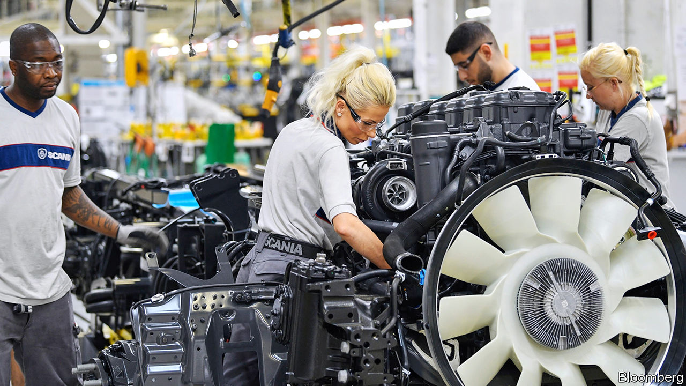

## What’s American for Mitbestimmung?

# Most of the world has yet to embrace co-determination

> Few countries outside Europe mandate works councils or worker representatives on boards

> Feb 1st 2020

WORKS COUNCILS and worker representatives on boards are a German invention. But Mitbestimmung has spread throughout Europe. Nineteen of the EU’s 27 post-Brexit members—all bar Belgium, Bulgaria, Cyprus, Estonia, Italy, Latvia, Lithuania and Romania—have some “co-determination” in the private sector, at state-run firms or both. So does Norway, which is not in the EU.

Rules differ. In Sweden workers have the right to be represented on boards of firms with more than 25 employees. In Luxembourg the threshold is 1,000. Seats reserved for workers range from one in Croatia to half the board in Slovenia. In Norway and Sweden workers’ representatives sit on firms’ sole management board. Their Austrian and Slovakian counterparts are members of the supervisory board, the upper tier in two-layer board structures like Germany’s.

Outside Europe the practice has not taken hold (South Korea is a rare exception). In many countries unions play the role of works councils. America’s Wagner act of 1935 prohibits the formation of any form of employer-employee committee that has the power to decide on working conditions and labour-management relations, observes Steffen Müller at the Halle Institute for Economic Research. Some American unions oppose co-determination for fear of being usurped.

America’s private-sector unions have seen membership collapse in recent decades, leading to renewed interest in co-determination. The idea faces resistance—and not only from employers. In 2014 workers at a Volkswagen plant in Tennessee voted against being represented by the United Auto Workers, one of America’s biggest labour unions, which had planned to introduce a German-style works council at the plant. Local Republican leaders convinced enough workers that this would hurt jobs by deterring other businesses from investing in Tennessee.

## URL

https://www.economist.com/business/2020/02/01/most-of-the-world-has-yet-to-embrace-co-determination
