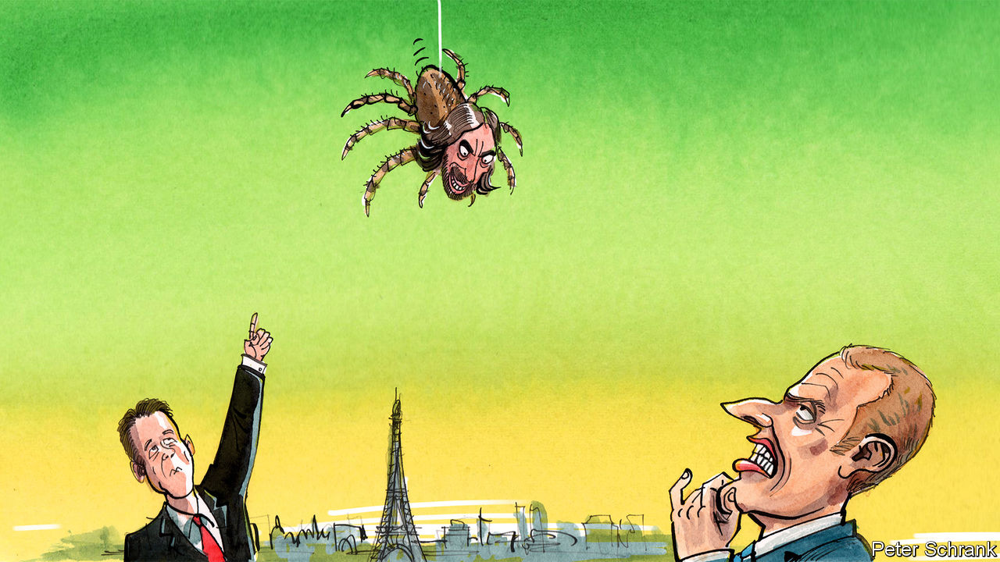

## One party, two candidates

# Emmanuel Macron may be about to lose in Paris

> He won 90% of the Parisian vote in 2017. But his party is in disarray

> Jan 30th 2020PARIS

IF THERE IS one city that should be a natural habitat for Emmanuel Macron and his centrist party, it is Paris. Home to the country’s liberal elite, as well as to bike-sharing eco-types who applauded the president’s pledge to “make our planet great again”, the French capital is a world away from the rural roundabouts of the anti-Macron gilets jaunes. In the second round of the presidential election in 2017, fully 90% of the city’s voters backed Mr Macron. Yet, thanks to internal rivalry and mismanagement, his party is currently making a hash of the race for mayor of Paris.

The capital, along with all other municipalities, goes to the polls for two rounds of voting on March 15th and 22nd. In a bid to dislodge Anne Hidalgo, the sitting Socialist mayor of Paris, Mr Macron’s party, La République en Marche (LREM), finds itself with, in effect, not just one candidate but two. The first, Benjamin Griveaux, is the official nominee. The other, Cédric Villani, failed to secure the party nomination but insists on staying in the race anyway.

Both Mr Griveaux and Mr Villani are LREM deputies, elected for the first time in 2017. Mr Griveaux is one of the original “Macron boys”: a co-founder of En Marche, the party Mr Macron launched to win the presidency, and a campaign insider who was propelled directly into government. Mr Villani is a prize-winning mathematician, known for his signature three-piece suit and spider brooches, who has published research papers on such topics as collisional kinetic theory. It was something of a coup for En Marche to have coaxed him into running for parliament.

Last July, when the LREM investiture committee picked Mr Griveaux as the official candidate, however, Mr Villani refused to stand down. The selection process was flawed, he said; he also defended his right to “liberty”. The upshot has been to split the LREM vote. Polls now suggest that Mr Griveaux could come third in the first round of voting, behind both Ms Hidalgo and Rachida Dati, the centre-right Republican candidate, with Mr Villani trailing in fifth. A second-round vote would then keep Ms Hidalgo in the job.

Efforts are afoot to try to broker a peace and persuade Mr Villani to give up. Mr Macron even summoned him to the Elysée palace, but Mr Villani emerged to declare that he had “a major divergence” with the president. On January 29th, after much internal soul-searching, LREM decided to expel Mr Villani from the party. Disappointingly for the president, he says he will continue his campaign as an independent.

Further realignments are possible, including one around the Greens’ candidate, David Belliard. Making Paris greener is the one idea all the candidates agree on. For his part, Mr Griveaux says that his “door remains open”, should Mr Villani change his mind about running. But time is running out. History teaches that France’s presidents, like its Bourbon kings, often struggle to impose their will on Paris, an unruly city that famously does not take kindly to decisions imposed from on high. ■

## URL

https://www.economist.com/europe/2020/01/30/emmanuel-macron-may-be-about-to-lose-in-paris
