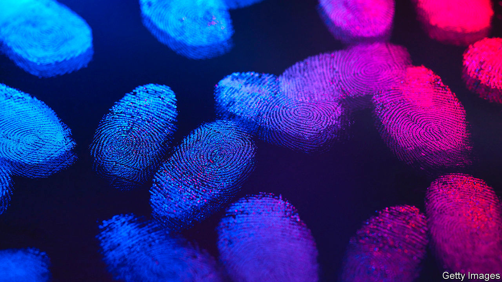

## Forensic science

# Fingerprints can now be dated to within a day of when they were made

> Thus answering the question, “Whendunnit?”

> Jan 30th 2020

SINCE THE first use of fingerprints to identify and convict a murderer, in 1892, detectives the world over have come to rely heavily on print evidence to build their cases against suspects. One limit on the value of fingerprints, though, is that it is hard to work out how old they are. This is a particular problem when a crime is committed somewhere that a suspect frequently and legitimately visits, such as a place of work. In this case exactly when a print was made might be crucial to establishing guilt or innocence. But it is information that science has, until now, been unable to provide with any accuracy.

As they write in Analytical Chemistry, Paige Hinners and Young Jin Lee of Iowa State University believe they can remedy this state of affairs. They knew from work conducted by other laboratories that the triglyceride oils contained in fingerprints change by oxidation over the course of time. That provides an obvious way to date prints. The problem is that the techniques which have been applied to analyse these oils are able to distinguish age only crudely. In practice, they can determine whether or not a print is over a week old, but nothing else.

Dr Hinners and Dr Lee wondered if higher precision could be obtained by thinking a bit more about oxidation. Oxygen molecules in the air come in two varieties. Most have a pair of atoms but some, known as ozone, have three. Though far rarer than diatomic oxygen, ozone is more reactive and also reacts in ways different from those of its two-atomed cousin. The two researchers therefore decided to focus their attentions on ozonolysis, as triatomic oxidation is known.

Triglycerides, as their name suggests, are three-tailed molecules. Each tail is a chain of carbon atoms, with hydrogen atoms bonded to the carbons. The chains are held together by bonds between the carbon atoms. These are of two varieties, known as single and double bonds. Single bonds are, in chemistry-speak, saturated, and double bonds unsaturated. By extension, molecules with one or more double bonds in them are also referred to as unsaturated, while those with only single bonds are called saturated.

Unsaturated bonds are more reactive, and it is here that ozonolysis does its work. Ozone breaks up triglycerides at their double bonds, with one or more of the ozone’s oxygen atoms becoming attached to the carbon chain, to create new chemical species. In principle, this should result in a gradual loss of unsaturated triglycerides and a concomitant rise in the reaction products of ozonolysis.

And that, in practice, is what Dr Hinners and Dr Lee found. They asked three volunteers to leave their prints on a number of glass slides. They then tested some of those slides immediately, using a sensitive analytical technique called matrix-assisted laser desorption/ionisation (MALDI) to produce a spectrum of the prints’ chemical contents. The other slides they left exposed to the air for between one and seven days, testing them at regular intervals.

As they suspected, as time progressed the ratio of saturated to unsaturated triglycerides in a sample rose, and so did the quantities of two characteristic products of ozonolysis—aldehydes and Criegee ions. On the basis of what is, admittedly, a small sample, Dr Hinners and Dr Lee therefore think that MALDI analysis of fingerprint residues should prove accurate enough to date to within 24 hours when a fingerprint under a week old was made—and thus whether it is associated with a crime temporally, as well as spatially.■

## URL

https://www.economist.com/science-and-technology/2020/01/30/fingerprints-can-now-be-dated-to-within-a-day-of-when-they-were-made
