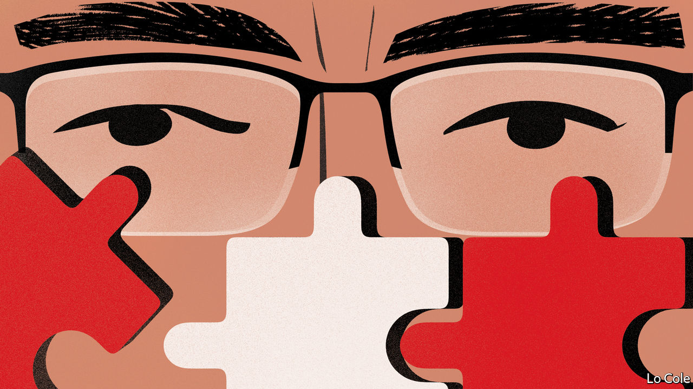

## Bello

# The difficulty of reforming Peru

> An election vindicates but doesn’t strengthen Martín Vizcarra

> Jan 30th 2020

IT WAS THE most popular thing any Peruvian president has done in a long time. Facing a serially obstructive congress widely seen as defending corrupt interests, in September Martín Vizcarra decreed its dissolution. This was constitutionally questionable and set a worrying precedent. But in political terms, the outcome of an election held on January 26th to replace the dissolved congress vindicated Mr Vizcarra. It also highlighted the weaknesses of Peru’s political system, and has not made his project of institutional reform any easier.

Mr Vizcarra, who was elected as vice-president in 2016, took over the top job almost two years ago when Pedro Pablo Kuczynski resigned over conflicts of interest. He inherited a battle with congress, dominated by the opposition led by Keiko Fujimori, the daughter of a former president. When leaked phone calls revealed apparent collusion among some judges and opposition lawmakers, Mr Vizcarra successfully appealed for public support in a referendum on reforms of the judiciary and politics.

That gave him the initiative, but only for a while. To break the deadlock Mr Vizcarra proposed calling an early general election. Ignoring this, the fujimoristas went ahead with a rushed vote to appoint new justices to the constitutional tribunal. The president claimed that this amounted to a (second) denial of confidence in his government. Under Peru’s semi-parliamentary constitution, that is grounds for the dissolution of congress. In January the tribunal upheld by four votes to three the constitutionality of the president’s action.

The voters inflicted a crushing defeat on the fujimoristas, who slumped from 36% of the parliamentary vote in 2016 to 7%. Two smaller allied parties failed to enter the new congress. That is the extent of the good news for Mr Vizcarra. The election marked an exacerbation of Peru’s political fragmentation. Nine parties obtained the minimum 5% of the vote required to win seats in the legislature but none got much more than 10%.

On paper, centrist parties will be the largest contingent, though the right is also strong. Two newcomers offer some cause for disquiet. The Agrarian Front, a party linked to a millenarian Old Testament cult, won at least 15 of the 130 seats. And 17 were taken by the party of Antauro Humala, a proto-fascist former army officer (and brother of a past president) serving a 19-year jail sentence for an assault on a police station in 2005 in which six people died.

Their success is, in different ways, a protest against the Lima political establishment. Neighbouring countries have seen sometimes violent street protests in recent months. In Peru, the dissolution of congress and the jailing of several former presidents over accusations of corruption (none of which has yet been proved) have taken some of the sting out of popular anger. On January 28th a judge remanded Ms Fujimori for a second time over accusations of irregularities in campaign finance in 2011.

Perhaps, too, the flexible nature of Peru’s political culture provides resilience. But it might make reform harder. After the recent confrontations both public opinion and many politicians favour co-operation. But Mr Vizcarra has only a year or so to complete the task of institutional reform he set himself before the general election in April 2021.

The government has already set up a new body, picked on merit, to oversee judicial appointments. Several measures approved by the outgoing congress are aimed at cleaning up, and solidifying, political parties. Some are useful. They include tightening up rules on campaign finance, steps to cut the cost of politics and, from 2021, the shutting down of parties that fail to cross the 5% threshold. Pending are a tighter definition of parliamentary immunity and, perhaps, the addition of a senate to Peru’s small single-chamber legislature.

The election offers few pointers to the 2021 presidential contest. “Everyone is weak and anything can happen,” says Alberto Vergara, a political scientist. By championing the fight against corruption, Mr Vizcarra has achieved the rare feat for a Peruvian president of remaining popular. Now more may be needed. The government is trying to improve health care and rural roads but is dogged by union pressures to raise public-sector salaries and business opposition to higher taxes (which raise revenue of just 14% of GDP). A new political system may yet emerge. But if Peru is to continue to enjoy economic growth and to avoid a Chilean-style social explosion it also needs a stronger and more effective state.

## URL

https://www.economist.com/the-americas/2020/01/30/the-difficulty-of-reforming-peru
