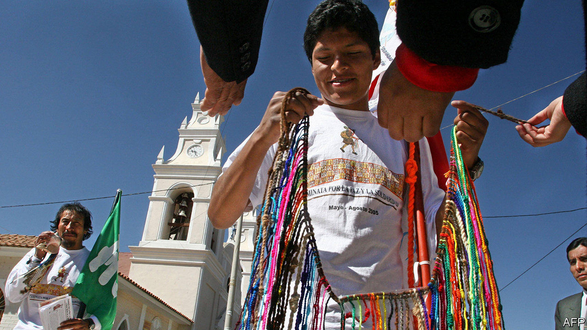

## Knotty tale

# The mystery of quipus—Incan knot records

> In a small Peruvian town, the Incas’ method of record-keeping survives

> Feb 1st 2020LIMA

SAN ANDRéS DE TUPICOCHA starts every year by swearing in new leaders, like many small towns in Peru. Instead of giving the office-holders a sash or medal it gives them a quipu, a coloured skein of knotted cords.

Quipus, or khipu, which means knots or talking knots in Quechua, were used to administer the vast empire of the Incas, which lasted for about a century until 1533. No one alive knows just how. San Andrés, in the highlands near Lima, is the last place in Peru where quipus have an official role, and that is ceremonial. “They represent who we are,” says Tito Rojas, president of one of the town’s ten communities. In December Peru’s government declared its ritual of bestowing them on community leaders like Mr Rojas to be part of the country’s cultural heritage.

The town’s quipus are thought to date from after Peru’s independence from Spain in 1821. They were used until the mid-20th century to record attendance at meetings, says Roy Vilcayauri, a former mayor. But the last person who could read that set died in 1990.

Scholars have been trying to puzzle out what messages are encoded in the knotted tally cords, which are usually made from dyed alpaca wool (they can also contain fibres from llamas, vicuñas and cotton). The type of knot, their number and their spacing conveyed numerical information. The placing of principal and subsidiary cords could show family or tribal relationships.

Quipus’ main use was as a management tool, says Gary Urton, who set up the Khipu Database Project at Harvard University. From the Incan capital in Cusco to the empire’s outer reaches in present-day Argentina, Ecuador and Colombia, quipus helped officials keep track of tax collection, command armies and maintain census records. The Incas had no written language. Quipus are the only documentary record of their life that does not come from Spanish chroniclers. Mr Urton has recorded the characteristics of more than 1,000 quipus in digital form and spent 30 years trying to understand them.

Nowadays the largest collection of quipus, around 350, is in Berlin’s Ethnological Museum. Some 500 others are in Peru and Chile. To see quipus perform any function beyond serving as objects of study or curiosity, you will have to spend a new year in San Andrés de Tupicocha.■