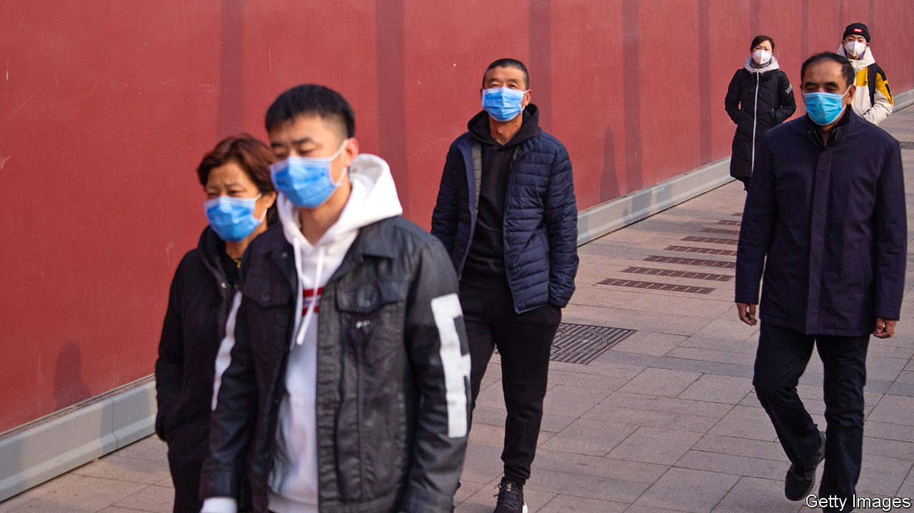
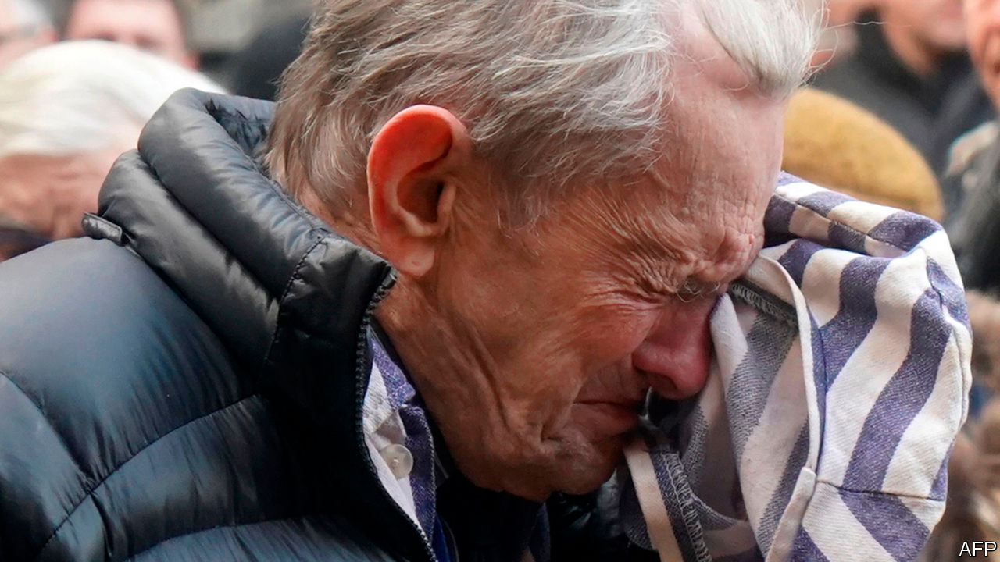

# Politics this week

> Feb 1st 2020

A new coronavirus continued to spread rapidly in China. Several large cities were locked down in Hubei province, whose capital, Wuhan, is where the virus broke out. Streets emptied; people stayed at home. However, Wuhan’s mayor said that 5m people had left the city before the quarantine was imposed: some for their usual Chinese New Year trips, others to escape the virus. Some airlines cancelled flights to and from China. See [article](https://www.economist.com//leaders/2020/01/30/will-the-wuhan-virus-become-a-pandemic).

Many countries, including America, Britain and Japan, took steps to evacuate their citizens from China. Some businesses scaled back or closed their operations in the country. Cases of Wuhan virus have been detected outside China. Human-to-human transmissions were reported in Germany, Japan, Vietnam and Taiwan. Stockmarkets shivered when it became clear that the disease is spreading rapidly; the S&P 500 had its worst day since October.

India partially restored internet access in the Kashmir valley, where it has been blocked since August. But the authorities are only allowing Kashmiris to visit 301 “whitelisted” websites. Social-media services remain banned and mobile-data speeds have deliberately been reduced. The government says the measures are needed to impede terrorism.

Authorities in Pakistan arrested Manzoor Pashteen, the head of the Pushtun Protection Movement, which has campaigned for justice for victims of military abuses. He has been charged with sedition, among other crimes. Several supporters protesting against his detention were also arrested. See [article](https://www.economist.com//asia/2020/01/30/a-prominent-critic-of-pakistans-army-is-hauled-into-court).

Democrats pushed their case for witnesses to give evidence in the impeachment trial of Donald Trump. They hoped to call John Bolton, the president’s former national security adviser, who has claimed in a forthcoming book that Mr Trump explicitly withheld military aid from Ukraine to press its government to investigate Joe Biden and his son. This claim is a central plank of the case against Mr Trump, which he denies. See [article](https://www.economist.com//united-states/2020/01/27/john-boltons-claims-jolt-donald-trumps-impeachment-trial).

Possibly to take his mind off the impeachment trial, and shore up his support among ardent pro-lifers, Mr Trump gave a speech at the annual March for Life anti-abortion rally in Washington, the first president to do so.

In a 5-4 vote, the Supreme Court let stand a new immigration rule that could stop legal migrants from becoming permanent residents if they use public-welfare programmes, such as food stamps. See [article](https://www.economist.com//united-states/2020/01/30/the-supreme-court-votes-to-allow-a-green-card-wealth-test).

Donald Trump’s peace plan for Israel and the Palestinians gave Israel most of what it wanted, such as a green light to annex occupied lands in the West Bank straight away. The Palestinians got conditional promises of something like a state and billions of dollars in investment at some point in the future. They instantly rejected the deal. See [article](https://www.economist.com//leaders/2020/01/30/donald-trumps-one-sided-peace-plan).

The American embassy in Baghdad was struck by three rockets, wounding three people. America has blamed Iran and its proxies for an increase in attacks on American forces and facilities in Iraq.

Heavy fighting broke out in Libya between forces loyal to the UN-backed government, which is supported by Turkey, and soldiers under the command of Khalifa Haftar, who is supported by Russia, Egypt and the United Arab Emirates. Despite an arms embargo, weapons are pouring in.

The biggest infestation of locusts for at least 25 years wrought havoc on east Africa. Heavy rains last year created ideal conditions for the pests. An adult locust can eat its own weight each day. See [article](https://www.economist.com//middle-east-and-africa/2020/01/30/east-africa-is-reeling-from-an-invasion-of-locusts).

Holocaust survivors and international leaders gathered at the former Auschwitz death camp in Poland to mark the 75th anniversary of its liberation by Allied troops, amid calls to fight resurgent anti-Semitism. The presidents of Israel and Poland led the commemoration. About 1.1m people, mostly Jews, were murdered at Auschwitz-Birkenau, the Nazis’ biggest death camp. See [article](https://www.economist.com//europe/2020/01/26/an-anniversary-at-auschwitz-is-marred-by-disputes).

Regional elections in Italy were a setback for Matteo Salvini, leader of the populist Northern League. He had hoped to win a big victory in Emilia-Romagna, but did not. See [article](https://www.economist.com//europe/2020/01/30/regional-elections-in-italy-buttress-the-government).

The German cabinet agreed to cut the country’s greenhouse-gas emissions to 55% of their level in 1990 by 2030. The plan aims to end reliance on coal by 2038. However, it undermines its own objectives by also shutting all nuclear plants by 2022. Coalmining regions are to get some €40bn ($44bn) in compensation. The nationalist Alternative for Germany party (AfD) had been making electoral gains in such places.

Britain prepared to leave the European Union on January 31st, after the European Parliament signed off Boris Johnson’s Brexit deal. It has taken three years of political instability (and three prime ministers) to move Britain into a transition period with the EU so that the details of separation can be finalised. The focus now shifts to a trade deal, but there are clear disagreements, over regulation for example, that are unlikely to be resolved within just 11 months. See [article](https://www.economist.com//leaders/2020/01/30/britain-after-brexit).

The Labour Party in Britain has learned little from its drubbing in December’s election, its worst result since 1935. The party’s ruling committee absolved Jeremy Corbyn, its leader, of any blame. Labour MPs on the campaign trail, and post-election polls, found that Mr Corbyn was by far the main reason voters were turned off by the party.

The largest party in Peru’s congress lost most of its seats in an election. Popular Force, a centre-right party led by Keiko Fujimori, the daughter of a jailed former president, won just 7% of the vote. This boosted the current president, Martín Vizcarra, who dissolved congress in September because it failed to enact anti-corruption reforms. Ms Fujimori returned to jail amid an investigation into allegations of illegal campaign funding. See [article](https://www.economist.com//the-americas/2020/01/30/the-difficulty-of-reforming-peru).

Jeanine Áñez, Bolivia’s interim president, announced that she would run for the presidency in May. A conservative former senator, she became president after Evo Morales quit in November. Critics of Ms Áñez say she should not run for office while also, as interim president, overseeing the election.

Conservationists spotted three Bolivian Cochran frogs, the first time they have been seen in 18 years. The internal organs of the vividly green frogs are visible through their abdomens and they weigh less than 100 grams (3.5 ounces). They were spotted in Carrasco National Park near Cochabamba, the site of a hydroelectric dam that is under construction.

## URL

https://www.economist.com/the-world-this-week/2020/02/01/politics-this-week
