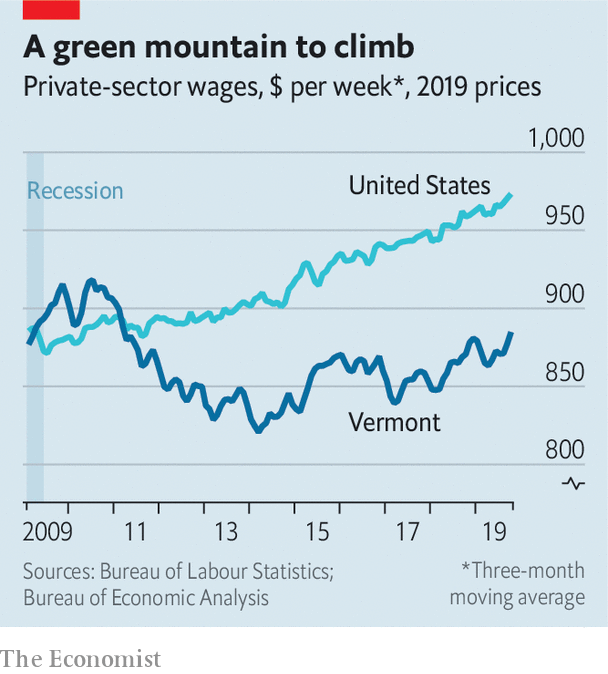

## The road not taken

# As wages grow across America, one state is left behind

> Vermont attracts tourists and students. What is holding it back?

> Jan 30th 2020MONTPELIER

FOR YEARS after the global financial crisis of 2007-09, America’s wage growth was frozen. Earnings have recently been rising at a faster rate. The latest figures point to year-on-year growth of around 3% in nominal terms. But not all states have shared the gains. On both a per-hour and per-week basis, Vermont has seen the weakest wage growth of any state in the past decade, despite a rapid rise in the minimum wage and low unemployment. Real wages remain lower than they were when the last recession ended (see chart). What has Vermont got wrong that much of the rest of America has got right?

Weak earnings growth is in part the product of a relatively weak economy. In the past decade Vermont’s GDP has grown at two-thirds the rate of America’s. Critics point to a mountain of red tape and regulation. The state comes close to the bottom of various indices of “economic freedom” produced by libertarian think-tanks. These may be rough and ready but, when it comes to the regulation of land, small-government types may have a point.

A recent working paper from the Bank of England shows that in many parts of America building houses has become more difficult since the mid-2000s. Tough zoning laws may partly be to blame. The paper’s results suggest that it is now about as hard to build in Burlington, the biggest city in Vermont, as in San Francisco. Constraining Burlington’s growth weighs on the economy. People find it hard to move there because it is too expensive, so they are stuck in less productive jobs elsewhere.

Yet it is wrong to blame Vermont’s wage woes on policy alone. The state has raised its minimum wage by 36% since 2009. The higher pay floor has supported earnings at the bottom—apparently with little negative impact on jobs. Vermont’s unemployment rate is below America’s average. The most important reason why Vermont has missed out on wage gains may be the structure of its economy.

Low-paid folk have lately done fairly well out of America’s labour market. Since 2015 the wages of high-school dropouts have risen twice as fast as those of workers with advanced degrees as firms in service industries have competed for workers and minimum wages have risen. Pay-packets in blue-collar jobs have also swelled. The booming energy sector, in particular shale oil, takes much of the credit for that. The top five oil-producing states contributed 23% of America’s GDP in 2009, but have accounted for 30% of countrywide GDP growth since then.

Vermont’s minimum wage rises have affected relatively few people, however. And the state lacks blue-collar workers. Highly educated but not high-income, it is often seen as a destination for hippies trying to get away from it all. Montpelier, the capital, is bursting with hot-yoga studios and shops selling “Eat More Kale” T-shirts. Production of more traditional types of energy is scarce. In 2014 a big nuclear plant closed. And the state produces no oil.

Could its wage growth pick up? If the jobless rate continues to fall, complaints about labour shortages are likely to get louder. Activists are pushing for faster increases in the minimum wage. But Vermont is ageing rapidly. Meanwhile, one of its big industries, education, faces growing competition from other states. Like an enthusiastic yogi, Vermont’s wages could stay floorbound for some time.■