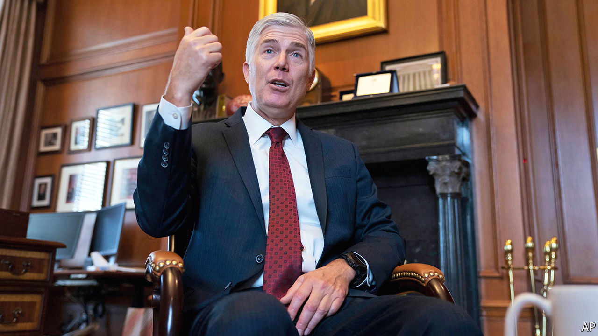

## Injunction dysfunction

# The Supreme Court votes to allow a green-card wealth test

> The 5-4 decision could deny permanent legal status to immigrants deemed likely to need food stamps

> Jan 30th 2020NEW YORK

THE SUPREME COURT has often been a friendly forum for Donald Trump’s administration when its immigration policies have foundered in the lower courts. In 2018, the justices blessed the third iteration of Mr Trump’s ban on travel from predominantly Muslim countries. The next year they allowed the president to move forward with asylum restrictions and to divert federal money for a wall on the Mexican border. On January 27th the Supreme Court voted to permit a new wealth test for green-card applicants while litigation on the matter continues.

The latest decision, like two of the other three, split the justices 5-4. For 130 years the government could deny permanent legal status to immigrants at risk of becoming a “public charge”. But a rule that originally barred only a handful of destitute immigrants could, under the revision announced last August, rope out hundreds of thousands of immigrants. Those who are deemed likely to need food stamps, Medicaid or housing assistance over 12 of the next 36 months—after considering family size, English proficiency, credit score and income, among other factors—would be ineligible for a green card.

Before the Trump administration could implement the change on October 15th, it was blocked in a federal district court in New York. The move has “absolutely no support in the history of US immigration law”, Judge George Daniels wrote, and is “repugnant to the American dream”.

After an appeals court allowed Judge Daniels’s injunction to stand, the Trump administration asked the Supreme Court to step in. The court granted the request without comment. But Justice Neil Gorsuch, joined by Justice Clarence Thomas, expressed frustration with the phenomenon of district judges issuing injunctions that apply universally across the country.

In his four-page statement, Justice Gorsuch noted that two circuit courts had lifted similar injunctions against the revised wealth test and that an injunction in Illinois applied only to in-state green-card applicants. But Judge Daniels’s move, Justice Gorsuch complained, involved “a single judge” who “enjoined the government from applying the new definition to anyone”, anywhere, without regard to “participation in this or any other lawsuit”.

These injunctions “share the same basic flaw”, in Justice Gorsuch’s eyes, in that they dictate how the government must treat people “who are not parties to the case”. Judicial interventions that have an impact on everyone from coast to coast affected by a government programme are “patently unworkable” and sow chaos, Mr Trump’s first Supreme Court appointee argued. He also characterised them as “a sign of our impatient times”.

Howard Wasserman, a law professor at Florida International University, agrees with Justice Gorsuch’s reasoning but wonders why he chose this moment to attack universal injunctions. Justice Gorsuch probably would have opposed even a narrower injunction, Mr Wasserman reckons. Further, a more suitable case raising the question will be before the court in the spring. That case involves carve-outs to the contraception mandate in the Affordable Care Act, better known as Obamacare.

Mila Sohoni, a professor at the University of San Diego law school, speculates that Justice Gorsuch’s missive may be designed as a warning to judges “to be more cautious in issuing such broad injunctions” and an invitation to the Department of Justice to keep up its “aggressive” efforts against injunctive overreach.

But contrary to Justice Gorsuch’s claim that the use of broad injunctions “has proliferated only in very recent years”, Ms Sohoni’s forthcoming article in the Harvard Law Review traces the practice back to the 19th century. It is not “some late-blooming efflorescence of post-Warren Court judicial hubris”, she writes. There is a debate to be had regarding when universal injunctions are appropriate, says Amanda Frost, a law professor at American University, but it is “almost laughable” to argue that they are unconstitutional. Ms Frost says administrative law explicitly allows judges to invalidate regulations “as to everyone, not just the plaintiff”.■

## URL

https://www.economist.com/united-states/2020/01/30/the-supreme-court-votes-to-allow-a-green-card-wealth-test
