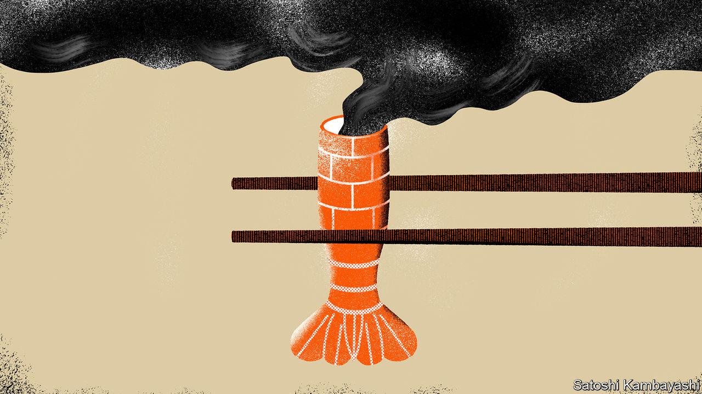

## Brain v prawn

# How artificial shrimps could change the world

> A Singaporean technology could curb both slavery and environmental destruction

> Feb 8th 2020SINGAPORE

FOR A LONG time, beef has been a target of environmentalists because of cattle farming’s contribution to global warming. But what about humble shrimp and prawns? They may seem, well, shrimpy when compared with cows, but it turns out the tasty decapods are just as big an environmental problem. The issue is not so much their life cycle: shrimp (as UN statisticians refer to all commonly eaten species collectively) do not belch planet-cooking methane the way cows do. But shrimp farms tend to occupy coastal land that used to be covered in mangroves. Draining mangrove swamps to make way for aquaculture is even more harmful to the atmosphere than felling rainforest to provide pasture for cattle. A study conducted in 2017 by CIFOR, a research institute, found that in both these instances, by far the biggest contribution to the carbon footprint of the resulting beef or shrimp came from the clearing of the land. As a result, CIFOR concluded, a kilo of farmed shrimp was responsible for almost four times the greenhouse-gas emissions of a kilo of beef. Eating a surf-and-turf dinner of prawn cocktail and steak, the study warned, can be more polluting than driving across America in a petrol-fuelled car.

Eating wild shrimp is not much better: catches are declining around the world as a result of overfishing. Trawlers can pull as much as 20kg of by-catch from the sea for every kilo of shrimp. And reports abound of the appalling treatment of workers on shrimp-fishing vessels, including human-trafficking and child labour. When UN investigators interviewed a sample of Cambodians who had escaped virtual slavery on Thai fishing boats, 59% of them reported seeing fellow crew-members murdered by the captain.

Most of the world’s shrimp and prawns come from Asia. The continent accounts for 85% of the farmed sort and 74% of the wild catch. Global sales were around $45bn in 2018 and are thought to be growing by about 5% a year. But the industry is controversial, not just because of its part in global warming. Razing mangroves also leaves coastal regions vulnerable to flooding. Many shrimp farms are unsanitary; ponds often have to be abandoned after a few years because of problems with disease and pollution.

All this has given one Singaporean company a brain wave. “Farmed shrimps are often bred in overcrowded conditions and literally swimming in sewage water. We want to disrupt that—to empower farmers with technology that is cleaner and more efficient,” says Sandhya Sriram, one of the founders of Shiok Meats. The firm aims to grow artificial shrimp, much as some Western firms are seeking to create beef without cows. The process involves propagating shrimp cells in a nutrient-rich solution. Ms Sriram likens it to a brewery, disdaining the phrase “lab-grown”. Since prawn-meat has a simpler structure than beef, it should be easier to replicate in this way. Moreover, shrimp is eaten in lots of forms and textures: whole, minced, as a paste and so on. The firm is already making shrimp mince which it has tested in Chinese dumplings. It hopes the by-product of the meat-growing can be used as a flavouring for prawn crackers and instant noodles. Eventually it plans to grow curved “whole” shrimp—without the head and shell, that is.

The hitch is that producing shrimp in this way currently costs $5,000 a kilo. Shiok Meats thinks it can bring the price down dramatically by using less rarefied ingredients in its growing solution. People want to know more about where their food comes from and how it is harvested, argues Ms Sriram. “Cell-based technology is one of the ways to provide that accountability.” And even ordinary shrimp, whether farmed or fished, come at a heady price.

Sign up to our fortnightly climate-change newsletter [here](https://www.economist.com//theclimateissue/)