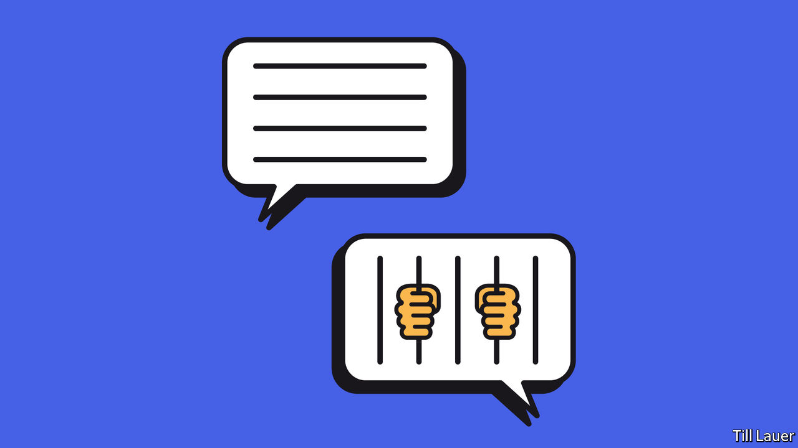

## Banyan

# Singaporean ministers can decide what is fake news

> And then order websites and social media firms to delete it

> Feb 6th 2020

AS SINGAPORE GRAPPLES with the first cases of local transmission of the Wuhan virus, its government is also worried about another form of contagion: fake news. The two are not unrelated. In late January a Singaporean website claimed that someone in the city-state had died of the virus, when no one has to date. And two Facebook posts claimed, wrongly, that a train station had been closed and cleaned because an infected person had been there.

With an evolving epidemic, false rumours can lead to panic. Cue the Protection from Online Falsehoods and Manipulation Act, or POFMA, which came into force four months ago. A new virus was not what the government had in mind when it framed the legislation, but rather the danger in a multiracial, multireligious society of incitement to hatred or violence based on false rumours. Online lies risked undermining faith in government itself. Such falsehoods were, the government claimed, being weaponised “to attack the infrastructure of fact, destroy trust and attack societies”.

All democracies are grappling with the challenges of fake news. POFMA is the most sweeping response to date. It outlaws any false statement deemed “prejudicial” to public health, security or Singapore’s foreign relations, or which may “diminish” public confidence in government. It gives what Cherian George of Hong Kong Baptist University says is unprecedented discretion to individual ministers to pronounce on what is false or misleading. The minister may demand a correction notice or even the removal of any offending statement or the post or article in which it appears. Sanctions include hefty fines for individuals and companies and up to a year in prison. Ministers’ rulings may be challenged in the High Court. But it can rule only on whether disputed statements are indeed false, not on whether using POFMA is a reasonable response. What if a website exposed an official cover-up of shoddy construction work, say, but stated that the offending minister wore size eight shoes when they were in fact size ten?

Singapore’s minister of communications, S. Iswaran, insists that the new legislation, far from being a sledgehammer, adds finesse in dealing with fake news. “Before this, the only tool you really had was to block or to take down, right?” he says. “Now, you have a tool that allows this spectrum of possibilities.” POFMA’s defenders point out that in none of the ten cases since October have ministers demanded that offending posts be removed, merely that corrections be published. It is about restraint and proportionality, Mr Iswaran says.

Yet POFMA has been invoked mainly against opposition figures, activists and NGOs—at a time when the ruling party is skittish about an approaching general election. In one case the Singapore Democratic Party earned a correction notice for a discussion of unemployment and redundancies among white-collar Singaporeans. Its appeal in the High Court argues that the statistics are not in dispute, merely their interpretation. In another case, a Malaysian watchdog, Lawyers for Liberty, refused to issue a correction to its online claims about how Singapore carries out the death penalty, arguing that the demand curtailed freedom of speech in Malaysia. In response, Singapore blocked its website.

As for social-media companies asked to implement POFMA notices, such as WhatsApp, Facebook and Twitter, dismayed executives say the government has come very late to an understanding of the practical, commercial and ethical challenges. “They seemed to think we are like a bulletin board,” says one. Quite how—and to how many people—a general correction notice gets issued via a platform remains problematic. “One of the things they didn’t quite grasp,” says another executive, “is that they could end up driving people off our platforms really quickly, and that they would lose the audiences they wanted.” It is surely better for the government to get its own message out before policing others’. Yet the health ministry sent out zero tweets between May 3rd and January 29th.

As for Banyan, is he within his rights to call POFMA draconian? Go ahead, says Mr Iswaran, that’s an opinion. Yet the minister is an exception. The government is notoriously thin-skinned. It also lacks a funny bone—and POFMA contains no exemptions for satire. The government’s already frequent resort to the law has become something of a joke among some Singaporeans. Far from protecting citizens’ good opinion of their government, POFMA is undermining it.