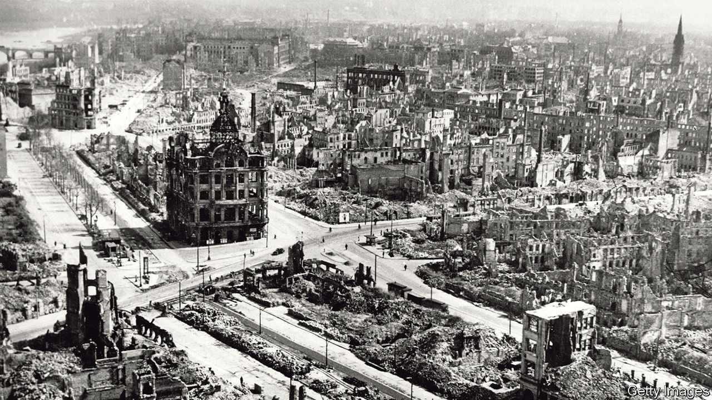

## The inferno

# The destruction of Dresden, the “Florence of the Elbe”

> A compassionate new history of an infamous Allied bombing raid

> Feb 6th 2020

The Fire and the Darkness: The Bombing of Dresden, 1945. By Sinclair McKay. St Martin’s Press; 400 pages; $32.50. Published in Britain as “Dresden: The Fire and the Darkness”; Viking; £20.

SEVENTY-FIVE YEARS ago, on February 13th 1945, Dresden’s citizens were weary and apprehensive. Since the middle of January trains packed with refugees fleeing the relentless advance of the Soviet Red Army had been arriving at the city’s huge railway station. Having crossed the Oder, Marshal Zhukov’s troops were getting close. But despite the anxiety, Dresdeners were trying to summon up the carnival mood of Fasching, the festival that marks Shrove Tuesday. It was a day of socialising and drinking, while children donned colourful costumes and played street games.

At 9.40pm what had passed for jollity came to a sudden end as the drone of air-raid sirens echoed through the streets. Resignedly people made their way to shelters, for the most part wretchedly inadequate basement cellars. There had been many false alarms in the city, but only two raids had materialised to date. Both had been carried out by the Americans, each resulting in several hundred deaths.

Dresden’s inhabitants knew only too well the devastation that mass bombing raids had brought to other German cities. In Hamburg, firestorms whipped up by incendiary bombs had killed 37,000 civilians. But many were convinced that their city, the “Florence of the Elbe”, would be spared because of its cultural importance. Soon after 10pm those hopes were dashed as the first wave of 796 RAF bombers began dropping their 4,000lb “blockbuster” bombs, opening gaping holes in roofs for incendiary devices to fall through.

In the course of that single night, the historic heart of the city and much of its suburbs became a conflagration that left around 25,000 dead. But the Allies were not finished. The morning saw another wave of attacks, this time by 311 American B-17s. Even after the dropping of atom bombs on Hiroshima and Nagasaki, Dresden was to stand as a symbol of wanton destruction. Increasingly, the wider “area bombing” campaign, which killed more than half a million Europeans and of which Dresden was a tragic climax, was questioned on both moral and military grounds.

There have been many books on the bombing of Dresden (not least Kurt Vonnegut’s novel, “Slaughterhouse Five”), but Sinclair McKay’s account is a worthy addition. For one thing, it is scrupulously fair. Before describing the city’s extraordinary contribution, from the early 18th century onwards, to the arts and science, he paints a picture of a community that had accommodated itself to Nazism all too comfortably. At the time of the raid, Dresden’s Jewish population, so central to that creativity, had fallen from more than 6,000 to 198. Slave labourers toiled in its factories. Even before the war, the beautiful Semper Synagogue was burned down. How could “such violent hatred against Jews”, Mr McKay asks rhetorically, “have festered in a city that had stood above all for art, and the intellect, and the commingling of cultures?”

He provides a harrowingly detailed narrative of the horrors experienced during the night of the raid by Dresdeners from many walks of life, illuminated by eyewitness descriptions, letters and diaries (including those of Victor Klemperer, a Jewish philologist). But he also extends human sympathy to the mostly very young men who had been sent to destroy the place, and whose chances of completing their tours of duty were slim. Of the 125,000 air crew who served in the RAF’s Bomber Command, 72% were either killed, seriously wounded or became prisoners-of-war.

Was the attack a war crime, as many believe? Winston Churchill’s omission of the bombing campaign when reeling off British military triumphs in his victory speech was telling, as was the post-war reluctance to award its veterans a campaign medal, a slight still felt deeply by their families. The campaign’s architect, Sir Arthur Harris, continued (if unconvincingly) to claim the “military necessity” of the raid—Britain’s Soviet allies had been demanding it as a way to spread chaos behind enemy lines—while insisting that he was not responsible for individual targeting decisions.

Mr McKay’s purpose is neither to condemn nor condone, but to record what happened and why. Eschewing easy moralising, he prefers to reflect on Dresden’s intensely moving annual ceremony of remembrance and the episode’s place in collective memory. Above all, he rejoices in the modern city’s resurrection. ■

## URL

https://www.economist.com/books-and-arts/2020/02/06/the-destruction-of-dresden-the-florence-of-the-elbe
