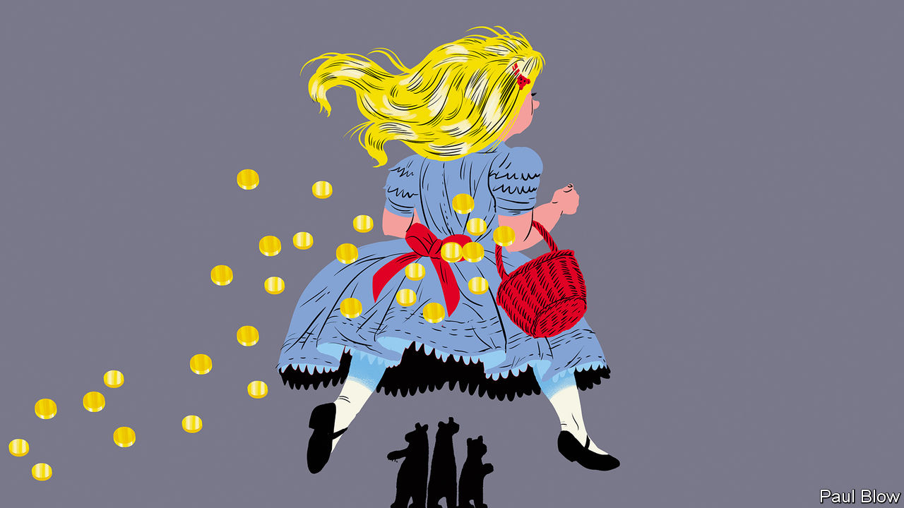
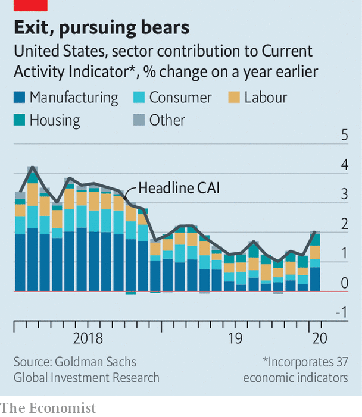
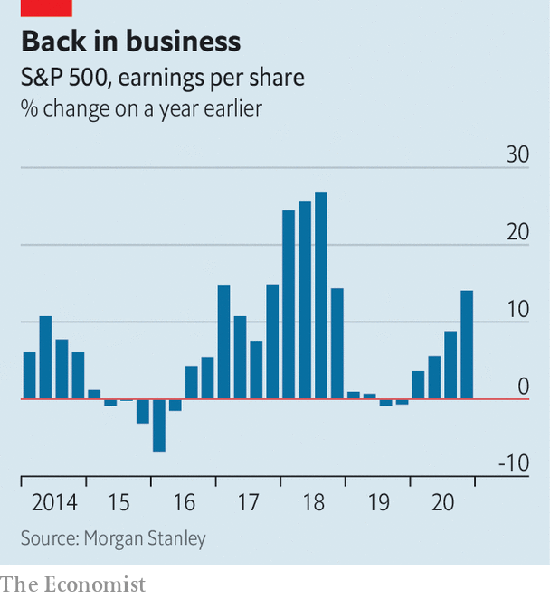
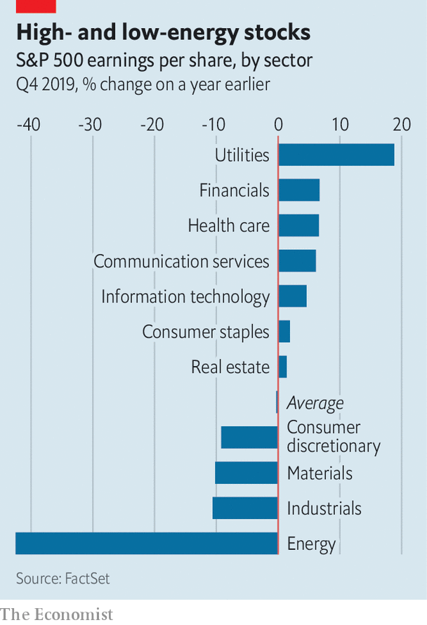

## Goldilocks and the three bears

# After a nervy year America Inc has a bounce in its step

> The corporate earnings recession may be over. But risks loom

> Feb 6th 2020NEW YORK

IS THE EARNINGS recession over? Many observers of corporate life have been asking this question as America’s listed companies report last quarter’s results in January and February. The omens going into the decade’s first earnings season did not look good. The current expansion is the longest in American history, so a downturn seemed inevitable. Indeed, the first three quarters of 2019 saw year-on-year declines in earnings for the S&P 500 index of leading firms. Financial analysts had forecast another drop, of 2% or so, in the fourth, marking the first such prolonged malaise since 2015-16, when America suffered a manufacturing slump.

With firms accounting for two-thirds of S&P 500 earnings out of the way, the mood has shifted—and then some. American bosses have unfurrowed their brows. A survey of big firms’ chief executives by the Conference Board, a business think-tank, showed a rebound in confidence from a ten-year low in the third quarter. The latest poll of smaller firms by the National Federation of Independent Business, a trade group, also recorded greater optimism. Equities may be headed for what Michael Wilson of Morgan Stanley, an investment bank, calls “a Goldilocks environment”.

America’s biggest firms are leading the charge. Apple’s net income grew by 11% to a record $22.2bn thanks in part to surprisingly strong iPhone sales. A surging cloud business boosted Microsoft’s net income by 38% to $11.6bn. Even Amazon, renowned for profitless growth, increased net income by a tenth, year on year, to $3.3bn. But Big Tech is not alone. Industries from utilities to banks to health care appear to be back in business—prompting analysts to revise upwards their forecasts for 2020. Jill Casey of Bank of America expects profits to rise by 8% this year, compared with the latest estimate of about 1% for last year.

What happened? For a start, fears of a recession have not materialised. If anything, America’s economy is perking up. In January the IMF forecast that American GDP would grow by 2% in 2020, faster than the euro area (1.3%) or Japan (0.7%). The “current activity indicator”, an aggregate of 37 economic metrics compiled by Goldman Sachs, an investment bank, rose sharply in January (see chart). Even manufacturing, where activity had been slowing since mid-2018, looks in better nick. A survey published on February 3rd by the Institute of Supply Management points to the first expansion in months.

America’s commercial truce with China announced in December played a role. Most bosses know that this “phase one” deal is imperfect. China’s commitment to purchase $200bn of American agricultural and other exports in 2020 and 2021 is widely seen as unrealistic. But the deal did make clear that President Donald Trump is willing to avoid an all-out trade war with America’s Asian rival, at least for the time being.

Mr Trump’s massive corporate tax cut continues to be a source of bosses’ contentment, as are low interest rates. So too is the absence of wage inflation—a big concern in boardrooms last year. David Kostin of Goldman Sachs argues that it should not be. He calculates that for the median stock in the American market, labour costs (including everything from salaries to share options to health insurance) are stable at around 13% of revenues—despite record-low levels of unemployment. Overall wage growth has been stuck around 3% a year for a while.

A balmier business climate is encouraging companies to invest. Morgan Stanley’s index of capital-expenditure plans, which combines various indicators, moved up in January after falling for seven straight months. The bank’s economists attribute this capex revival in part to “more positive headlines on global trade”.

Jonathan Golub of Credit Suisse, an investment bank, argues that if the expansion since the global financial crisis of 2007-09 is measured not in time but in GDP, which has grown unusually slowly by historical standards since 2008, it may have life in it yet. The business cycle is not dead, he says. But it is “elongated”. Economists scoff at such simplistic metrics, but a version of this argument is an increasingly common refrain among bulls on Wall Street. Their poster child is Tesla, an electric-car manufacturer whose market value nearly quadrupled in four months.

Lest the bulls get carried away, they should consider the three risks facing America’s Goldilocks market. First, the coronavirus from Wuhan is infecting American firms’ Asian supply chains—and global confidence (see [article](https://www.economist.com//finance-and-economics/2020/02/06/companies-warn-of-an-economic-crisis-as-china-battles-coronavirus)). Manufacturers in particular are vulnerable to contagion. Most economists, pointing to the modest global impact of outbreaks such as SARS in 2003, remain cautiously optimistic. But if the Wuhan virus turns into a deadlier global pandemic equity markets would invariably suffer.

Another worry is that the entire stockmarket is skewed by Big Tech. Apple, Microsoft, Amazon, Alphabet and Facebook account for 18% of the S&P 500. Cassandras note that in 2000, on the eve of the dotcom bust, the giants of the day—Microsoft, Cisco, GE, Intel and ExxonMobil—also made up 18% of the index. Because of their exposure to other tech firms, including frothy startups, Microsoft, Intel and especially Cisco were brought low by the crash rather than being a counterweight to it.

Mr Kostin notes that today’s big five are different. They trade at lower multiples of annual earnings than the big five of 2000 did (30 now versus 47 then) and reinvest more capital into the business (48% against 26%). The implication is that today’s giants have room to grow. Even so, their shares are looking pricey; Tesla’s plunged by 17% on February 5th. The companies remain vulnerable to antitrust action, privacy regulation, uncertain succession (see [article](https://www.economist.com//business/2020/02/06/talk-of-succession-atop-big-tech-grows-louder)), as well as the health of their myriad Asian suppliers.

The final bear case has to do with potential weakness in American household consumption. Ellen Zentner of Morgan Stanley notes that real personal consumption spending grew at an annualised rate of 1.8% in the fourth quarter, down from 3.2% in the third. She calculates that the annualised growth in spending on non-durable goods last quarter was only 0.8%, down from 3.9% in the one before. Spending on food and beverages fell by 0.5% on an annualised basis in the fourth quarter of 2019, down from an increase of 5% in the previous three months.

The profits just reported by big banks, which owe their strength in part to credit-card spending and mortgages, suggest that consumers are in a buying mood for now. Bosses have reason to kick back and relax. Farsighted ones know that this warm feeling will not last for ever. ■