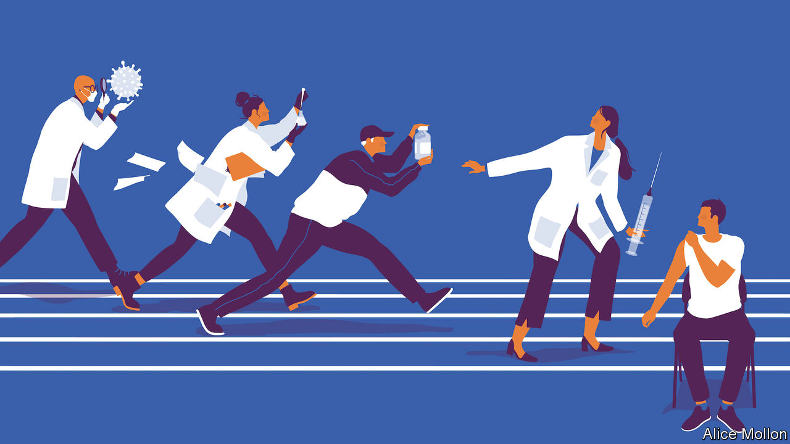
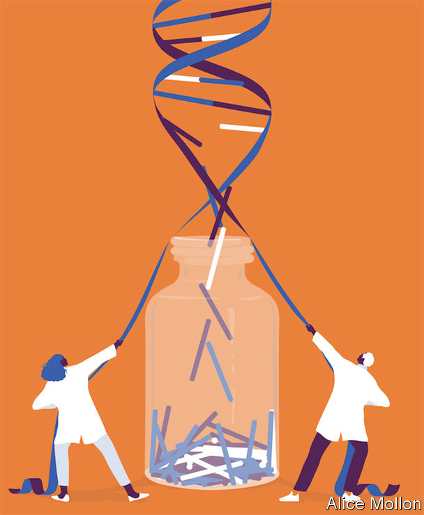

## Run, don’t walk

# The race to produce a vaccine for the latest coronavirus

> Even if scientists are too late for this outbreak, their work will not be wasted

> Feb 6th 2020

IN RECENT WEEKS searches on Google for “contagion movie” have soared. In the film, a thriller from 2011, a virus spreads rapidly around the world, killing 26m people. The plot follows the frantic efforts of scientists to produce a vaccine. Some 133 days after the first infection, they succeed.

In the real world most recent vaccines have taken years to develop. Some have taken more than a decade. Others, such as a vaccine to stop HIV, the virus that causes AIDS, still elude scientists. But technological innovations and a more streamlined development process could dramatically shrink the time it takes to produce a vaccine against a new pathogen that has the potential to cause an epidemic.

The new coronavirus that emerged in the Chinese city of Wuhan in December presents vaccine-makers with an urgent test. It has so far killed almost 600 people and infected more than 28,000. Scientists in China published the Wuhan virus’s genetic sequence on January 12th, less than a week after they isolated the bug from a patient suffering from a mysterious respiratory infection. By late January, several groups around the world had started work on a vaccine using these genetic data. The first clinical tests on humans, for safety, could begin as early as April. With luck, a vaccine could be ready within a year. Next week the World Health Organisation (WHO) will convene a global meeting to set a research agenda. It will agree on rules, or protocols, for trials and work out which medical advances should be priorities.

People have rushed to make new vaccines before. The west African Ebola outbreak of 2013-16 tested the world in many ways, but particularly in the need to speed up the delivery of new treatments. Organisations and institutions that normally work slowly, and at arm’s length, came together to get the job done faster. Drug regulators from America and Europe, pharmaceutical firms, charities, experts and the WHO all worked closely to advance the trials and technologies needed. They succeeded. An outbreak of Ebola in 2018 in the Democratic Republic of Congo, which now appears to be on the wane, has been contained largely as a result of the wide availability of a vaccine. This process of scientific acceleration is under way again, this time “on steroids”, says Seth Berkley, the boss of GAVI, a vaccine-finance agency.

Even if a vaccine were ready within a year, it would be too late to stem the current epidemic in China. But it could help other countries. Fears are growing that the Wuhan virus will spread more widely and become an established seasonal disease around the world, like the common flu. China’s extraordinary efforts to contain the virus, including quarantining over 50m people, may stave off epidemics in other countries until next winter. It is too soon to tell how deadly the Wuhan virus is. But if it is at least as bad as seasonal flu, a vaccine for those most at risk will be vital. In 2017-18 more than 800,000 people were hospitalised and about 60,000 died in America alone as a result of influenza.

The rush to develop a vaccine against the Wuhan virus has been led by the Coalition for Epidemic Preparedness Innovation (CEPI), a group set up in 2017 in the wake of the west African Ebola outbreak. CEPI’s purpose is to forearm the world against future outbreaks of disease, without knowing what those diseases will be. Its aim is to have a vaccine against a previously unknown pathogen ready to test in humans within 16 weeks of its identification. To that end, some of the university research centres and biotechnology firms that it has funded have been working on “plug-and-play” vaccine design and manufacturing technologies that can be used for a number of pathogens. This allows the genetic sequence of a particular pathogen to be slotted into an existing molecular platform that forms the basis of the vaccine.

In the past, laboratory work on a vaccine required stocks of the actual virus. It would be treated to make it harmless but still able to tickle the immune system into producing antibodies—proteins that fight off the wild virus if it attacks. Working with a deadly virus is tricky, naturally. It requires special containment facilities and exhaustive procedures to prevent it from escaping or infecting scientists.

Gene sequencing has made this process quicker, safer and easier. Researchers can build synthetic versions of parts of viruses to work on vaccines without needing complete samples of the pathogens.

Scientists have produced vaccines against other viruses, including Zika, Ebola and two other coronaviruses—SARS (Severe Acute Respiratory Syndrome) and MERS (Middle East Respiratory Syndrome)—using such technology. The vaccine research on these two cousins of the Wuhan virus has come in handy in recent weeks.

Once a vaccine has been developed in a laboratory, it is sent to a factory where it is turned into a sterile vaccine mix. This is then put into vials and tested to ensure it is not contaminated before clinical trials in humans can be carried out. Many of these tests are done in petri-dishes; the process takes several months. Genetic sequencing can do the job much faster. By sequencing the DNA of everything in a vial of vaccine and examining the result, scientists can spot traces of viruses that should not be present. Vaccine research groups in Britain are in talks with the country’s medicines regulator about an approval process for such alternative testing methods.

The development of a vaccine can be speeded up if bottlenecks in the process are eliminated, says Sarah Gilbert. She leads a group at Oxford University which is working on a vaccine against the Wuhan virus. Her group has developed a template for vaccines that can be adapted quickly for new pathogens. The researchers can make the first small quantities of a new vaccine in just six to eight weeks. In the past the process would have taken up to a year. The other groups trying to come up with a vaccine for the Wuhan virus are using similar methods involving templates that have already been proven to work.

Faster regulatory approval can also speed vaccines through clinical trials. Even as it started making the vaccine, Dr Gilbert’s group began putting together an application for clinical trials for it. The group plans to apply for an expedited ethical and regulatory review, which can be granted within days as it was for clinical trials of the Ebola vaccine conducted in Britain in 2014. Normally, the process takes about three months, says Dr Gilbert.

Even if a vaccine is developed and approved, the rapid rise in cases of the Wuhan virus in China and its spread to other countries has created a new urgency: planning ahead for ways to make massive quantities of a vaccine quickly. There are not many factories that can mass-produce vaccines, so new vaccines often wait in a long queue. Aware of this problem, the American government has built dedicated manufacturing facilities that can produce vaccines rapidly for emergencies. Britain is doing something similar.

When CEPI was planning its work, those involved were thinking about epidemics (outbreaks limited to one country), not pandemics (global epidemics), explains Richard Hatchett, the head of the group. Last week CEPI put out a call for vaccine candidates for the Wuhan virus that can be manufactured on a large scale with existing capacity. On February 3rd it brought on board as a partner GSK, a big drug firm, which has agreed to lend its highly effective adjuvant to a new vaccine. An adjuvant is a special ingredient that makes vaccines more efficient by boosting the immune response—which means that fewer doses of the vaccine or a lower concentration of its core ingredient is needed for vaccination.

Even if a vaccine can be produced in sufficient quantities, getting it to the people who need it, regardless of where they live, can still be a problem. In theory, a vaccine for the Wuhan virus would go to those most at risk, such as health workers, the elderly and those with conditions that appear to make the virus more lethal, such as patients with immune deficiencies. The problem is that politics often intervenes during a pandemic, and governments that are the home to vaccine-making facilities can requisition some of it for their own use, citing national defence or security.

This is a problem Mr Hatchett knows all too well; he worked at the White House on medical preparedness during a flu pandemic in 2009. The outbreak had a very low mortality rate, but exporting any vaccine before it was available to American citizens quickly became a vexed issue. Mr Hatchett is working with the WHO to try to ensure that the Wuhan virus vaccine is made at a number of different sites around the world including ones in small countries which would quickly be able to meet the needs of their entire populations.

The issues surrounding any potential vaccine make questions about medicines to treat those who have become gravely ill particularly acute. Licensed medicines to treat coronaviruses do not currently exist, but experimental drugs are in development, with some early data on their use. One that has been highlighted as promising is called remdesivir, which is made by Gilead, a drug firm. Two randomised controlled trials will start enrolling patients in mid-February. Remdesivir was developed to treat Ebola but in laboratory tests has been shown to be effective against a range of viruses. A combination of two drugs usually used in HIV treatment also looks promising and is already being tried on patients, says Vasee Moorthy who helps set research and development priorities at the WHO during epidemics.

Randomised controlled trials—in which some people are given the drug being tested and some are given a placebo—are the gold standard of scientific evidence. These will probably go ahead in the coming weeks when it is clear which drugs seem most promising. Trials with hospitalised patients will probably involve a placebo arm. Everyone in the trial would receive intensive care but some would also be given the drug being tested. This is because no one yet knows whether the new drugs, which may have side effects, do more harm than good. The most gravely ill patients may also be allowed to try untested drugs.

Only so much preparation is ever possible in advance of a new disease. A drug or vaccine’s efficacy can only be tested during an outbreak. The urgency behind the search for treatments for the Wuhan virus is understandable. Such efforts were effective in the case of Ebola. People are willing to rush vaccines and drugs into use for a disease with a fatality rate around 70%, as Ebola’s was. The calculus is different for one that kills 2% (or less) of those infected. Should hasty decisions lead to products that are not completely safe, people’s faith in vaccines could be damaged. If so, the harm done to the world’s health could rival the worst feared of the Wuhan virus. ■

## URL

https://www.economist.com/international/2020/02/06/the-race-to-produce-a-vaccine-for-the-latest-coronavirus
